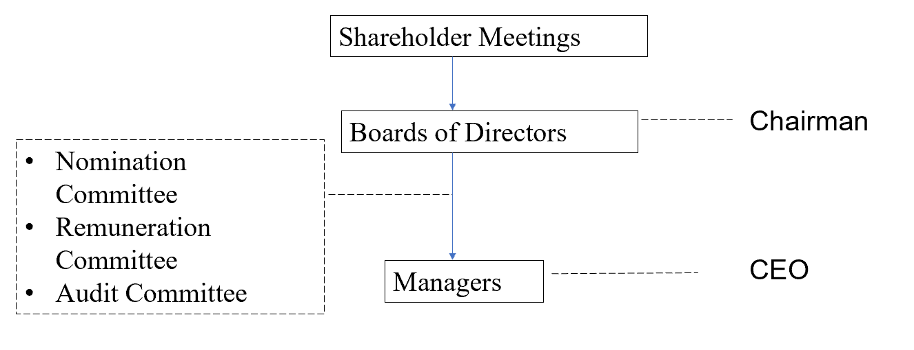
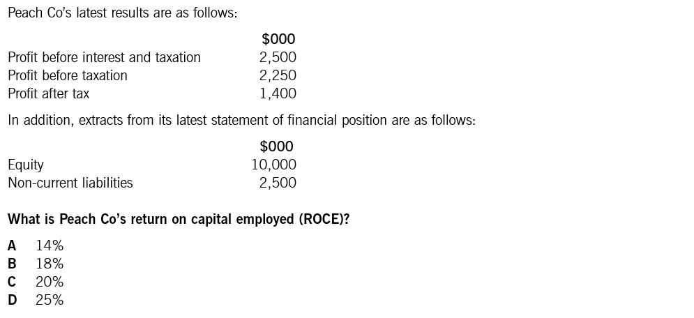
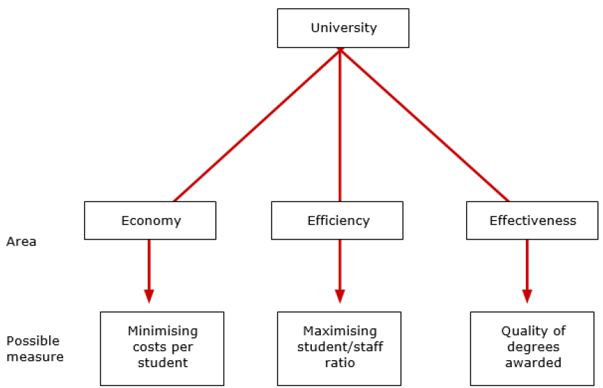

## Chapter 1 Financial Management Function

### Syllabus

**A. Financial Management Function**

**1. The nature and purpose of financial management**

a) Explain the nature and purpose of financial management. [1]

b) Explain the relationship between financial management and financial and management accounting. [1]

**2. Financial objectives and the relationship with corporate strategy**

a) Discuss the relationship between financial objectives, corporate objectives and corporate strategy. [2]

b) Identify and describe a variety of financial objectives, including: [2]

1. shareholder wealth maximization
2. profit maximization
3. earnings per share growth

**3. Stakeholders and impact on corporate objectives**

a) Identify the range of stakeholders and their objectives. [2]

b) Discuss the possible conflict between stakeholder objectives. [2]

c) Discuss the role of management in meeting stakeholder objectives, including the application of agency theory. [2]

d) Describe and apply ways of measuring achievement of corporate objectives including: [2]

1. ratio analysis (using appropriate ratios such as ROCE, ROE, EPS and DPS)
2. changes in dividends and share prices as part of total shareholder return

e) Explain ways to encourage the achievement of stakeholder objectives, including: [2]

1. managerial reward schemes such as share options and performance related pay
2. regulatory requirements such as corporate governance codes of best practice and stock exchange listing regulations.

**4. Financial and other objectives in not-for-profit organizations**

a) Discuss the impact of not-for-profit status on financial and other objectives. [2]

b) Discuss the nature and importance of Value for Money as an objective in not-for-profit organizations. [2]

c) Discuss ways of measuring the achievement of objectives in not-for-profit organizations. [2]

### 1 Nature and Purpose of Financial Management

#### 1.1 Definition of Financial Management

Financial management is the management of activities associated with acquiring and using financial resources of an organization in order to achieve the primary financial objectives of the organization.

The three key financial management decisions are investment, financing and dividend policy.

#### 1.2 FM Compared to FA and MA

**Relationship**

Financial accounting may influence financial management in various ways. For example, directors need to consider the effect of:

- financing decisions on the published financial statements.
- investment decisions on key financial ratios such as ROCE.

Management accounting information can often assist the financial manager. For example:

- analysis of costs into fixed and variable elements may assist financial management decisions.

**Differences**

Financial management differs from management accounting because financial management is:

- externally focused — analysis is focused on what is best for shareholders
- concerned with long-term decision-making issues.

Financial management differs from financial accounting because it is:

- forward looking
- useful at providing information that is directly used for decision making.

#### 1.3 Key Financial Objectives

For a for-profit company, financial objectives include targets for EPS, dividend per share, gearing level and operating profitability. However, **maximization of shareholder wealth** is assumed to be the **primary financial objective**, although profit-based objectives are still important.

Shareholder wealth is the combination of dividend and share price growth, referred to as total shareholder returns (TSR).

$$
\text{TSR} = \frac{\text{Dividend per share} + (\text{Year-end share price} - \text{Price at start of year})}{\text{Share price at start of year}}
$$

In practice, many companies find the theoretical objective of maximizing TSR hard to follow because:

- share price is often influenced more by overall stock market conditions than its own performance.
- there is no quoted share price for unlisted companies.

Therefore, profit maximization is often used as a proxy for shareholder wealth maximization. Unfortunately, profit is not a reliable proxy.

**Problems with the Objective of Profit Maximization**

- The value of the company's equity is more closely connected with its cash generation than accrual-based accounting profits.
- Management may be myopic and boost short-term profit at the expense of long-term growth (such as cutting investment in R&D).
- It does not take account of **risk**, and profits can be increased by taking very high levels of risk.
- Pressure to maximize profits can lead to earnings manipulation, and in extreme cases, fraudulent financial reporting.

**Earnings per Share Growth**

Earnings per share is calculated as:

$$
\text{EPS} = \frac{\text{Profit for the year} - \text{Preference dividends}}{\text{Number of ordinary shares}}
$$

EPS growth is a key indicator for financial analysts, and they often publish quarterly forecasts for a company's EPS. This leads to pressure on management to meet analysts' expectations. As it is based on accounting profits, EPS shares all of the problems listed above.

::: {.callout-tip}
**Example 1 (Dec 2016, Q10)**

Green Co, a listed company, had the following share prices during the year ended 31 December 20X5:

|                           |        |
| ------------------------- | ------ |
| At start of 20X5          | \$2.50 |
| Highest price in the year | \$3.15 |
| Lowest price in the year  | \$2.40 |
| At end of 20X5            | \$3.00 |

During the year, Green Co paid a total dividend of \$0.15 per share.

**What is the total shareholder return for 20X5?**

A. 26%　　B. 22%　　C. 32%　　D. 36%
:::

::: {.callout-tip}
**Example 2**

Increasing which **TWO** of the following would be associated with the financial objective of shareholder wealth maximization?

A. Share prices

B. Dividend payment

C. Reported profit

D. Earnings per share

E. Weighted average cost of capital
:::

#### 1.4 Strategy and Corporate Objectives

**Corporate strategy** is a long-term plan for how an organization intends to compete, and which markets it intends to compete in. **Corporate objectives** are the overall aims of an organization that should result from the successful implementation of its corporate strategy.

Examples of such objectives:

- shareholder wealth maximization and profit maximization
- a certain level of market share, social responsibility, and survival which reflect the existence of stakeholders' interests

**Relationship to Financial Objectives**

From a financial management perspective, corporate objectives should be pursued in support of a long-term objective to maximize shareholder wealth. However, there are some **potential conflicts** between the key financial objectives and other corporate objectives. The ability of a company to manage the potential conflict between corporate and financial objectives will depend on the actions of its managers and the effectiveness of its corporate governance.

**Environmental Issues**

Environmental or 'green' issues are an area of growing concern to all parties, companies included. Managers must understand how the organization's operations affect the environment to satisfy public concerns and, increasingly, avoid any penalties or costs due to environmental regulations.

For these reasons, environmental reporting is becoming more common in company financial reporting.

### 2 Encouraging Achievement of Stakeholder Objectives

#### 2.1 Agency Problem

In a for-profit company, managers can be said to be acting as the agents of shareholders. The agency problem refers to the danger that managers (unless they have a significant equity stake in a company) may not act in the best interest of shareholders.

Examples of agency problem:

- Excessive pay and perks that damage shareholder wealth
- Reduced dividend payments to free up funds over which managers have control
- Maximization of short-term profits at the expense of long-term profits
- Greater focus on profits and neglect of risk management

#### 2.2 Stakeholders

Stakeholders are various individuals or groups whose interests are directly affected by the activities of the firm. Stakeholders may have different interests and objectives for the company.

They can be classified as:

- **Internal:** staff, managers
- **Connected:** finance providers (shareholders, banks, bond holders), customers, suppliers
- **External:** government, communities, press groups, regulators

Conflict between these various stakeholders is possible. For example, efforts to reduce environmental effects (community objective) will reduce profits and therefore shareholder wealth.

Although shareholders are the key stakeholders, directors should take account of the objectives of a broader range of interested parties, and are expected to show responsibility to creditors (e.g. reasonable payment terms), employees (e.g. health and safety) and ultimately to society as a whole through corporate social responsibility (e.g. minimizing pollution, investing in social projects, etc.).

Therefore, the overall corporate objective may become **satisficing** (i.e. producing satisfactory rather than maximum returns for shareholders).

#### 2.3 Encouraging Achievement of Stakeholder Objectives

Two ways of encouraging achievement of stakeholder objectives:

- Managerial reward schemes
- Corporate governance

##### 2.3.1 Managerial Reward Schemes

Goal congruence occurs when the objectives of agents acting within an organization align with the organization's objectives. For example, managers should be encouraged to aim for long-term growth and prosperity rather than short-term reported profitability.

Methods of encouraging goal congruence between directors and shareholders include:

**(1) Performance-Related Pay**

Relating pay or bonuses to profits may lead to short-termism (e.g. not investing for future growth to maintain high profits in the short term).

**(2) Executive Share Option Scheme**

The evidence is mixed regarding the success of such schemes in motivating directors to improve performance:

- A company's share price may rise due to a general rise in the stock market rather than the quality of its management.
- Managers' interests in share price will end when managers exercise their options, so there will be no incentive effect when the option exercise date has passed.
- If share price falls and the options go underwater and have no value, they cannot act as an incentive.
- Managers may distort profits to protect share price and the value of their options.

**(3) Long-Term Incentive Plans (LTIPs)**

Paying a bonus to directors if the company's performance over several years is good when benchmarked against competitors.

##### 2.3.2 Corporate Governance

**Corporate Governance**: rules and systems by which companies are directed and controlled. An objective of corporate governance is to ensure agency costs remain at a level acceptable to shareholders.

{width="4.742179571303587in" height="1.824070428696413in"}

The main principles of codes of corporate governance:

- The company should be headed by an effective board.
- There should be a clear division of responsibilities at the head of the company between running the board (chair) and running the business (CEO).
- The board should have a balance of executive and *independent* non-executive directors (NEDs).
- **Remuneration Committee** — should be comprised of independent non-executive directors; responsible for the pay and incentives of executive directors.
- **Audit Committee** — responsible for internal control and risk management; should be comprised of independent non-executive directors.
- **Nomination Committee** — responsible for the appointment of new directors; should be comprised of independent non-executive directors.

##### 2.3.3 Listing Regulations

Stock exchanges have rules and regulations to ensure that the stock market operates fairly and efficiently for all parties involved. To become listed, a company must meet listing requirements set out in the listing rules.

::: {.callout-tip}
**Example 3 (Sep 2016, Q30)**

Which of the following statements about Fence Co directors' remuneration package is/are correct?

(1) Directors' remuneration should be determined by senior executive directors.

(2) Introducing a share option scheme would help bring directors' objectives in line with shareholders' objectives.

(3) Linking financial rewards to a target return on capital employed will encourage short-term profitability and discourage capital investment.

A. 2 only

B. 1 and 3 only

C. 2 and 3 only

D. 1, 2 and 3
:::

### 3 Ratio Analysis

**Ratio Analysis** — comparing and quantifying relationships between financial variables (e.g. in the statement of financial position and the statement of profit or loss) — is often used to understand how an organization performs and to determine whether it is achieving its objectives.

#### 3.1 Profitability Ratios

**Return on Capital Employed (ROCE)**

$$
\text{ROCE} = \frac{\text{Operating profit}}{\text{Capital employed}} \times 100\%
$$

- Operating profit = profit before interest and tax
- Capital employed = Equity + Long-term debt = Total assets − Current liabilities

This is an important ratio because it assesses profits or profit growth by relating them to the amount of funds (the capital) employed in making the profits.

**Return on Equity (ROE)**

$$
\text{ROE} = \frac{\text{Profit for the year} - \text{Preference dividends}}{\text{Shareholders' funds}} \times 100\%
$$

This is another measure of an organization's overall performance and shows the earning power of shareholders' book investment. It is particularly useful for comparing companies in the same industry.

A higher ROE could indicate:

- Good cost control or investment in profitable projects; or
- The company is more geared and has more risk associated with shareholder returns.

**Operating Profit Margin**

$$
\text{Operating profit margin} = \frac{\text{Operating profit}}{\text{Sales}} \times 100\%
$$

Profit margins measure how well revenue is converted into profit by the company. It can be calculated using any profit figure, e.g. gross profit or operating profit.

**Gross Profit Margin**

$$
\text{Gross profit margin} = \frac{\text{Gross profit}}{\text{Sales}} \times 100\%
$$

::: {.callout-tip}
**Example 4 (Sep 2016, Q14)**

{width="6.518692038495188in" height="2.9877996500437445in"}
:::

#### 3.2 Liquidity and Gearing Ratios

**Current Ratio** = Current assets / Current liabilities

**Quick Ratio** = (Current assets − Inventory) / Current liabilities

**Gearing** = Long-term debt / Equity

**Interest Cover** = Operating profit / Interest expense

#### 3.3 Efficiency Ratios

Efficiency ratios measure how well a company utilizes its assets and manages its liabilities. Key efficiency ratios include:

- **Receivable Collection Period** - the average number of days it takes to collect payment from customers.
- **Payables Payment Period** -the average number of days it takes to pay suppliers.
- **Inventory Holding Period** - the average number of days inventory is held before being sold.
- **Cash Operating Cycle** - the total time between paying for inventory and receiving cash from customers.
- **Sales / Net Working Capital** - measures how efficiently working capital is used to generate sales.

#### 3.4 Investor Ratios

**Earnings per Share (EPS)**

$$
\text{EPS} = \frac{\text{Profit for the year} - \text{Preference dividends}}{\text{Number of ordinary shares}}
$$

This is the basic measure of a company's performance from an ordinary shareholder's point of view. It is the amount of profit attributable to each ordinary share.

**Price/Earnings Ratio (P/E)**

$$
\text{P/E} = \frac{\text{Price per share}}{\text{EPS}}
$$

It reflects the market's appraisal of the share's future prospects. A higher P/E ratio means highly regarded future prospects.

**Other Investor Ratios**

- **Dividend per Share (DPS)**

$$
\text{DPS} = \frac{\text{Total ordinary dividend}}{\text{Number of ordinary shares}}
$$

The DPS helps individual ordinary shareholders see how much of the overall dividend payout they are entitled to.

- **Dividend Cover**

$$
\text{Dividend cover} = \frac{\text{Profit for the year} - \text{Preference dividends}}{\text{Ordinary dividend}}
$$

Dividend cover measures how many times the company's earnings could pay the dividend. The higher the cover, the better the ability to maintain dividends if profits drop.

- **Dividend Payout Ratio**

$$
\text{Dividend payout ratio} = \frac{\text{Ordinary dividend}}{\text{Profit for the year} - \text{Preference dividends}}
$$

- **Dividend Yield**

$$
\text{Dividend yield} = \frac{\text{Dividend per share}}{\text{Ex-div share price}}
$$

This is a direct measure of the wealth received by the ordinary shareholder. No capital growth is taken into account.

- **Total Shareholder Return (TSR)**

$$
\text{TSR} = \frac{\text{Year-end share price} - \text{Share price at start of year} + \text{Dividend for year}}{\text{Share price at start of year}}
$$

::: {.callout-tip}
**Example 5**

Geeh Co paid an interim dividend of \$0.06 per ordinary share on 31 October 2006 and declared a final dividend of \$0.08 on 31 December 2006. The ordinary shares in Geeh are trading at a cum-div price of \$1.83.

**What is the dividend yield (to one decimal place)?**
:::

::: {.callout-note}
**Note: What does a ratio tell us?**

Three comparisons can be made:

- The change in the ratio from one year to the next
- Other benchmark company's ratio, if this information is available
- A given target ratio
:::

### 4 Not-For-Profit Organizations

Not-for-profit (NFP) organizations can be defined as organizations whose attainment of their prime goal cannot be assessed by economic measures, for example, charities, health services or public utilities such as water or road maintenance.

**Value for Money**

NFP organizations aim to maximize the difference between the benefits generated and the costs of their operations. The maximization of this difference is commonly known as Value for Money. This is similar to profit maximization apart from society's interests being maximized rather than profit.

Value for Money can be defined as 'achieving the desired level and quality of service at the most economical cost'. It can be measured using the **Three Es**:

- **Economy** — securing resources as economically as possible, that is minimizing the input costs of the organization.
- **Efficiency** — employing resources as efficiently as possible within the organization, that is maximizing the output/input ratio.
- **Effectiveness** — using resources as effectively as possible to meet the organization's objectives.

{width="3.5357983377077864in" height="2.27702646544182in"}

**Measuring Performance**

As well as having multiple, conflicting objectives, it is often difficult to measure the output of NFP organizations in a meaningful way.

To overcome these issues, performance can be measured by:

- using judgments by experts;
- using comparisons to other similar bodies or against historical results;
- using inputs (e.g. teaching staff hours paid or costs).
