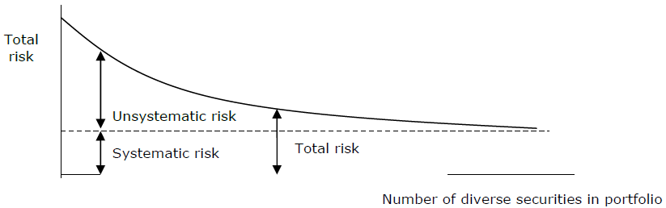
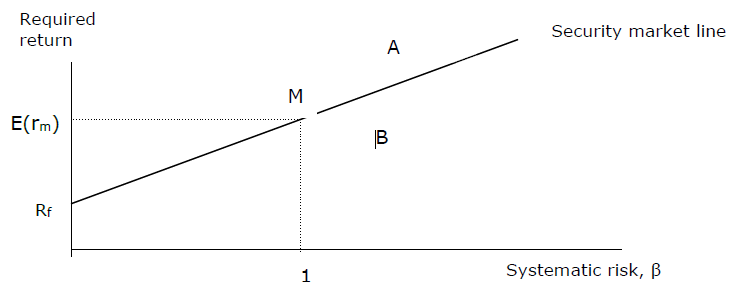
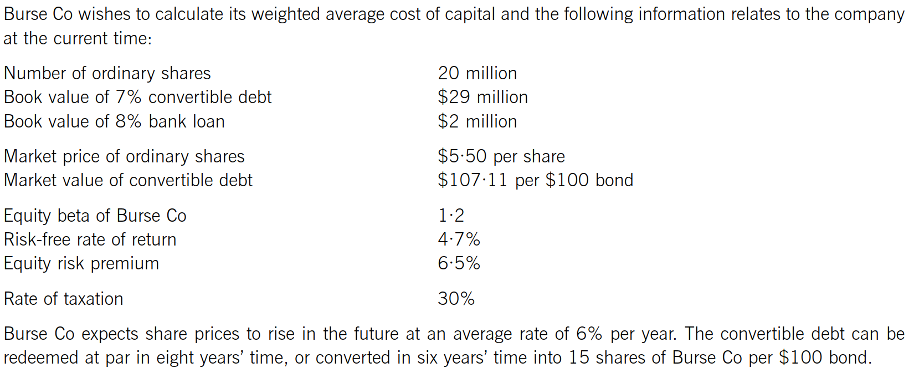
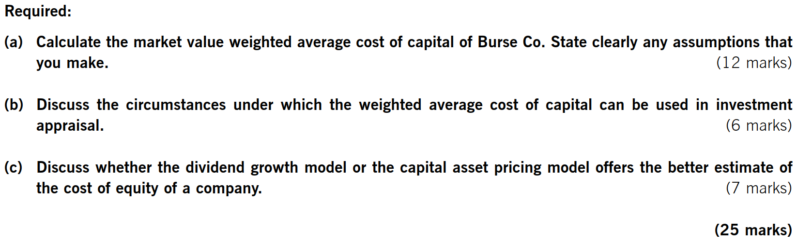

## Chapter 11 the Cost of Capital

### Syllabus  {.pagebreak}
**B. Financial Management Environment**

**2. The Nature and Role of Financial Markets and Institutions**

d\) Explain the nature and features of different securities in relation to the risk/return trade-off.

**E. Business Finance**

**2. Estimating the cost of capital**

a\) Estimate the cost of equity including:

i.  application of the dividend growth model, its assumptions, advantages and disadvantages.

ii. explanation and discussion of systematic and unsystematic risk

iii. relationship between portfolio theory and the capital asset pricing model (CAPM)

iv. application of the CAPM, its assumptions, advantages and disadvantages.

b\) Estimating the cost of debt:

i.  irredeemable debt

ii. redeemable debt

iii. convertible debt

iv. preference shares

v.  bank debt.

c\) Estimating the overall cost of capital including:

i.  distinguishing between average and marginal cost of capital

ii. calculating the weighted average cost of capital (WACC) using book value and market value weightings.

**3. Sources of finance and their relative costs**

a\) Describe the relative risk-return relationship and the relative costs of equity and debt.

b\) Describe the creditor hierarchy and its connection with the relative costs of sources of finance.

### 1 Risk and Return {.pagebreak}

The relative risk return relationship of equity and debt is based on their relative priority for repayment on liquidation -- the creditor hierarchy:

- secured creditors (loans and loan notes)
- Unsecured creditors (trade payables and unsecured debt)
- Preference shares
- Ordinary shares

The risk faced by each class of investor drives the required return of investors (there is a risk/return pay off) and the required return drives the company's cost of each finance.

**Providers of debt holders** will face low risk because:

- Debt holders will receive interest payment each year
- Are paid before providers of share capital in the event of liquidation

**Preference shareholders** face higher risk because:

- a dividend will only be paid after providers of debt have been paid
- in a liquidation the debt holders will be paid before preference shareholders.

**Ordinary shareholders** face the highest risk because:

- A dividend will only be paid after the providers of debt and preference shareholders have been paid
- In a liquidation the debt holders and preference shareholders will be paid before ordinary shareholders

The cost of capital is the rate of return that the company must pay to satisfy the providers of funds, and it reflects different levels of risk of providing funds. The higher the risk faced, the higher return that will be expected.

Investor's rate of return and cost of capital

- For equity and preference share, cost of capital equals to investor's required rate of return
- for debt finance, cost of capital does not equal to investor's required rate of return because a company receive tax relief on interest payments.

### 2 Cost of Equity

The cost of equity can be estimated in two ways:

- the dividend growth model
- the capital asset pricing model

#### 2.1 the Dividend Growth Model

**The DVM**

According to the DVM, the market value of share:

Ex-div market value at time 0 = Present value of the future dividends discounted at the shareholder's required rate of return.

The DVM model then becomes:

P~0~ = $\frac{D}{Ke}$ for constant dividend to infinity;

or

P~0~ = $\frac{D_{0}(1 + g)}{Ke - g}$ = $\frac{D_{1}}{Ke - g}$ for dividend grow at a constant rate in perpetuity.

If the company is listed and the share price is known, the DVM can be rearranged and used to estimate shareholders' required return:

K~e~ = $\frac{D}{P0}$ for constant dividend to infinity;

or

$Ke\  = \ \frac{D_{0}(1 + g)}{P_{0}} + g$ for dividend grow at a constant rate in perpetuity

Where:

K~e~ = the cost of equity

D = constant annual dividend per share

D~0~ =the current dividend per share

g = expected dividend growth rate in future

P~o~ =current ex-div price per share

The ex-div market value is the market value of the share, assuming that the current dividend has just been paid.

A cum-div market value includes the value of the dividend just about to be paid. The relationship between cum-div price and ex-div price is below:

cum-div Price = ex-div share price + dividend

::: {.callout-tip}
**Lecture example 1**

> A company's current dividend cover ratio is 4 times and after-tax profits are \$20m. The company has one million \$1 ordinary shares in issue and the current market capitalization of the company is \$50m.
>
> What is the cost of equity capital if?

:::

- > expects zero growth in dividends
  >
- > expects a growth rate of 4% in dividends in future?
  >

**Estimating the Growth Rate of Dividends**

The growth rate of dividends can be estimated using either of two methods:

- extrapolation of past dividends
- Gordon's growth model

##### 1. From Historic Growth

This method analyses historical growth to predict future growth rate. For uneven but steady growth, take an average overall growth -- the geometric mean.

growth rate=$\sqrt[n]{\frac{current\ dividend}{dividend\ n\ years\ ago}} - 1$

##### 2. Gorden's Growth Model

According to Gordon's growth model, growth is achieved by retaining and reinvesting profits:

g = br~e~

where: r~e~= rate of return on reinvested funds (ROCE)

b= % of profits reinvested (retention ratio)

r~e~=$\frac{profit\ (for\ the\ year)}{shareholders'fund} = \frac{profit\ (for\ the\ year)}{net\ assets}$

::: {.callout-tip}
**Lecture example 2**

Cg company has 4 million shares in issue, and has done for many years. Its dividend payments in the years 2009 to 2013 were as follows.

  End of year                   Dividends (\$000)
...

  2009                          220\^\[2\]\^
  2010                          257\^\[2\]\^
  2011                          310\^\[2\]\^
  2012                          356\^\[2\]\^
2013                          423\^\[2\]\^---------------------------------

dividends are expected to continue to growth at the same average rate into the future. The current ex-div share price of the company at year 2013 is \$1.73.

what is cost of equity for Cg company?
:::

::: {.callout-tip}
**Example 3**

> IPA company is about to pay a \$0.50 dividend on each ordinary share. Its EPS was \$1.5. Net assets per share is \$6. Current share price is \$4.50 per share.
>
> What is the cost of equity?

:::

**Underlying Assumptions of the DVM Include:**

- The same expectations for all investors; therefore, they all require the same rate of return.
- Perfect capital market assumptions: 

-rational investors;

-no taxes or transaction costs;

-large number of buyers and sellers of shares;

-no individual can affect the share price; and

-perfect information is freely available to all investors.

- Dividends are paid just once a year and one year apart.
- Dividends are either constant or are growing at a constant rate.

**Advantages and Disadvantages of DVM**

Advantages:

- It is easy to understand and can be applied to any share that offers a dividend.
- For minority shareholders without control over a company's policies, dividends are the only available metric.
- It is particularly suitable for "mature" companies paying regular dividends.

Disadvantages:

- It cannot be applied to shares that do not pay dividends therefore, it cannot be used for smaller businesses and startups.
- It does not explicitly incorporate risk.
- Dividends don't grow smoothly in reality so it is only an approximation
- It makes no allowance for non-dividend factors that influence the value of a share (e.g. brand loyalty and other internally generated intangible assets).

- It assumes there are no issue costs for new shares
- current market price P~0~ can be subject to short-term influence which will distort the estimate of cost of equity
- It's difficult to estimate growth rate, and the future growth rate may not equal historical growth rate

#### 2.2 Capital Asset Pricing Mode (CAPM)

##### 1. Systematic and Unsystematic Risk

If an investor has a portfolio of investments in the shares of several different companies, the risk of the portfolio is less than the average due to diversification.

Investment risk has two elements:

- Systematic risk; and
- Unsystematic risk.

**Unsystematic risk** -- The risk which is unique to each company's shares (also called diversifiable or industry-specific risk). Unsystematic risk can be eliminated by a diversified portfolio.

**Systematic risk** - The risk is associated with the financial system which affects the market as a whole rather than a specific company's shares (also called market risk or undiversifiable risk). Systematic risk cannot be eliminated by a diversified portfolio.

The sum of systematic risk and unsystematic risk is called total risk.

As more different shares are added to the portfolio, the unsystematic risk is diversified away and the total risk reduces to approach systematic risk.

This means that investors should only be rewarded for risks they cannot avoid − systematic risk.

{width="5.768055555555556in" height="1.8083333333333333in"}

##### 2. Measurement of Systematic Risk

Beta factor describes a share's degree of sensitivity to changes in the market's returns caused by systematic risk.

Beta factors for quoted shares are measured using historical data and published in \"beta books\". They are determined by comparing changes in a share's returns to changes in the stock market returns as a whole over many years (at least five years).

Typically, beta lies between 0.2 and 1.6:

- β~i~=1, indicate a neutral share that is as sensitive as the market to systematic risk. Such shares should earn the **market return**.
- ßi\>1, indicate an aggressive share that is more sensitive than the market.
- ßi\<1, indicates a "defensive" share that is less sensitive than the market and is likely to rise and fall in value less than the market in general.

##### 3. The Capital and Asset Pricing Model

The CAPM is a method of calculating the return required on an investment based on its risk.

The Security Market Line (SML) plots the required return (E(ri)) from any investment according to its systematic risk, as measured by its beta.

{width="3.888888888888889in" height="1.5038659230096239in"}

Comparing forecast returns from an investment against the required return indicates whether an investment is undervalued or overvalued.

- Any share with a return above the SML (e.g. A has higher returns than predicted) would be sought after as it appears to be temporarily underpriced. It is, therefore, underpriced and will be sought after. This will drive up its price and reduce its expected return until it earns only the required return indicated by the SML. A is a "positive alpha" investment.
- Any share with a return below the SML (e.g. B) would be sold as it appears to be temporarily overpriced. This will drive down the price and increase the expected return until it earns the required return indicated by the SML. B is referred to as a "negative alpha" investment.

In the long run, market forces should ensure that all investments give the returns predicted by the SML.

CAPM is the equation of the SML that relates required returns to beta values as measures of systematic risk. CAPM assumes that investors hold fully diversified portfolios. This means that investors are concerned only with systematic risk.

The formula for the CAPM is:

E(r~i~)= R~f~ + β~i~(E(r~m~)-R~f~)

Where:

- E(r~i~)=expected / required return of equity investors
- R~f~ =Risk-free rate of return.
- β~i~=beta of the investment
- E(r~m~)=expected return from the market portfolio

E(r~m~-R~f~) is called the equity/market risk *premium* (i.e. the extra return an investor expects for holding a diversified portfolio of shares rather than a risk-free security).

::: {.callout-tip}
**Lecture example 4**

> Investors have an expected rate of return of 8% from ordinary shares in A company, which have a beta of 1.2. the expected returns to the market are 7%.
>
> What will be the expected rate of return from ordinary shares in B, which have a beta of 1.8?

:::

**Assumptions of CAPM**

The assumptions of the CAPM can be summarized as follows:

- Total risk can be split between systematic risk and unsystematic risk.
- Unsystematic risk can be diversified away entirely.
- Shareholders hold well-diversified portfolios.
- A risk-free security exists which provides a minimum level of return required by investors. 
- Investors can borrow and lend at the risk-free rate (for which the yield on short-dated government debt is taken as a proxy).
- A standardized holding period (usually one year) to make the returns on different securities comparable (e.g. a return over six months cannot be compared with a return over 12 months).
- A perfect capital market exists, as for the dividend valuation model, so all securities are valued correctly.

**Advantages and Disadvantages of CAPM:**

advantages:

- It considers systematic risk
- It generates a theoretically derived relationship between required return and systematic risk.
- It is a much better method of calculating the cost of equity than the DVM in that it explicitly allows for a company's level of systematic risk relative to the stock market as a whole.

Disadvantages:

- It is a single-period model -- whereas company projects are often for multiple periods.
- CAPM tends to overstate the required return on high-risk companies and understate the returns on low-risk companies.
- Assumptions do not hold in the real world. For example, the assumption that investors can borrow and lend at the risk-free rate (for which the yield on short-dated government debt is taken as a proxy) is unrealistic.

#### 2.3 Comparing CAPM and the DVM

The DVM can be readily applied to any listed companies that offer dividends. However, the model gives no explanation as to why different shares have different costs of equity. The reason that different shares have different rates of return is that they have different risks, but this is not made explicit by the DVM. The formula suggest that the rate of return would be lowered if the company reduced its dividends or the growth rate, however, a business cannot alter its cost of equity by changing its dividends.

Compared to the DVM, CAPM is generally a more stable method for calculating the cost of equity. The CAPM explicitly takes into account of a company's level of systematic risk and gives a clear link between required return and risk, so explains why different companies give different returns.

### 3 Cost of Debt

#### 3.1 Bank Loan

A profitable company should be able to claim tax relief on bank interest; therefore, the post-tax cost of bank loans is:

K~dat~ = quoted interest rate × (1- tax rate)

As bank loans are **not** traded, their book value must be used as a proxy for market value.

#### 3.2 Irredeemable Debt

The market value of debt can be calculated using the DVM:

MV (ex-interest) = PV of future interest payments discounted at the debtholder's required rate of return.

Annual interest payment = coupon rate × nominal value

For irredeemable bons the interest is a *perpetuity*.

P~0~ =I / K~d~

Where: P~0~ =ex-interest market price

I = annual interest payment

K~d~ = bondholder's required return

The **pre-tax** cost of irredeemable bonds is the debtholder's required return:

K~d~ = I / P~0~

As the company gets tax relief on interest expense, the cost to the company (post-tax cost of debt) will be:

K~dat~ = I × (1- tax rate) / P~0~

::: {.callout-tip}
**Example 5**

> L co. has issued bonds of \$100 nominal value with annual interest of 9% per year, based on the nominal value. The current ex-interest market price of the bonds is \$90. Assuming the tax rate of L is 30%.
>
> What is the cost of bonds?

:::

::: {.callout-tip}
**Example 6**

> Henry has 12% irredeemable bonds in issue with a nominal value of \$100. The market price is \$95 ex-interest. Assuming the tax rate is 30%. Calculated the cost of capital if interest is paid half-yearly.

:::

#### 3.3 Redeemable Debt

For redeemable debt, the cost of any source of funds is the IRR of the cash flows associated with that source.

Finding the IRR of the following cash flows:

  Year   cash flow \$                   DF(a%)     PV \$    DF(b%)     PV \$
...

  0      Ex-interest MV      \(x\)      1                   1

  1-n    Post-tax Interest   x

  n      Redemption value    x

NPV~a~              NPV~b~

::: {.callout-tip}
**Lecture example 7**

> L co. has issued bonds 10% bonds of a nominal value of \$100. The current market price of the bonds is \$90 ex-interest. Assuming the tax rate is 30%.
>
> What is the cost of the bonds if it is redeemable at par after ten years?

:::

If interest is paid every six months rather than annually, the calculations for the cost of debt as follows:

- calculation the IRR based on cash flows at six-month intervals
- The IRR will then be a six-month cost of debt and must be adjusted to determine the annual cost of debt. 

#### 3.4 Convertible Debt

Holders of convertible bond can choose between redemption at some future date or conversion into a predetermined number of equity shares. Debt holders will only convert if the MV of the shares is greater than the redemption value of the debt. So calculation of cost of convertible bonds involves:

- Calculate the conversion value and determine whether or not converse

Conversion value = conversion ratio \* market price

- Find the IRR of the after-tax cash flows:

  Year   cash flow \$                                      DF(a%)    PV \$    DF(b%)       PV \$

  0      (ex-interest MV)                                  1                  1

  1-n    Post-tax Interest

  n      Higher of redemption value and conversion value

  NPV~a~                NPV~b~

K~dat~=

::: {.callout-tip}
**Example 8**

> A co. has issued 8% convertible bonds which are due to be redeemed in five years' time. They are currently quoted at \$82 per \$100 nominal. The bonds can be converted into 25 shares in five years' time. The share price is currently \$3.5 and is expected to grow at a rate of 3% per year. Assume a 30% rate of tax.
>
> What is the cost of the convertible bonds?

:::

#### 3.5 Preference Share

A preference shareholder will receive a fixed income based upon the nominal value of the shares held.

K~p~=$\frac{\mathbf{D}}{\mathbf{P}_{\mathbf{0}}}$

Where: D = constant annual dividend

P~o~ = ex-div market price of the preference share

Preference dividends are typically quoted as a percentage (e.g. 10% preference shares). This means the annual dividend will be 10% of the *nominal* value, **not** the market value.

::: {.callout-tip}
**Lecture example 9**

> An 8％ irredeemable \$0.50 preference share is being traded for \$0.30 cum-dividend in a company that pays corporation tax at a rate of 30%.
>
> What is the cost of preference shares?

:::

### 4 Weighted Average Cost of Capital (WACC)

#### 4.1 Formula for WACC

Companies are usually financed by combination of debt and equity (i.e. they use some degree of financial/capital gearing). The WACC represents a company's average cost of long-term finance.

The formula is given below:

Where: K~e~ = cost of equity,

K~dat~ = after-tax cost of debt

V~e~ = market value of shares i.e. **market capitalization**

V~d~ = market value of debt

Market values of equity/debt (where available) are used to weight the individual costs of capital.

MV of Equity = No. of ordinary share × Share price

MV of Debenture = Book value of debenture/100 × Debenture price

MV of loan = Book value

MV of preference share = No. of preference share × Share price

**Example 10**

IDO company has a capital structure as follows.

    \$m

  \$0.50 ordinary shares                                       5

  reserves                                                     20

  13% irredeemable loan notes                                  7

32
--

The ordinary shares are currently quoted at \$3, and the loan notes at \$90. IDO has a cost of equity of 12% and pays corporation tax at a rate of 30%.

What is the company's WACC?

#### 4.2 Weightings Used in WACC

But market values should always be better than book value.

As book value are based on historical costs, and the market value of shares are usually much higher than its book value, therefore, using book value will s**eriously underestimate** the impact of cost of equity finance on WACC, that is WACC will be seriously underestimated if they are calculated based on book value.

If WACC is underestimated, projects that do not in fact deliver a high return to finance providers may be accepted.

#### 4.3 WACC and Project Appraisal

Marginal cost of capital (MCC) is the cost of raising the most recent dollar of finance.

When evaluating a project, the WACC is a more appropriate discount rate than the MCC, as the WACC is an average of the cost of equity (which measures business risk) and the cost of debt.

The existing WACC can be used as a discount rate if the project has the same risk as the company's existing activities. However, if the project has a different risk, the existing WACC will not be appropriate. In this case, a tailor-made discount rate for that project must be determined using the CAPM.

{width="5.768055555555556in" height="2.3652777777777776in"}

{width="5.768055555555556in" height="1.7729166666666667in"}

