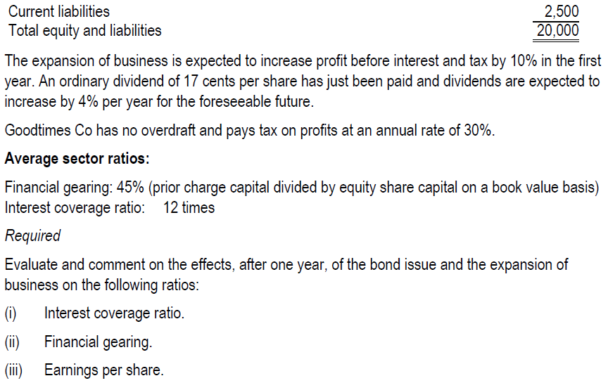
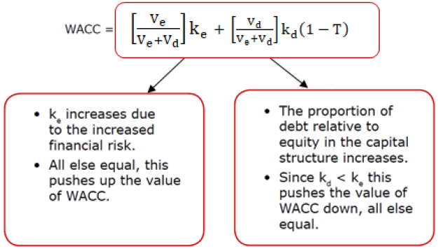
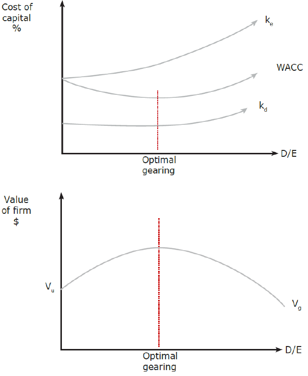
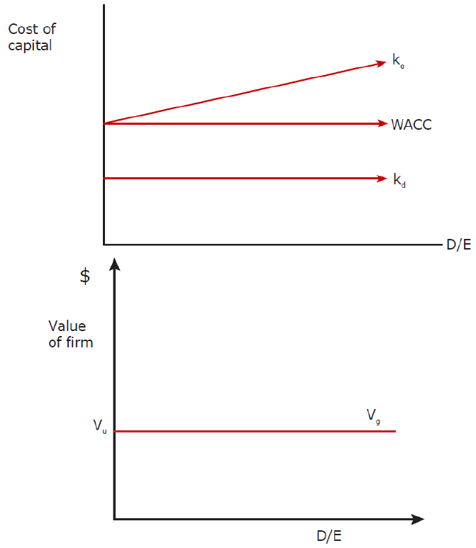
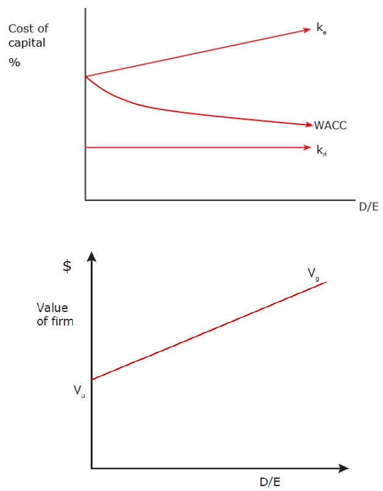
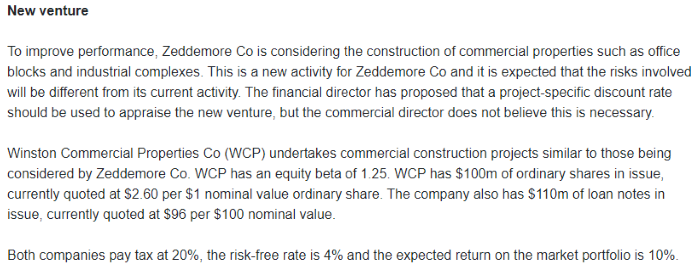
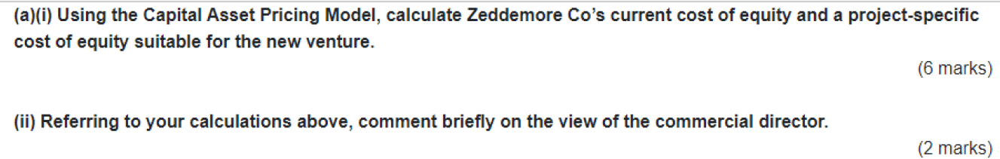
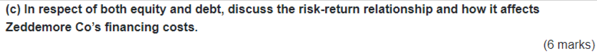

## Chapter 12 Gearing and Capital Structure

### Syllabus  {.pagebreak}
**E. Business Finance**

**3. Sources of finance and their relative costs**

c\) Identify and discuss the problem of high levels of gearing.\^\[2\]\^

d\) Assess the impact of sources of finance on financial position, financial risk and shareholder wealth using appropriate measures, including:\^\[2\]\^

i.  ratio analysis using statement of financial position gearing, operational and financial gearing, interest coverage ratio and other relevant ratios

ii. cash flow forecasting

iii. leasing or borrowing to buy.

e\) Impact of cost of capital on investments including:\^\[2\]\^

i.  the relationship between company value and cost of capital.

ii. the circumstances under which WACC can be used in investment appraisal

iii. the advantages of the CAPM over WACC in determining a project-specific cost of capital.

iv. the application of the CAPM in calculating a project-specific discount rate.

**4. Capital structure theories and practical considerations**

a\) Describe the traditional view of capital structure and its assumptions.\^\[2\]\^

b\) Describe the views of Miller and Modigliani on capital structure, both without and with corporate taxation, and their assumptions.\^\[2\]\^

c\) Identify a range of capital market imperfections and describe their impact on the views of Miller and Modigliani on capital structure.\^\[2\]\^

d\) Explain the relevance of pecking order theory to the selection of sources of finance.\^\[1\]\^

### 1 Gearing {.pagebreak}

#### 1.1 Financial Gearing

**Financial risk** is the additional variability in shareholder returns due to introducing fixed-interest debt in the capital structure. As a committed fixed cost, interest on debt creates more volatile "bottom-line" profits for shareholders.

{width="5.001221566054244in" height="1.8846041119860018in"}

The more highly geared a company is, the more fixed interest it has to pay regardless of profits; therefore, the greater the risk that there will be little or nothing available to distribute as a dividend to shareholders. High financial gearing makes a company more vulnerable to poor trading conditions.
:::

##### 1. Measurement of Financial Gearing

A company's financial gearing may be considered relatively high when:

- Gearing is significantly above the industry average and/or
- Interest cover ratio is relatively low

(1) **Financial gearing= debt / equity**

Debt (prior charge capital) includes:

- bonds and long-term loans
- Preference share capital

(Possibly bank overdraft will be included in debt if overdraft if significant)

Gearing can be calculated either based on **book Value** or on **market value**.

Book value

- Bonds: Face value (usually 100) ×number of bonds

- Bank loan:
- Preference share: face value× number of preference shares

- Equity: Share capital + share premium + reserve

Market value:

- Bonds: market price of bond × number of bonds
- Bank loan: MV=BV
- Preference share: share price× number of preference share
- Equity: Share price\* number of ordinary shares

(2) **Interest coverage ratio**

Interest Cover = operating Profit / Interest expense

(3) **Debt ratio**

Debt ratio=total debt/ total assets

A higher debt ratio means higher financial risk. As a general rule, 50% might be seen as a safety limit to the debt.

{width="5.580919728783902in" height="3.937007874015748in"}

{width="5.604646762904637in" height="3.543307086614173in"}
:::

::: {.callout-tip}
**Lecture example 2b (March/June 2022)**

Beaver Co has 100 million equity shares in issue and has just reported a profit, after tax, of \$55m.

A new issue of 50 million equity shares at an issue price of \$1.50 is being considered. All proceeds would be used to redeem a bank loan with an annual cost of 8%. Beaver Co pays corporation tax at a rate of 20%.

Assume that operating profit (profit before interest and tax) remains constant. If the equity issue goes ahead and the bank loan is redeemed, what will be the new earnings per share figure?

A \$0.399

B \$0.367

C \$0.598

D \$0.388
:::

#### 1.2 Impact of Financial Gearing

\(1\) Impact on ratios

Ratios related to shareholders such as EPS and ROE will be affected by gearing. high gearing will increase the volatility of EPS and ROE.

> The indifference points of EPS
>
> Financial gearing = % change in EPS / % change in PBIT
>
> Determine the PBIT indifference points among the various alternative financing plans
>
> At a given level of PBIT which is greater than the indifference point, it will be better to issue debt
>
> At a given level of PBIT which is less than the indifference point, it will be better to issue equity

(2) Potential problems of high financial gearing

- High level of financial risk: The high levels of committed interest expense make earnings to equity investors more volatile, pushing up the cost of equity.
- Financial distress costs
- Increased credit risk: The rating agencies may cut the company's credit rating, pushing up its cost of debt.
- Agency costs: Debt contracts include increasingly restrictive covenants (e.g. limiting dividend payments or forcing the company to stay within low-risk projects). In this way the directors become agents of debt holders rather than of the equity investors and shareholder returns are subsequently damaged.

#### 1.2 Operational Gearing

Business risk refers to the variability in the company's operating earnings associated with the industry in which it operates. It is general business and economic conditions.

Business risk can be measured by operational gearing.

Operational gearing =contribution/ PBIT= (sales-variable cost of sales)/ (sales-variable cost-fixed cost)

a high operational gearing indicates higher business risk.

::: {.callout-tip}
**Lecture example 3: Heskey and Owen**

> Two companies are concerned about their potential profitability in the forthcoming year and wish to forecast their profitability given that volumes change by [+]{.underline}50%
>
> Company Heskey Owen
>
> \$m \$m
>
> Sales 12.0 12.0
>
> Variable Cost 1.0 9.0
>
> Fixed Cost 9.0 1.0
>
> Profit before interest and tax 2.0 2.0
>
> Required:
>
> 1)Prepare an analysis of profit at all three suggested levels of activity
>
> which company is riskier?
>
> 2\) Calculate the operational gearing

:::

### 2 Capital Structure Theories

The **capital structure** of a company refers to the mixture of equity and debt finance used by the company to finance its assets. The decision on what mixture of equity and debt capital to have is called the financing decision.

**Gearing and WACC**

two things will happen as gearing increases:

{width="3.668467847769029in" height="2.0833333333333335in"}

The effect of increased gearing on WACC depends on the relative sizes of these two opposing effects. There are two views on gearing and capital structure:

- Traditional view
- Modigliani and Miller's theories

#### 2.1 Traditional Theory

Traditional theory is based on the trade-off caused by gearing. This view assumes the following:

- WACC will fall initially as gearing rises because the benefits of using lower-cost debt finance outweighs the increase in cost of equity due to increasing financial risk. The WACC will fall until it reaches its minimum value, the optimal capital structure.
- After a certain level of gearing, WACC will increase as gearing rises because the increase in financial risk outweighs the benefit of cheaper debt. At very high levels of gearing, bankruptcy risk causes the cost of equity rise at a steeper rate and also cause the cost of debt to start to rise.

The relationships are shown in below:

{width="2.762820428696413in" height="3.370534776902887in"}

Conclusions

As the **market value of a company** is equal to the present value of its future cash flows discounted by its WACC, the lower the WACC and the higher the market value of the company. So, there is an optimal gearing level at which WACC is minimized and the total value of the company is maximized. Hence, if we can change the capital structure to lower WACC, we can increase the market value of the company and thus increase shareholder wealth.

Therefore, it is the duty of all financial managers to find the optimal capital structure that minimize WACC and maximize the company value. However, the optimal capital structure can only be found by trial and error.

#### 2.2 Modigliani & Miller Theory

##### 1. M&M Theory with No Tax

In 1958, Modigliani and Miller (MM) constructed a mathematical model to provide a basis for company managers to make financing decisions.

MM's assumptions include the following:

- All investors are rational, have the same expectations and are indifferent to personal and corporate borrowing.
- Capital markets are perfect: all investors have equal access to information, no transaction costs
- no tax
- There is a single risk-free rate of borrowing (R~f~).
- no financial distress risk even at very high debt levels.

**Propositions of MM theory**:

- k~e~ would increase at a constant rate as gearing increase due to the perceived increased financial risk. k~d~ would remain constant (at R~f~) whatever the gearing level. The rising k~e~ would offset the benefit of cheaper debt so the WACC remains constant.

- The market value will also remain constant at all levels of gearing.

This can be illustrated as follows:

{width="2.8046380139982503in" height="3.2307699037620297in"}

**Conclusions:**

- Only investment decisions affect the value of the company.
- The value of the company is independent of the financing decision (i.e. capital structure is irrelevant).
- There is no optimal gearing level.

Of course, this is not true in practice because the assumptions are too simplistic.

##### 2.3 M&M Theory (with Tax)

In 1963, M&M allowed for corporation tax, their conclusions regarding capital structure were altered. This is because of tax relief on debt interest.

**Proposition**

In the with-tax theory:

When gearing increase, k~e~ rises (as before) due to perceived financial risk; cost of debt is constant but falls significantly from K~d~ to K~d~(1-t). As debt became even cheaper due to tax shield on interest payments, thus, the decrease in the WACC is now greater than the increase in the WACC, so, WACC must fall and the company's value must rise.

The relationships are shown as:

{width="2.6730774278215224in" height="3.4251826334208224in"}

**Conclusions**

MM's theory with tax implies that there is an optimal gearing level and that this is to maximize debt in the capital structure to generate maximum value for shareholders. This is **not true** in practice (because companies' capital structures are not geared as much as possible). M&M failed to take account of factors like bankruptcy costs, agency costs and tax exhaustion, which discourage companies from totally debt finance.

- **Bankruptcy Costs** -- very high levels of debt will cause a significant possibility of default on its interest payments and hence bankruptcy. As the high possibility of bankruptcy risk, the cost of debt and cost of equity will increase to compensate for shareholders and debt-holders' additional risk, WACC will increase and the share price reduces.
- **Agency cost** -- As gearing increases, debt-holders would want to impose more constraints on the management to safeguard their increased investment. Extensive covenants reduce the company's operating freedom, investment flexibility (positive NPV projects may have to be forgone) and may lead to a reduction in share price.
- **Tax exhaustion** -- as a company gears up, interest payments may rise and reach a point that they are equal to the profits from which they are to be deducted; therefore, any additional interest payments beyond this point will not receive any tax relief. This is the point where companies become tax - exhausted, ie interest payments are no longer tax deductible. Once this point is reached, debt loses its tax advantage and a company may restrict its level of gearing.

#### 2.3 Pecking Order Theory

According to pecking order theory, a company should simply follow an established pecking order to raise finance simply and efficiently.

1. Use retained earnings available\^\[2\]\^2. Then issue debt\^\[2\]\^3. Then issue equity, as a last resort.\^\[2\]\^
**Reasons for Following Pecking Order**

\(1\) The first reason for this theory is to minimize issue costs:

- retained earnings have no issue costs.
- Issue new debt will incur moderate issue costs
- issuing new equity will incur high levels of issue costs

\(2\) The second reason for this theory is to minimize the time and expense involved in persuading outside investors of the merits of the project:

- For retained earnings, it does not have to spend time persuading outside investors.
- the time and expense associated with issuing debt is usually significantly less than that associated with issuing share.

(3) A further reason is the existence of asymmetric information and signal that result from managers

Managers know more about their companies' prospect than outside investors. Because of this asymmetry in information, management's actions are often interpreted as the insiders' view on the future prospects of the company.

Management with favorable inside information would want to avoid issuing shares because they would be undervalued. Conversely, outside investors assume that managers with unfavorable inside information would like to issue shares as they would be overvalued. Therefore, an equity issue is interpreted as a "bad" sign.

Implication of Pecking Order Theory

- highly profitable companies would borrow the least, because they have higher levels of retained earnings to fund investment projects.
- companies should hold cash for speculative reasons, so that if in the future the company has insufficient retained earnings to finance all positive NPV projects, they use these cash reserves and therefore not need to raise external finance.

The pecking order theory Explains what businesses actually do, **rather than what they should do.**

**Conclusion**

As the primary financial objective is to maximize shareholder wealth, then companies should seek to minimize their weighted average cost of capital (WACC). In practical terms, this can be achieved by having some debt in the capital structure, since debt is relatively cheaper than equity, while avoiding the extremes of too much gearing.

Companies should be aware of the pecking order theory which takes a totally different approach, and ignores the search for an optimal capital structure.

### 3 Practical Capital Structure Issues

The following practical factors should be considered:

- The project's business risk. It is not advisable to finance high-risk projects with debt, as interest payment is a legally binding commitment.
- The existing level of financial gearing.
- The existing level of operational gearing (i.e. the proportion of fixed to variable operating costs). If already high, the company may prefer to avoid more debt as this increases fixed costs even further.
- The type and quality of assets that the company can offer as security.
- Tax exhaustion (i.e. not enough profit to fully utilize the interest tax shield).
- Issue costs associated with new debt or equity finance.
- Agency costs. At high levels of financial gearing, control of the company may move away from the shareholders towards the debt investors (e.g. restrictive debt covenants may restrict dividends or limit operations to low-risk areas). Limiting operations to low-risk areas may reduce returns to shareholders.
- Costs of financial distress. At dangerous levels of financial gearing, the company may find that operating costs start to rise (e.g. suppliers may ask for payment in advance, staff turnover may increase and customers may lose faith in the company's product warranties).

### 4 Project Specific Cost of Capital

The existing WACC can be used as the discount rate only if the project has the same risk with the company. However, when:

- The business risk of the project differs from the business risk of investing company (i.e. it does not change its business or industry); and
- the financial risk of the project differs from the financial risk of the investing company (i.e. it does not change its gearing).

it is **not appropriate** to use existing cost of capital as the discount rate for the investment project. instead, the CAPM can be used to calculate a **project-specific** discount rate that reflects the business risk of the new project.

#### 4.1 Equity Beta and Asset Beta

**Asset Beta**

Suppose company A is ungeared. As it has no debt, it has no financial risk, and so it faces only business risk. Because investors can diversify away unsystematic business risk, they face only systematic business risk. The beta factor for such a company is called the 'asset beta' (because the company has assets, no debt) β~a~.

**Equity Beta**

Suppose another company B is identical to A except that its capital structure includes debt. The financial risk will be added to business risk and this will increase the systematic risk investors face. The beta factor for company B's shares is called the equity beta (also called the geared beta) which increases as gearing increases.

- In the all-equity financed company (**ungeared** company)**:** βa = βe.
- in the **geared** company: βe \> βa.

The mathematical relationship between ungeared and geared beta is as follows.

$\mathbf{\beta}_{\mathbf{a}} = \mathbf{\beta}_{\mathbf{e}} \times \frac{\mathbf{Ve}}{\mathbf{Ve} + V\mathbf{d}(\mathbf{1} - \mathbf{t})}\ $+$\mathbf{\beta}_{\mathbf{d}} \times \frac{\mathbf{Vd}(\mathbf{1} - \mathbf{t})}{\mathbf{Ve} + V\mathbf{d}(\mathbf{1} - \mathbf{t})}$

Where: $\mathbf{\beta}_{\mathbf{d}}$ = beta of corporate debt

$\mathbf{\beta}_{\mathbf{a}}$ = asset beta

$\mathbf{\beta}_{\mathbf{e}}$ = equity beta

Ve = market value of equity

Vd = market value of debt

T = corporate tax rate

Usually in the exam question, it does not give a beta for debt, assume that debt is risk free, i.e. $\mathbf{\beta}_{\mathbf{d}}$ =0, then the formula becomes:

$$
\mathbf{\beta}_{\mathbf{a}} = \mathbf{\beta}_{\mathbf{e}} \times \frac{\mathbf{Ve}}{\mathbf{Ve} + V\mathbf{d}(\mathbf{1} - \mathbf{t})}
$$

- the debt beta is usually very small compared to the equity beta.
- the market value of a company's debt is usually very small in comparison to the market value of its equity, and the tax efficiency of debt reduces the weighting of the debt beta even further.

#### 4.2 Calculating the Project-Specific Cost of Capital

Step1 calculating ungearing proxy beta

Finding a proxy company (with business operations similar to that of the new project), removing the effect of the financial risk (gearing) from the proxy equity beta to find the asset beta that reflects business risk alone.

$$
\mathbf{\beta}_{\mathbf{a}} = \mathbf{\beta}_{\mathbf{e}} \times \frac{\mathbf{Ve}}{\mathbf{Ve} + V\mathbf{d}\left( \mathbf{1} - \mathbf{t} \right)}
$$

Step 2 re-gearing the asset beta

The asset beta represents the business risk of the proposed project. then regear the asset beta to reflect the gearing and the financial risk of the investing company.

$$
\mathbf{\beta}_{\mathbf{e}} = \mathbf{\beta}_{\mathbf{a}}/(\frac{\mathbf{Ve}}{\mathbf{Ve} + V\mathbf{d}\left( \mathbf{1} - \mathbf{t} \right)})
$$

Step 3 using the CAPM to calculate the project-specific discount rate

The re-geared equity beta reflects the new risk of the project, using the CAPM formula to calculate a project-specific cost of equity or WACC.

E(r~i~)=R~f~+$\mathbf{\beta}_{\mathbf{e}}$ (R~m~ -R~f~)

**Example 4 -- June 2015**

Are the following statements true or false?

1. The asset beta reflects both business risk and financial risk\^\[2\]\^2. Total risk is the sum of systematic risk and unsystematic risk\^\[2\]\^3. Assuming that the beta of debt is zero will understate financial risk when ungearing an equity beta\^\[1\]\^
{width="6.141773840769904in" height="3.6535640857392826in"}

{width="6.131422790901137in" height="2.3356397637795276in"}

{width="6.123331146106737in" height="0.9731277340332458in"}

{width="6.290850831146106in" height="0.3718766404199475in"}

{width="6.212270341207349in" height="0.5639359142607174in"}
:::

