## 13 Business Valuation

### Syllabus {.pagebreak}
**F. Business Valuation**

**1. Nature and purpose of the valuation of business and financial assets**

a\) Identify and discuss reasons for valuing businesses and financial assets.\^\[2\]\^

b\) Identify information requirements for valuation and discuss the limitations of different types of information.\^\[2\]\^

**2. Models for the valuation of shares**

a\) Discuss and apply asset-based valuation models, including:\^\[2\]\^

i. net book value (statement of financial position) basis

ii. net realizable value basis

iii. net replacement cost basis.

b\) Discuss and apply income-based valuation models, including:\^\[2\]\^

i. price/earnings ratio method

ii. earnings yield method.

c\) Discuss and apply cash flow-based valuation models, including:\^\[2\]\^

i. dividend valuation model and the dividend growth model

ii. discounted cash flow basis.

**3. The valuation of debt and other financial assets**

a\) Discuss and apply appropriate valuation methods to:\^\[2\]\^

i. irredeemable debt

ii. redeemable debt

iii. convertible debt

iv. preference shares.

**4. EMH and practical considerations in the valuation of shares**

a\) Distinguish between and discuss weak form efficiency, semi-strong form efficiency and strong form efficiency.\^\[2\]\^

b\) Discuss practical considerations in the valuation of shares and businesses, including:\^\[2\]\^

i. marketability and liquidity of shares

ii. availability and sources of information

iii. market imperfections and pricing anomalies

iv. market capitalization.

c\) Describe the significance of investor speculation and the explanations of investor decisions offered by behavioral finance.\^\[1\]\^

### 1 Nature and Purpose for Business Valuations {.pagebreak}

Businesses need to be valued for a number of reasons such as:

- To determine the maximum price to acquire a listed company

- To aid in decisions on buying/selling shares in private companies.

- To value companies entering the stock market (i.e. for an IPO).

- To value subsidiaries/divisions for possible disposal.

**Nature of Business Valuation**

Business valuation is a complex exercise. There is often no unique answer to the question of what a business is worth (e.g. the value to the existing owner may be significantly different from the value to a potential buyer).

There are various methods of valuing businesses, which may produce different overall values. These can be used to determine a relevant range of prices between:

- the minimum price the current owner is likely to accept; and

- the maximum price the bidder is likely to pay.

The final price will result from negotiations between the parties.

**Majority and Minority Shareholders**

- Majority holders - have power and control over the company. Therefore, majority shareholders should be prepared to pay a premium for control.

- Minority shareholders - have little power and no control over the company.

### 2 Valuation of Shares

models for the valuation of shares include:

- Asset-based valuations;

- Income-based valuations; and

- Cash flow-based valuations.

#### 2.1 Asset-based Valuation Models

The value of the equity of the business is estimated as the value of its net assets.

**Net assets** = total assets - intangible assets-all liabilities

The value of a share = net assets / the number of shares

Note: Intangible assets such as goodwill are ignored.

There are three ways of valuing its assets: book values, net realizable values and replacement values.

**(1) Balance Sheet (book) Value**

The book values of assets are often based on historical costs. Net asset value of non-current assets depends on depreciation policy. So, the book value approach is practically useless.

**(2) Net Realizable Values**

This method adjusts the book value of the assets to reflect their market value. This represents what should be left for shareholders if the assets were sold off and the liabilities settled.

It may represent the *minimum* price acceptable to the present owner of the business as it ignores unrecorded assets (e.g. internally generated goodwill)

**(3) Replacement Cost**

Net replacement cost can be viewed as the cost of setting up an identical business \"from scratch\".

This may represent the maximum price a buyer might be prepared to pay.

So, of the three approaches, net realizable value is likely to be the most useful because it presents the sellers with the lowest value they should accept.

**Comments of the Asset-based Approach**

Asset-based method ignores the value of intangible assets (such as reputation, brands, knowledge, goodwill etc.) and the value of future profits. This method is especially limited in their use in valuing companies which operate with a low tangible asset base, such as accountancy practice.

This method provides a floor value for a business that is up for sale.

**Example 1**

Non-current assets contain land and buildings that are valued \$700,000 above their book value, and plant and machinery, which would sell for \$200,000 less than their book value. Inventory would sell for \$400,000 and only \$250,000 would be realized from receivables. Closure costs would add \$100,000 to liabilities.

What is the minimum amount that the shareholders should accept for this business?

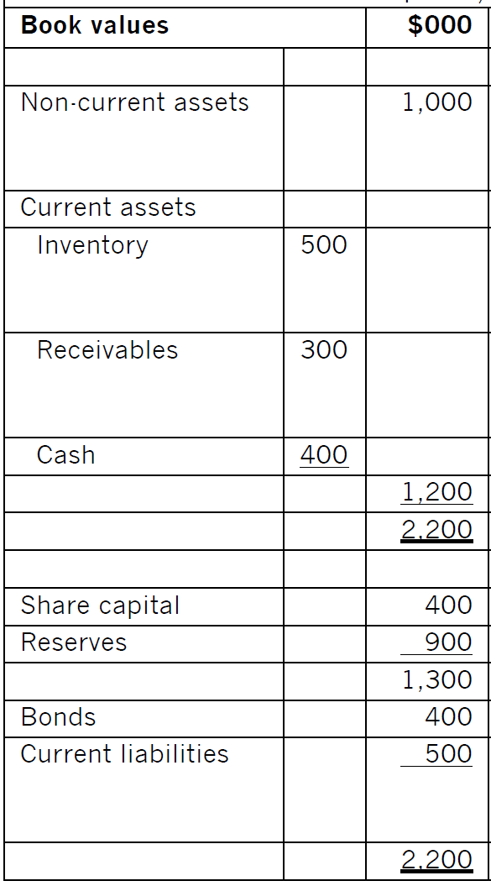{width="2.1830807086614175in" height="3.937007874015748in"}

#### 2.2 Income-based Valuation Methods 

##### 1. Price/Earnings Ratio

The P/E ratio of a quoted company takes into account the expected growth rate of that company (i.e. it reflects the market's expectations for the business).

Using published P/E ratios as a basis for valuing unquoted companies may indicate an acceptable price to the seller of the shares.

P/E ratio = $\frac{market\ price\ per\ share}{earnings\ per\ share}$

EPS = $\frac{(profit\ for\ the\ year\  - \ preference\ dividends)}{number\ of\ ordinary\ shares}$

Therefore:

Market price per share = P/E ratio \* earnings per share

Value of total equity = P/E ratio \* ($profit\ for\ the\ year\  - \ preference\ dividends)$

This can be used to value the shares in an unquoted company as follows:

Step 1 Select the P/E ratio of a similar quoted company

Step 2 Adjust downwards (usually 1/3 -- 1/2) to reflect the additional risk of unquoted and non-marketability of unquoted shares

Step 3 Determine the maintainable earnings for the unquoted company's EPS

Step 4 value of a share = EPS \* appropriated P/E ratio (unquoted company)

**Lecture Example 2**

Estimating the value of a small chain of UK-based grocery shops using P/E ratio method. The company has just enjoyed post tax earnings of \$200,000, out of which it paid a dividend of \$50,000.

The following information of three large UK quoted supermarket chains (Morrison (W), Sainsbury and Tesco) on 24 December 2011 are:

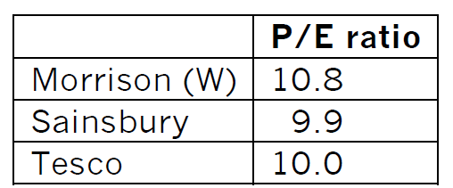{width="1.8957338145231846in" height="0.7874015748031497in"}

**Comments on P/E Ratio Method**

This method reflects the earnings potential of a company. However, as minority shareholders typically have limited influence to affect earnings, so, valuation based on earnings is less relevant for purchases of minority shareholdings, it is particularly appropriate for purchase of majority stakes.

Problems with P/E ratio method:

- It's very difficult to find a suitable \"proxy\" (i.e. a listed company very similar to the unquoted one).

- Accounting earnings are more subjective than cash flows -- Accounting earnings are affected by non-cash items (e.g. depreciation expense) and accounting policy choices.

- Earnings manipulation -- The earnings of the unquoted company may be intentionally inflated and may not represent future earnings fairly. Information asymmetry means the seller will know more about the company than the buyer.

- Historical data -- The P/E ratio is often based on historical earnings, which may not reflect earnings potential.

- Loss-making companies -- If the unquoted company is loss-making, the P/E ratio method results in a (meaningless) negative value for its equity.

##### 2. Earnings Yield Method

Earnings yield it simply the reciprocal of **the P/E ratio** method (and therefore has similar problems and weaknesses).

Earning Yield (EY) = $\frac{EPS}{market\ price\ per\ share}$ \* 100

Therefore:

Share price = $\frac{EPS}{earnings\ yield}$

#### 2.3 Cash Flow-based Valuation Methods

##### 1. Dividend Valuation Model

The market value of a share equals to the present value of future dividends shareholder received.

If dividends are forecast to grow at a constant annual rate to perpetuity, the valuation formula is:

$$P_{0} = \frac{D_{0}(1 + g)}{k_{e} - g}$$

Where:

P~0~ = ex-div share price at time 0

D~0~ = current dividend at time 0

g = annual growth rate of dividend

$k_{e}$ = shareholder's required rate of return (cost of equity)

$D_{0}(1 + g)\ $is dividend in one year

The DVM can be applied to the valuation of shares as follows:

Step 1 Identify the current dividend

Step 2 Estimate the growth rate of dividends (covered in part E).

-assume the historical growth rate will apply into the future;

-Gordon's growth approximation

Step 3 Determine the required return using the DVM or CAPM (covered in part E).

Step 4 using the DVM formula.

::: {.callout-tip}
**Example 3**

> Information of company A: Dividend/share just paid = \$0.12, Historical dividend growth rate = 5%/year. This is expected to be maintained in the future.
>
> Information of a suitable listed company (same business and same gearing):
>
> - Share price = \$2.40
> - Dividend just paid = \$0.22
> - Historical dividend growth rate = 10%/year. This is expected to be maintained in the future.
>
> What is the share value of the unlisted company A?

:::

**Comments of DVM**

As an investor with control can change the dividend policy, so this method is suitable for valuing a **minority shareholding**.

**weaknesses:**

- Simplifying assumptions -- The constant growth rate assumption for dividends may not hold true for many companies in the long run, leading to inaccurate valuations. 

- Dependence on dividends -- The DVM is less applicable to a company that does not pay dividends or pays inconsistent dividends. This limitation is particularly relevant for growth-oriented or non-dividend-paying companies. 

- Sensitivity -- The valuation is highly sensitive to the choice of the required rate of return. 

- Shareholder influence -- It has less relevance for valuing a majority shareholding.

::: {.callout-tip}
**Example 4 (March 2016)**

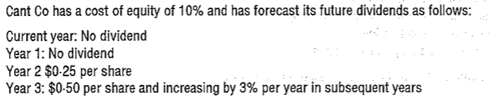{width="4.84251968503937in" height="0.984251968503937in"}

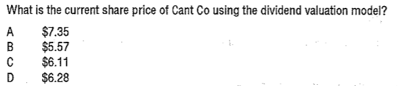{width="4.55511811023622in" height="0.984251968503937in"}
:::

##### 2. Discounted Cash Flow Basis

A business can be viewed as a combination of its underlying projects. Just as the value of an individual project equals the present value of its future cash flows, the total value of the business should also equal the present value of the company's cash flows.

**Two Application Approaches of DCF Methods**

Approach 1

- Estimating cash flows generated by the company, and cash flows are after-interest and after-tax (representing cash flows to ordinary shareholders)

- Discounting cash flows at the cost of equity to calculated the MV of equity

Approach 2

- estimating cash flows generated by the company and cash flows are before-interest and after-tax (representing cash flows to all investors)

- discounting cash flows at the WACC to calculate the MV of the company

- MV of equity= Company value---Market value of debts

**Comments on DCF Basis**

This method is suitable for value majority shareholdings. Theoretically, it is the best valuation model as it considers the intrinsic value of a business based on its expected future cash flows and allows for the time value of money, and **incorporate synergies**.

Although it enables a more precise assessment of a company's worth, it still has problems and weaknesses:

- Estimation challenges -- Estimating future cash flows and determining an appropriate discount rate can be complex and uncertain, especially for long-term forecasts. 

- Sensitivity to assumptions -- Small changes in assumptions about future cash flows and discount rates can lead to significantly different valuations. 

- Unpredictable cash flow -- A DCF-based valuation may be unsuitable for startups or high-growth companies with unpredictable cash flows.

**Example 5**

D company wishes to make a bid for TED. TED makes after-tax profits of \$40,000 a year. D believes that if further money is spent on additional investments, the after-tax and interest cash flows could be as follows.

| Year | 0 | 1 | 2 | 3 | 4 | 5 |
|------|---|---|---|---|---|---|
| Cash flow | (100,000) | (80,000) | 60,000 | 100,000 | 150,000 | 150,000 |

The cost of equity of TED is 15% and the company expects all its investments to payback, in discounted terms, within five years.

- \(1\) What is the maximum price that the company should be willing to pay for shares of TED?

- \(2\) What is the maximum price that the company should be willing to pay for shares of TED if it decides to value the business on the basis of cash flows in perpetuity, and annual cash flows from year 6 onwards are expected to be \$120,000?

::: {.callout-tip}
**Example 6**

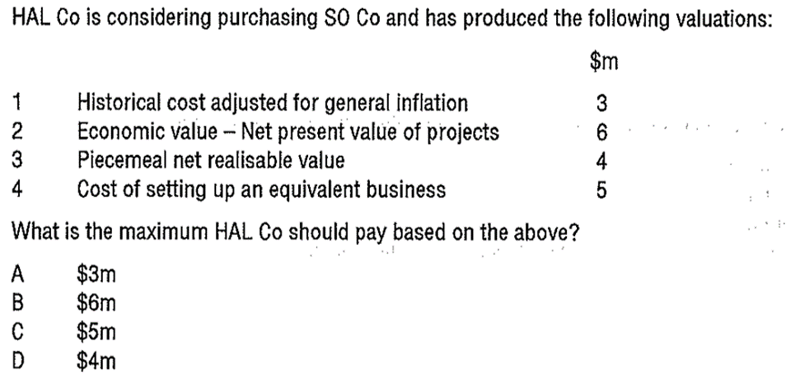{width="4.866141732283465in" height="2.3622047244094486in"}
:::

#### 2.4 Financial Market Efficiency

##### 1. Types of Efficiency

There are three types of efficiency can be distinguished in the context of the operation of financial markets.

\(1\) Allocative efficiency

Does the market attract funds to the best companies?

\(2\) Operational efficiency

Does the market have low transaction costs and a convenient trading platform?

\(3\) Information processing efficiency

Do share price quickly and accurately reflect all known information about the company?

##### 2. The Efficient Market Hypothesis 

The efficient market hypothesis considers information processing efficiency.

Three potential levels of information processing efficiency

**(1) Weak-form Efficiency**

Share prices fully and fairly reflect all the information contained in the record of past share prices. Share prices will follow a **random walk** by responding to new information as it becomes available.

In a weak-form efficiency market, it should not be possible to forecast price movements by reference to past trends. This means Chartism or technical analysis should not be able to outperform the market consistently. On the other hand, fundamental analysis would be able to predict future share price movements.

- **Technical analysis** attempt to predict share price movements by assuming that past price patterns will be repeated.

- **Fundamental analysis** evaluate shares by studying everything from the overall economy and industry conditions to the financial strength and management of individual companies.

- **Random walk -** Share price will have an intrinsic or fundamental value, but this value will be altered as new information becomes available, so the actual share price on any given day will fluctuate in an unpredictable (random) way around the intrinsic value.

**(2) Semi-strong Form Efficiency**

Share prices reflect **all historical and publicly available information.** Share prices respond quickly and accurately to new information as it becomes publicly available.

In semi-strong market, Individuals cannot beat the market by analyzing public information as these already be reflected in share prices. And price movements can only be forecast using inside information. This is known as insider trading.

**(3) Strong Form Efficiency**

Share prices reflect **all information**, including past, public and private information.

If the stock market is strong-form efficiency, shares prices will respond to new development and events **before** they even become public knowledge, and gains through insider dealing are impossible as the market already knows everything.

Major markets (e.g. the London and New York Stock Exchanges), have strict rules to prohibit insider dealing. Therefore, such markets are regarded as **semi-strong efficient**.

The three forms of efficiency describe how share prices react to information from the company. If prices do not react to new information, there is no efficiency at all.

**Implications for the Financial Manager**

The level of efficiency of the stock market has implications for financial managers:

- Timing of new issues: unless the market is fully efficient, the timing of new issues remains important. This is because the market does not reflect all the relevant information. Therefore, an advantage could be obtained by issuing shares just before or after additional information becomes available to the market.

- Project evaluation: if the market is not fully efficient, the share price is not fair; therefore, the rate of return required from that company by the market cannot be accurately known. If this is the case, it is not easy to decide what rate of return to use to evaluate new projects.

- Creative accounting: unless a market is fully efficient, creative accounting can still be used to mislead investors.

- Mergers and takeovers: where a market is fully efficient, the price of all shares is fair. Therefore, if a company is taken over at its current share value, the purchaser cannot hope to make any gain unless economies can be made through scale or rationalization when operations are merged. Unless these economies are significant, an acquirer should not be willing to pay a substantial premium over the current share price.

- Validity of current market price: the share price is fair if the market is fully efficient. In other words, an investor receives an appropriate risk/return combination for his investment, and the company can raise funds at a reasonable cost. If this is the case, there should be no need to discount new issues to attract investors.

**The Paradox of Efficient Markets**

Market efficiency relies on investors actively buying/selling shares to create a liquid market where fair prices emerge. Investors will actively trade shares if they believe that bargains are available (a signal to buy) and other shares are overvalued (a signal to sell).

However, if the market is efficient, such mispriced shares will not exist. This is the paradox of efficient markets -- investors must believe that the market is inefficient so that it becomes efficient.

#### 2.5 Practical Factors in Business Valuation

\(1\) Marketability and liquidity

The lack of marketability of shares in unquoted companies will reduce their value relative to shares in quoted companies. So, the P/E ratio of a comparable quoted company usually would be adjusted downwards by as much as 40% when valuing unquoted shares.

\(2\) information sources and availability

There is much less information may be available for unquoted companies because they may not be required to publish accounts and are also unlikely to be watched by analysts or news agencies. This asymmetry of information between managers and potential investors in unquoted companies may lead to investors potentially undervaluing the shares.

(3)Market imperfections and pricing anomalies（反常现象）

the DVM is based on perfect market assumptions. However, markets are not perfect markets, as evidenced by the following:

- Irrational investor behavior

- Pricing anomalies which appear to contradict perfect markets, such as:

-overreaction effect: share prices overreact to unexpectedly good/bad news initially, then slowly move back toward their fundamental value. 

\- **calendar effects:** such as share price often falling at particular times of this week (eg Monday morning) and high returns often occurring in particular months.

\(4\) Market capitalization

Market capitalization = the number of issued ordinary shares × market price per share

However, market capitalization is not necessarily the amount that would have to be paid for the company's entire equity. The quoted share price is for a minority shareholding. A significant premium would usually have to be paid if control is required.

On the other hand, there may be situations where the entire capital can be acquired at below-market capitalization (e.g. a small group of people holds a large proportion of the target company's shares). If the existing investors tried to dispose of their holdings via the market, they may be willing to sell \"off exchange\" at a small discount to the current quoted price.

\(5\) behavioral finance

Behavioral finance attempts to explain how decision makers take financial decisions in real life, and why their decisions might not appear rational and have unpredictable consequences. This contrasts many traditional theories, which assume investors make rational decisions.

**Herding** or herd mentality may be explained by:

- the desire to conform and not to act differently from others (e.g. fund managers tend to follow each other's strategies);

- individual investors, lacking confidence, believe that a large group of other investors cannot be wrong. 

If many investors follow a herd instinct to buy shares in a certain sector, a significant price rise for shares in that sector can lead to a stock market **bubble**.

**Noise traders** -- are investors who do not base buy/sell decisions on rational analysis (i.e. without using fundamental data about the company's performance). Noise traders generally have poor timing, follow trends and overreact to good and bad news.

**Loss aversion **means that some investors:

- avoid investments with the risk of making losses, even though expected value analysis suggests that, in the long term, they will make significant capital gains;

- prefer to invest in companies that look likely to make stable but low profits rather than those that may generate higher profits in some years but possibly losses in others.

The "**momentum effect**\" in stock markets can create optimism (e.g. investors believe a trend in price rises will continue), which increases willingness to invest in companies that show prospects for growth. If a momentum effect exists, it will likely lengthen a stock market boom (or bust) period.

An **overconfident** investor tends to believe that they are better and more able than they are. This excessive confidence can cause the investor to be reckless and make mistakes.

Therefore, individuals may not make decisions based on a rational analysis of all available information. This could lead to prices for an individual company and the market being valued either very high or very low.

::: {.callout-tip}
**example 7**

> WC company announces that it decided yesterday to invest in a new project with a huge positive NPV. The share price doubled yesterday.
>
> What does this appear to be evidence of?
>
> A a semi-strong form efficient market
>
> B a strong form efficient market
>
> C technical analysis
>
> D a weak form efficient market

:::

::: {.callout-tip}
**Example 8**

> Sarah decides to plot past share price movements to help spot patterns and create an investment strategy. What does Sarah believe the stock market is?
>
> ( ) completely inefficient
>
> ( ) weak form efficient
>
> ( ) semi-strong form efficient
>
> ( ) strong form efficient

:::

::: {.callout-tip}
**Example 9**

> In relation to capital markets, which of the following statements is true?
>
> A. The return from investing in larger companies has been shown to be greater than the average return from all companies
>
> B. Weak form efficiency arises when investors tend not to make rational investment decisions
>
> C. Allocative efficiency means that transaction costs are kept to a minimum
>
> D. Research has shown that, over time, share price appear to follow a random walk

:::

::: {.callout-tip}
**Example 10-2014 dec**

> An investor believes that they can make abnormal returns by studying past share price movements.
>
> In terms of capital market efficiency, to which of the following does the investor's belief relate?
>
> **A** Fundamental analysis
>
> **B** Operational efficiency
>
> **C** Technical analysis
>
> **D** Semi-strong form efficiency

:::

### 3 Valuation of Debts

The market value of any debt should equal the present value of the future payments to the investor discounted at the required return.

#### 3.1 Irredeemable Bonds

For irredeemable bonds, there will be a fixed annual payment of \"coupon\" interest into perpetuity, with no principal repayment.

$$P_{0} = \frac{I}{k_{d}}$$

Where: P~0~ = ex-interest market price

I = annual interest payment

K~d~ = required return of bond holders

#### 3.2 Redeemable Bonds

The market value of a redeemable bond should equal the present value of the coupon interest (paid each year until maturity) and the redemption price (paid at maturity), discounted at the investors' required rate of return.

P~0~=face value ×coupon rate × AF(k~d~, n)+redemption value × DF(k~d~, n)

::: {.callout-tip}
**Example 11**

> A company has 7% loan notes in issue which are redeemable in 7 years' time at a 5% premium to their nominal value of \$100 per loan note. The required return of debt holder is 6%.
>
> What is the current market value of each loan note?

:::

#### 3.3 Convertible Bond

**Convertible bonds** allow the investor to choose between redeeming the bond at some future date or converting them into a predetermined number of ordinary shares.

Conversion value = conversion ratio \* market price per share at conversion date

Conversion premium = market value of convertible bonds− current conversion value

Estimating the market value of convertible bonds:

- Firstly, decide whether the investor will choose redemption or conversion

- Secondly, using the annuity formula below

P~0~ = face value ×coupon rate × AF (k~d~, n) +

higher of (redemption value, conversion value) × DF(k~d~, n)

Floor value = the value of convertible bonds assuming investors will redemption

::: {.callout-tip}
**Lecture Example 12**

> A company has issued 9% convertible which can be converted into 35 shares in 5 years' time or redeemed at par of \$100. An investor's required return is 10% and the current share price of the company is \$2.5 which is expected to grow by 4% per year.
>
> Calculate the MV, floor value and conversion premium of convertible bond.

:::

**Different Conversion/redemption Dates**

::: {.callout-tip}
**Lecture example 13**

> A company has 7% loan notes in issue which are redeemable at their nominal value of \$100 per loan note in eight years. Alternatively, each loan note is convertible after seven years into 11 ordinary shares. The company's ordinary shares are currently trading at \$6.50 per share. The before-tax cost of debt of the convertible loan notes is 8%.
>
> Required:
>
> Calculate the current MV of each bond, assuming the share price increases by:
>
> - 4% per year
> - 6% per year

:::

#### 3.4 Preference Shares

As preference dividends are a fixed percentage of the share's nominal value, and the share price becomes the present value of a perpetuity:

$$P_{0} = \frac{D}{k_{p}}$$

Where: D is the constant preference dividend.

K~P~ is the required return of investors.

#### 3.5 Interest Rate and Bonds Value 

Market interest rates and the market value of bonds have an inverse relationship. This is because the market value of a loan note equals the present value of the fixed future payments it will make to the investor. If market interest rates (i.e. discount rates) fall, the present value of a loan note's future cash flows will rise, and with it, the loan note's market price.

::: {.callout-tip}
**Past example: Bluebell Co (March/June 2019)**

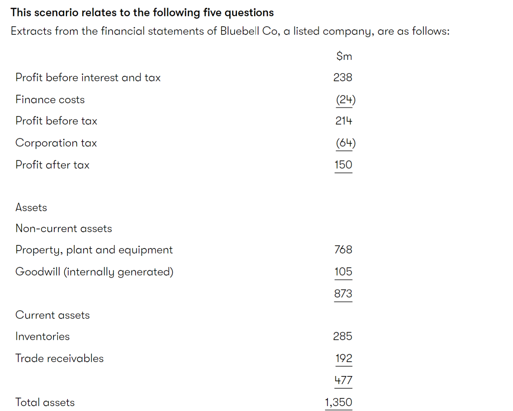{width="5.768055555555556in"}

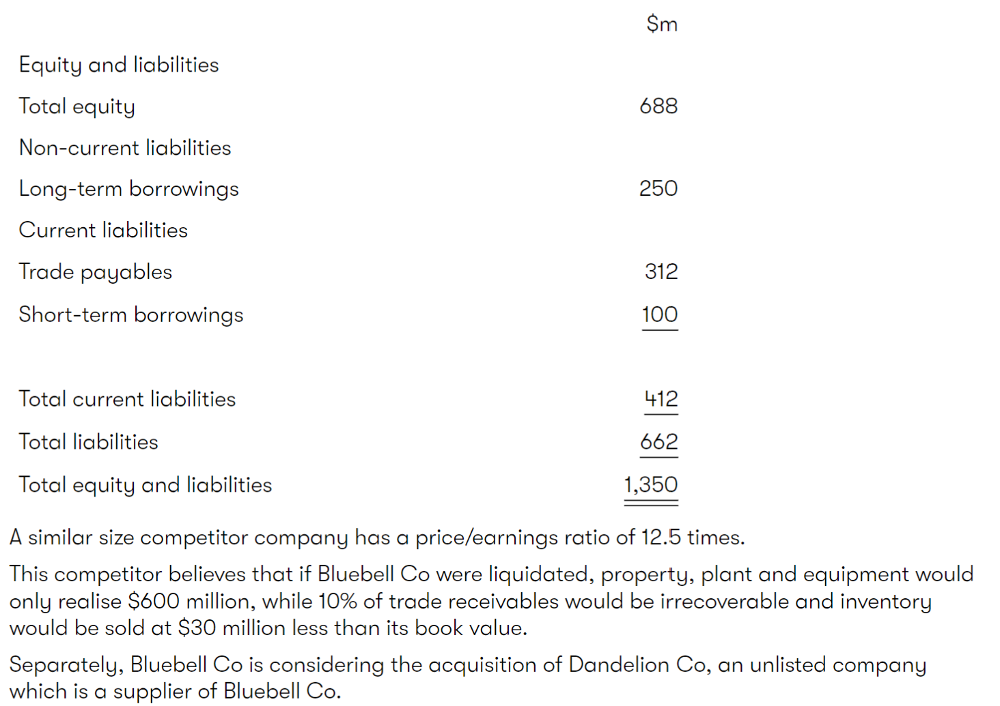{width="5.768055555555556in"}

\(1\) 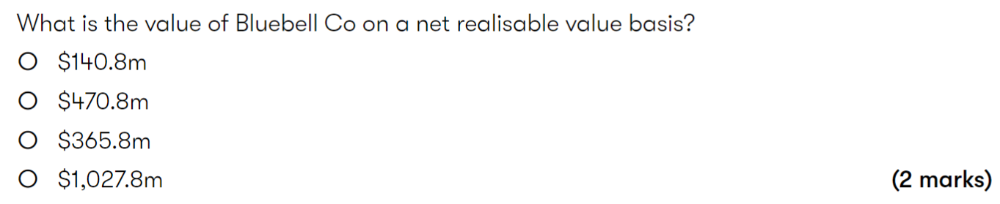{width="5.768055555555556in"}

\(2\)

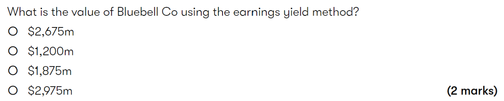{width="5.768055555555556in"}

\(3\)

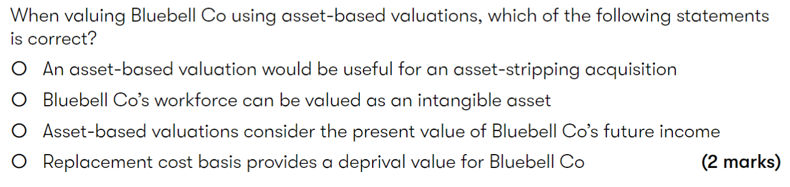{width="5.768055555555556in"}

\(4\)

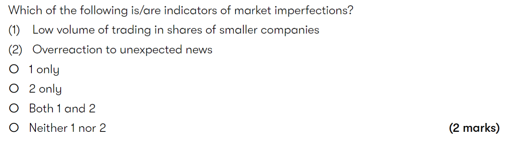{width="5.768055555555556in"}

\(5\)

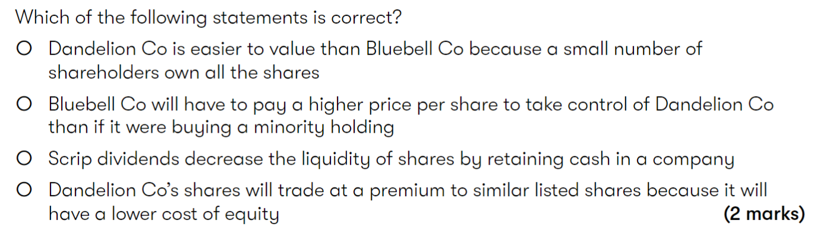{width="5.768055555555556in"}
:::

