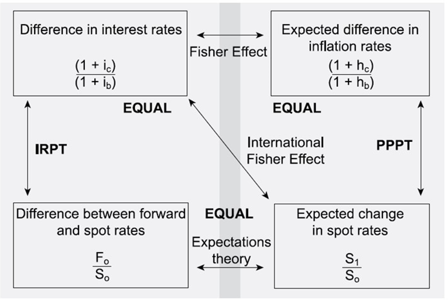
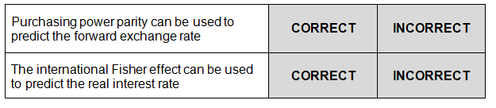
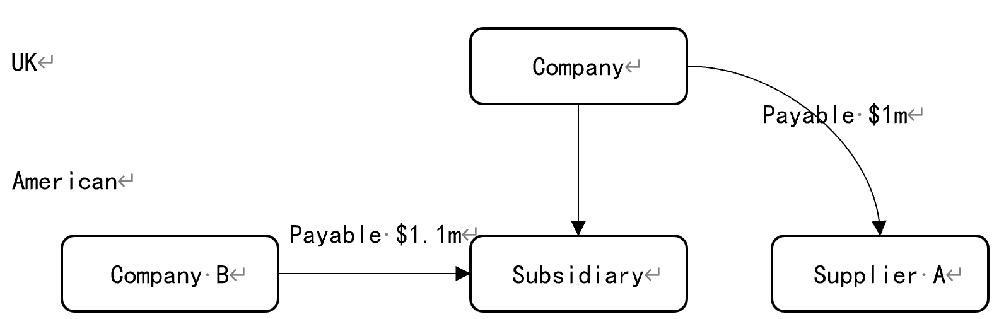
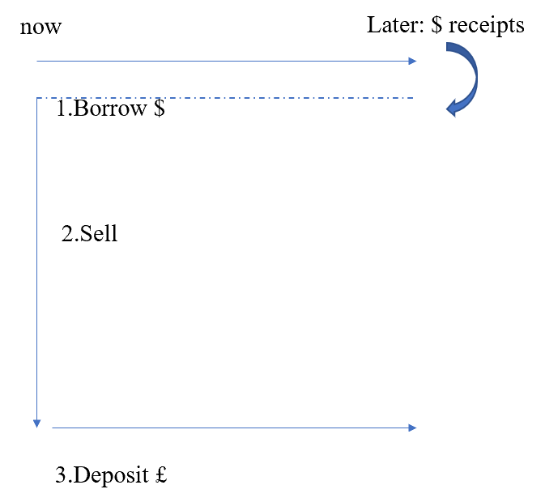
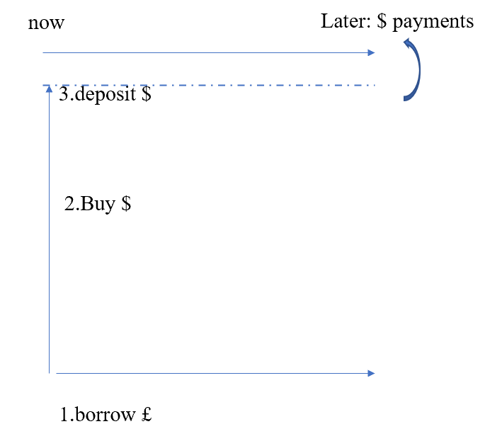
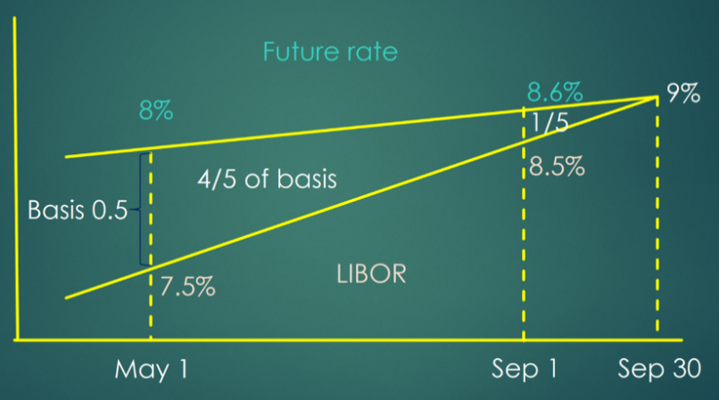
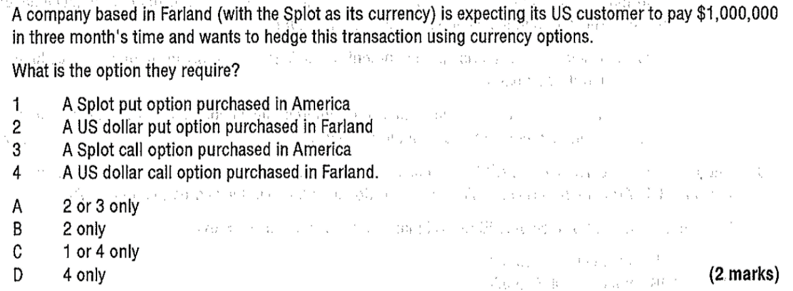
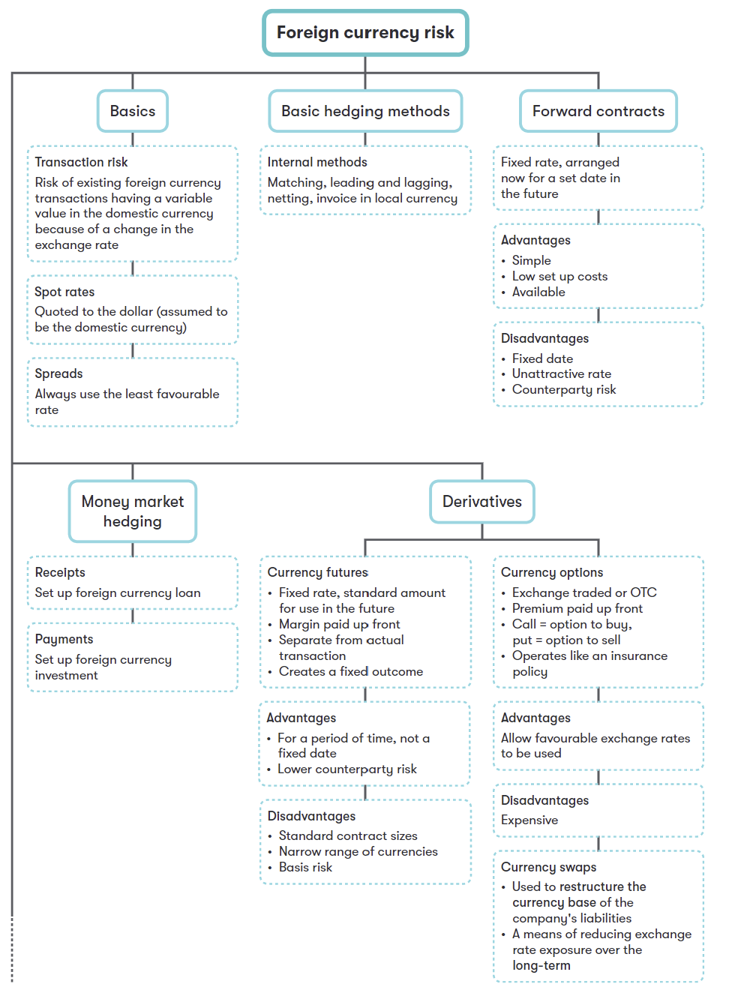
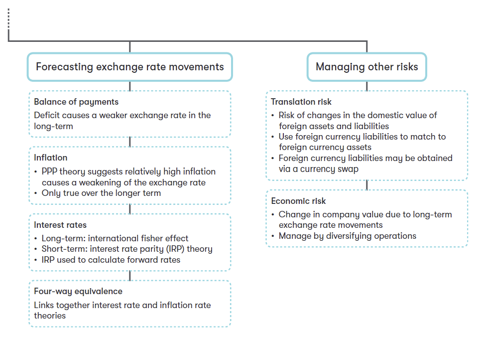

## 14 Foreign Currency Risk

### Syllabus  {.pagebreak}
**G. Risk Management**

**1. The nature and types of risk and approaches to risk management**

a\) Describe and discuss different types of foreign currency risk:\^\[2\]\^

i. translation risk

ii. transaction risk

iii. economic risk.

**2. Causes of exchange rate differences and interest rate fluctuations**

a\) Describe the causes of exchange rate fluctuations, including:

i. balance of payments\^\[1\]\^ 

ii. purchasing power parity theory\^\[2\]\^ 

iii. interest rate parity theory\^\[2\]\^ 

iv. four-way equivalence.\^\[2\]\^

b\) Forecast exchange rates using:\^\[2\]\^

i. purchasing power parity

ii. interest rate parity.

**3. Hedging techniques for foreign currency risk**

a\) Discuss and apply traditional and basic methods of foreign currency risk management, including:

i. currency of invoice\^\[1\]\^ 

ii. netting and matching\^\[2\]\^ 

iii. leading and lagging\^\[2\]\^ 

iv. forward exchange contracts\^\[2\]\^ 

v. money market hedging\^\[2\]\^ 

vi. asset and liability management.\^\[1\]\^

b\) Compare and evaluate traditional methods of foreign currency risk management. c) Identify the main types of foreign currency derivatives used to hedge foreign currency risk and explain how they are used in hedging. (No numerical questions will be set on this topic)\^\[2\]\^

### 1 Foreign Currency Risk {.pagebreak}

#### 1.1 Exchange Rate

Increasingly, many businesses have dealings in foreign currencies and, unless exchange rates are fixed with respect to one another, this introduces risk. An exchange rate is the rate at which one country's currency can be traded in exchange for another country's currency.

Exchange rate can be expressed as:

\$/£ 1.3425± 0.0025 or \$/£ of 1.340-1.3450

- bid prices-the bank's buying rate
- offer price-the bank's selling rate

To remember which of the two prices is relevant to any particular foreign exchange transaction, just remember the bank will always trade at the rate that is more favorable to itself.

- Spot exchange rate -- the market exchange rate for buying/selling the currency for immediate delivery.
- Forward exchange rate -- tthe exchange rate for buying or selling the currency at a specific date in the future.

#### 1.2 Types of Foreign Currency Risks

Foreign exchange risk (currency risk) is the risk arising from unforeseen changes in an exchange rate or the value of a currency. There are three types of currency risk: transaction risk, translation risk and economic risk.

##### 1. Transaction Risk

This arises when a company is importing or exporting. If tthe exchange rate moves between agreeing the contract in a foreign currency and paying or receiving the cash, the amount of home currency paid or received will alter, making those future cash flows uncertain.

::: {.callout-tip}
**example 1**

> An UK exporter now agrees to sell \$100,000 to a US customer, payable in 6 months.
>
> Assuming the current spot rate is 1.5 \$/£, and the spot rate is \$/£:1.8 after 6 months. the impact of this movement on an exporter will be:
>
> The UK exporter is expecting to receive
>
> However, as \$ weakens over 6 months the amount received would be worth only
>
> The exporter will loss due to foreign currency \$ weakens.
>
> If the spot rate is \$/£:1.2 after 6 months, the impact of this movement on an exporter will be:
>
> the UK exporter is expecting to receive
>
> however, as \$ strengthens over 6 months the amount received would be worth
>
> The exporter will gain due to foreign currency \$ strengthens.

:::

**The Effect of Exchange Rate Movements**

If a foreign currency [weakens]{.underline} it is simply worth less in our home currency.

- Exporter suffers because they will receive less
- Importer gains because they will pay less

If a foreign currency [strengthens]{.underline} it is simply worth more in our home currency.

- Exporter gains because they will receive more
- Importer suffers because they will pay more

##### 2. Economic Risk

The risk that cash flows will be affected by long-term exchange rate movements. (The source of economic risk comes from the change in the competitive strength of imports and exports due to movements in tthe exchange rate. It is **a longer-term effect**.

As the value of the company is the present value of its future cash flows, economic risk is a significant issue for the financial manager.

Lecture example

> The UK company is exporting to a eurozone country and the euro weakens from say €/£ 1.1 to €/£ 1.3 (**euro depreciation**).
>
> Any exports from the UK will be more expensive when priced in euros (e.g. goods where the UK price is £100 will cost €130 instead of €110), making those goods less competitive in the European market.
>
> Similarly, goods imported from Europe will be cheaper in sterling than they had been, so those goods will have become more competitive in the UK market.

Note that a company can experience economic risk even if it has no overt dealings with overseas countries. If competing imports could become cheaper you are suffering risk arising from currency rate movements.

Economic risk is difficult to mitigate, especially for small companies with limited international dealings. In general, diversification of the customer and supplier base across different countries will reduce exposure to this type of risk to an extent.

- Try to export or import from more than one currency zone and hope that the zones don't all move together, or if they do, at least to the same extent.
- Make your goods in the country you sell them. Although raw materials might still be imported and affected by exchange rates, other expenses (such as wages) will not be subject to exchange rate movements.

##### 3. Translation Risk

Translation risk occurs when a company has foreign subsidiaries or branches.

If the subsidiary is in a country whose currency weakens, the subsidiary's assets will be less valuable in the statement of financial position of the parent company, resulting in foreign exchange losses.

Although such gains/losses can be significant, they are not cash flows. So, in theory, they should not affect the value of the company. However:

- Debt covenants often use book values, so foreign currency gains and losses may have real economic consequences if a debt covenant is breached
- Shareholders may attribute great importance to reported profits/losses

Translation risk can be managed by:

- Match the foreign currency-denominated assets with that of foreign currency-denominated liabilities.

### 2 Causes of Exchange Rates Fluctuations

Factors that influence exchange rates include:

- **Balance of payments** in services and goods
- comparative **rate of inflation** in different countries
- Comparative **interest rate** in different countries
- Sentiment of foreign exchange market participants
- Speculation
- government policy on intervention to influence exchange rate

#### 2.1 Interest Rate Parity

The **interest Rate Parity theory** claims that the forward exchange rates is based on the spot rate and the interest rate differential between the two currencies.

- The expected return on different currency deposits will be equal. If this is not so, investors holding the currency with the lower interest rates would switch to the other currency ensuring that they would not make a loss. This is known as arbitrage.
- If enough investors acted in this way, forces of supply and demand would lead to a change in the forward exchange rate to eliminate any additional benefit in interests.

$\mathbf{F}_{\mathbf{0}} = \mathbf{S}_{\mathbf{0}} \times \frac{\mathbf{1} + \mathbf{ic}}{\mathbf{1} + \mathbf{ib}}$

F~0~: forward rate

S~0~: spot rate

I~c~: interest rate in foreign country

I~b~: interest rate in base country

IRPT predicts that the country with **the higher interest rate** will see the forward rate for its currency subject to a **depreciation**.

**Using IRPT to Forecast Forward Rate**

The **expectations theory** claims that the forward rate is an unbiased predictor of the future spot rate.

::: {.callout-tip}
**example 2**

> Assume the interest rate of a one-year US bond is 9% and the interest rate of a UK bond with similar risk is 7%. Current spot rate is ﹩/￡:1.5.
>
> Predict what tthe exchange rate is likely to be in one year.

:::

#### 2.2 Purchasing Power Parity Theory (PPPT)

Purchasing power parity theory predicts that the future spot exchange rate is based on the current spot rate (the purchasing power of one currency relative to another) and the inflation rate differential between the two currencies (relative price changes). For example, if the inflation rate is higher in the Us than in the Uk, PPP predicts that the value of the dollar will fall.

The formula:

$\mathbf{S}_{\mathbf{1}} = \mathbf{S}_{\mathbf{0}} \times \frac{\mathbf{1} + \mathbf{hc}}{\mathbf{1} + \mathbf{hb}}$

S~1~: expected spot rate after one year

S~0~: current spot rate

h~c~: expected inflation rate in country c

h~b~: expected inflation rate in country b

::: {.callout-tip}
**example 3**

> the current spot rate between UK sterling and US dollar is \$/£ 1.50. assuming that there is purchasing parity, an amount of commodity costing £2,00 in UK will cost \$300 in US. Over the next year, price inflation in US is expected to be 5% while inflation in UK is expected to be 8%.
>
> What is the expected spot exchange rate at the end of the year?

:::

Using PPPT to predict future spot rate

**Purchasing power model** is a poor predictor of short-term changes in exchange rates.

- The market is dominated by speculative transactions (98%) as opposed to trade transactions; therefore, purchasing power theory breaks down.
- Governments may manage exchange rate

It is likely that the purchasing power parity model may be more useful for predicting long-run changes in exchange rates since these are more likely to be determined by the underlying competitiveness of economies.

#### 2.3 the International Fisher Effect

According to the fisher effect, countries with a higher rate of inflation have higher nominal interest rates to offer the same real return as countries with low inflation.

According to the international fisher effect, the spot exchange rate will change of offset nominal interest rate difference between countries.

- The international effect assumes that the real interest rate will be equal across countries as a result of adjustment to spot exchange rate.
- So, the interest rate differential between two countries should be equal to the expected inflation differential.
- Therefore, countries with higher expected inflation rates will have higher nominal interest rates.

  $$\frac{1 + i_{a}}{1 + i_{b}} = \frac{1 + h_{a}}{1 + h_{b}}$$

I~a~: the nominal interest rate in country a

I~b~: the nominal interest rate in country b

h~a~: the inflation rate in country a

h~b~: the inflation rate in country b

#### 2.4 Four-Way Equivalence

The **four-way equivalence model** states that in equilibrium, theories that we have been examining are linked.

If interest rates are only different between two countries due to inflation (ie real interest rates are the same in both countries) then:

- Inflation rates can be used to predict the future spot rate (PPPT)
- Long-term interest rates can be used to predict the future spot rate (international fisher effect)
- If short-term interest rate differences explain the difference between the forward rate and the spot rate, then over the long-term this can be seen as an unbiased indicator of expected changes in the spot rate.

{width="4.09375in" height="2.76128280839895in"}

::: {.callout-tip}
**Example 4**

> Handria is a country that has the peso for its currency and Wengry is a country that has the \$ for its currency. The current spot rate is 1.5134 pesos = \$1.
>
> Using interest rate differentials, the one year forward exchange rate is 1.5346 pesos = \$1.
>
> The currency market between the peso and the dollar is assumed perfect and the international fisher effect holds.
>
> Which of the following statements is true?
>
> A Wengry has a higher forecast rate of inflation than Handria
>
> B Handria has a higher nominal rate of interest than Wengry
>
> C Handria has a higher real rate of interest than Wengry
>
> D the forecast future spot rate of exchange will differ from the forward exchange rate

:::

::: {.callout-tip}
**Example 5**

Indicate, by clicking on the relevant boxes, whether the following statements are correct or incorrect?

{width="4.9212959317585305in" height="1.0712379702537183in"}
:::

### 3 Managing Transaction Risk

#### 3.1 Internal Methods

Exchange rate risk may be managed internally in the following ways:

\(1\) **Invoice** in domestic currency - Arrange for the contract and the invoice to be in home currency. This will transfer the transaction risk to the customer. However, this may lead to lost sales.

**(2) Netting -** when there are both sales/receivables and purchases/payables in a foreign currency, so the net exposure is only on the difference between receivables and payables. This is only effectively when there are many sales and purchases in the foreign currency and transaction occur relatively closely.

{width="4.5407020997375325in" height="1.4503346456692914in"}

By netting off group currency flows the net exposure is only for \$0.1m.

\(2\) **Matching** of receipts and payments -- offsetting payments against receipts in a foreign currency using a foreign currency bank account. The left unmatched portion will exposure to currency fluctuations. However, transactions must be relatively close together as few companies can afford keep money in a foreign currency bank account and not use it for months.

**(4) Leading and lagging -** if the currency is expected to strengthen, converting domestic currency into foreign currency earlier than needed to pay suppliers, this is leading; or, if the foreign currency is expected to weaken, then delaying conversion and pay suppliers late (although taking longer than the agreed credit period is questionable business practice). This is lagging.

Note, leading will reduce exposure to risk; lagging does not reduce risk, it is simply taking a gamble.

**(5) Asset and liability management** - overseas subsidiaries borrow locally rather than receive finance from the parent. This reduces the net assets of the subsidiary, and reduces exposure to translation risk on consolidation of the subsidiaries' net assets in the group accounts.

#### 3.2 External Techniques

Transaction risk can be managed using a variety of external hedges, including:

- Forward exchange contracts;
- Money market hedges;
- Currency options;
- Currency futures contracts;
- Currency swaps.

##### 1. Forward Exchange Contracts

A forward exchange contract is a legally binding agreement to sell or buy:

- an agreed amount of a specified currency;
- on an agreed future date (delivery date);
- at an exchange rate fixed today (the forward rate).

Forward contracts are not traded but agreements between a company and a counterparty (e.g. a bank). They are customized to match the company's exact requirements regarding quantity and delivery date.

**The spot rate** is the rate at which you can buy or sell a currency immediately.

**Forward rate** is the exchange rate that given in a forward contract.

::: {.callout-tip}
**example 6-Nedwen**

> Nedwen Co is a UK-based company which has the following expected transactions.
>
> One month: Expected receipt of \$140,000
>
> One month: Expected payment of \$240,000
>
> Three months: Expected receipts of \$300,000
>
> The finance manager has collected the following information:
>
> Spot rate (\$ per £): 1.7820 ± 0.0002
>
> One-month forward rate (\$ per £): 1.7829 ± 0.0003
>
> Three-month forward rate (\$ per £): 1.7846 ± 0.0004
>
> Money market rates for Nedwen Co:
>
> Borrowing Deposit
>
> One-year sterling interest rate: 4.9% 4.6
>
> One-year dollar interest rate: 5.4% 5.1
>
> Assume that it is now 1 April.
>
> Required:
>
> (a)Calculate the expected sterling payments in one month and receipts in three months using the forward market.
>
> (b)Calculate the expected sterling payments in one month using a money-market hedge and recommend whether a forward market hedge or a money market hedge should be used.

:::

a forward contract can remove uncertainty about exchange rate changes in the future. it can hedge against the risk of an adverse movement in the future exchange rate, and also loses the opportunity to gain from a favorable movement in the spot rate.

Lecture example -- what happens if sale falls through?

> Suppose a UK company has \$30,000 receipts in 6 months. The current spot rate is \$/£: 1.4. worrying tthe exchange rate will increase, the company contracts a 6-month forward exchange contract of selling \$30,000 with a bank, the 6-month forward rate is \$/£: 1.5. The spot rate becomes \$/£: 1.2 after 6 months.
>
> What happens if the US customer fails to pay after 6 months?
>
> The company should fulfil that commitment: sell \$30,000 to the bank at the forward rate.
>
> firstly, the company has to buy \$30,000 using the spot of \$/£: 1.2, which costs the company 30, 000/1.2=£25,000.
>
> then, the company sell the \$30,000 to the bank at the forward rate and get 30, 000/1.5=£20,000.
>
> the fulfillment of the contract will incur a loss of £5,000 to the company. This process is known as closing out, the company could win or lose on it depends the spot rate at the time.

**Advantages of Forward Contracts**

- It is OTC transactions and can be tailored to the exact requirement regarding quantity and delivery date.
- It can be available for many currencies
- It does not require any margin to be posted (unlike future contracts). However, there will be a small fee to set up a forward contract.

**The Main Disadvantages of Forward Contracts**

- it is a legally binding contract with a bank; the physical delivery must occur.
- No opportunity to benefit from favorable movements in exchange rates

Therefore, forward contracts are not a flexible method of hedging.

##### 2. Money Market Hedge

A technique to lock in the value of a foreign currency transaction in terms of the organization's domestic currency using a combination of investing, borrowing and a spot currency exchange.

**Hedging Steps for an UK Exporter (has \$ Receipts)**

(1) borrowing dollars \$ now (the intention is that the dollar receipts will pay the dollar loan)

the amount of borrowing: X× (1+interest rate of borrowing) = foreign currency receipts

**(2) Converting** These Dollars into Sterling at Current **spot Rate**

amount of domestic funds: X/S~0~

(3) Depositing the sterling received in domestic bank for the same period with foreign receipt.

(4) Using the future dollar receipt to repay the dollar bank loan.{width="3.0416666666666665in" height="2.8020833333333335in"}

A money market hedge effectively produces a \"homemade\" forward exchange rate. 

**Hedging Steps for an Importer (has Dollar Payment)**

(1) **borrowing** an amount of sterling now and converting these sterlings into dollars at current spot rate

> amount of borrowing funds: X/S~0~

(2) depositing the amount of dollar in foreign bank account

The amount of deposit: X× (1+deposit rate) = \$ payments

(3) then pay the dollar payments with the dollar deposit

{width="3.046527777777778in" height="2.770138888888889in"}

Because the money is changed now at the spot rate, the transaction is immune from future changes in tthe exchange rate. however, market hedge has obvious cash flow effect:

- for an exporter, the company will have money now rather than have to wait several months.
- for an importer with cash flow deficit, this method may bring a greater liquidity risk.

**whether a forward contract or a money market hedge should be used?**

::: {.callout-tip}
**example 6 --Nedwen(b)**
:::

##### 3. Currency Futures

A standard contract for buying or selling a fixed amount of a currency (the contract size) at a fixed price (the future price) on a specified date (the delivery date).

Futures are exchange-traded forward contracts and have various \"delivery dates\" (e.g. March, June, September and December).

A company can choose:

- whether to buy or sell futures; and
- which delivery date to use.

The price of a currency futures contract represents the forward exchange rate for the currencies specified in the contract.

The difference between the futures price and the spot exchange rate is known as the basis in the futures contract. The basis in a futures contract will naturally amortize to zero by the contract's delivery date.

**Steps for Foreign Currency Futures (\$) Are as Follows:**

step 1: enter into a futures contract now according to basic transaction

- buy (or sell) futures now

Step 2: complete the currency transaction on the spot market later

- the currency transaction will have a loss (or profit) due to exchange rate movement

Step 3: close out the futures contract by doing the opposite of step 1

- sell (or buy) futures later

If the futures hedge is correctly performed, any gain on future market will offset a loss (or profit) made on the spot currency markets (and vice versa).

A currency future is like a forward contract in that it fixes tthe exchange rate to use in the future. Currency futures are traded on markets, each contract fixes tthe exchange rate on a large, standard amount of currency and contracts expire at the end of each quarter (march, June, September and December) but can be used on any date up to the expire date. for example, Chicago Mercantile Exchange trade sterling futures contracts with a standard size of £62,500. Only whole number multiples of this amount can be bought or sold.

Lecture example -illustration of futures

> It is currently February and a US company expects to receive £500,000 in June.
>
> The current Spot rate is \$/£: 1.65
>
> The quote for June sterling futures is \$/£: 1.65
>
> standard size future contract is £62,500
>
> The US company wants to hedge against the currency risk, how to set up the hedge?
>
> Step 1: Worrying sterling depreciate (exchange rate fall), so selling futures now (and buy later)
>
> in February -Sell futures now at \$/£ 1.65
>
> Number of contracts = £500,000 /62,500=8
>
> Step 2: Assume the spot rate in June moves to \$/£: 1.70, the future rate in June is also \$/£: 1.70
>
> In June the company receives £500,000
>
> Outcomes on foreign currency markets in June:
>
> in February- Values of £500,000=500,000×1.65=\$825,000
>
> in June- Values of £500,000=500,000×1.70=\$850,000
>
> profit in currency transaction =\$25,000
>
> step 3:in June, do the opposite transaction of step 1 in future market
>
> Outcomes on futures market in June:
>
> Sell £ for \$1.65
>
> buy £ for (\$1.70)
>
> (0.05)
>
> Loss on futures market = 0.05×8×62,500 = \$25,000
>
> This loss made on future market will offset the profit made on currency transactions.

**Advantages of Futures**

- Transaction costs are generally lower than other hedging methods
- Most currency futures contracts are closed out before delivery, it is more flexible than a forward contract which is only valid on a specific day.

**Disadvantages of Futures**

- Currency futures are only available in large, standard, contract sizes, and for a narrow range of currencies (compared to forward contracts). This makes currency futures less suitable for small transactions
- it cannot be tailored to the user's exact requirements.
- It requires to place a deposit (called a margin) with the exchange
- Hedging inefficiencies may be caused by the following reasons:

**-**futures contract is a standard contract;

-basic risk.

**Basic risk** occurs when changes in futures prices are not correlated with changes in exchange rates (or interest rates) on a given date.

::: {.callout-tip}
**example 7**

{width="3.6618055555555555in" height="2.045138888888889in"}

> Which of the following are descriptions of basis risk?
>
> \(1\) It is the difference between the spot exchange rate and currency futures exchange rate
>
> \(2\) It is the possibility that the movements in the currency futures price and spot price will be different
>
> \(3\) It is the difference between fixed and floating interest rates
>
> \(4\) It is one of the reasons for an imperfect currency futures hedge
>
> A 1 only
>
> B 1 and 3
>
> C 2 and 4 only
>
> D 2, 3 and 4
:::

Difference between currency futures and forward contracts:

| Currency futures | Forward contracts |
|---|---|
| Standard contracts | Tailored contracts |
| Traded on the open market | Traded over the counter |
| Flexible close out dates | Fixed settlement date |
| Underlying transactions take place at the spot rate | Underlying transactions take place at the forward rate |
| Cheaper than forwards | Relatively high premium required |

##### 4. Currency Options

Options are an example of derivatives (i.e. a financial instrument based on an underlying asset). In the case of currency options, the underlying asset is a currency.

A currency option gives the right but not the obligation to buy or sell currency:

- A specified quantity of a specified currency;
- at a fixed exchange rate (the exercise price);
- on or before a specified date (expiry date).

the owner of the option can either:

- exercise their right; or
- allow it to lapse (i.e. not exercise it).

however, the company must pay for this flexibility. the cost of an option is known as option premium, and this premium is paid at the date the option is bought and are non-refundable.

A company may buy options:

- on a derivatives market; or
- directly from a bank − known as OTC (\"over-the-counter\").

Call option -- give the holder the right to buy the underlying asset.

Put option - give the holder the right to sell the underlying asset.

Lecture example

> A UK importer is due to pay €100m in 6 months' time. The financial manager worries tthe exchange rate fall and buy a call option on €100m at an exercise rate of €1.155 per £ with a premium of £ 20,000.
>
> If the spot rate moves to €/£ 1.100 in 6 months:
>
> Payment at the exercise rate = 100/1,155 = £ 86.58m
>
> Payment at the spot rate = 100/1,100 = £ 90.91m
>
> The company will exercise the option because the exercise rate in the option is more favorable than the spot rate.
>
> If the spot rate moves to €/£ 1.200 in 6 months:
>
> Payment at the exercise rate = 100/1,155= £ 86.58m
>
> Payment at the spot rate = 100/1,200= £ 83.33m
>
> the company will pay at the spot rate and let the option lapse as the spot rate is more favorable than the exercise rate.

**Advantages of Currency Options**

- Currency options protect against adverse exchange rate movements while allow a company to benefit from a favorable exchange rate movement. It is flexible.
- Exchange-traded options can be sold on if not needed.

**Disadvantages of Currency Options**

- The cost of options (premium) can be expensive
- Exchange-traded options are only available in large, standard, contract sizes, and for a narrow range of currencies

::: {.callout-tip}
**example 8**

{width="5.472222222222222in" height="1.78125in"}
:::

##### 5. Currency Swaps

An agreement in which two parties exchange the principal amount of a loan and the interest in one currency for the principal and interest in another currency.

Currency swaps can eliminate exchange rate risk on foreign currency loans as follows:

- On commencement of the swap -- an exchange of agreed principal amounts, usually at the prevailing spot rate.
- Over the life of the swap -- an exchange of interest payments.
- At the end of the swap -- a re-exchange of principals, usually at the original spot rate (thereby removing foreign currency risk).

Liability on the main debt is not transferred and the parties are liable to **counterparty risk**: if the other party defaults on the agreement to pay interest, the original borrower remains liable to the lender.

Currency swaps provide a means of hedging against exchange rate exposure over a longer period, and can be used to restructure the currency base of the company's liabilities.

Lecture example-swaps

> Consider a UK company X, wishes to invest in Germany. Y is a Germany company wishes to finance funds to pay for up-to-date capital equipment imported from UK. Current spot exchange rate is €1.5 per X and Y could swap currencies.
>
> Step 1: X could borrow £20m from its bank and pay interest at 5%, Y could borrow 30m from its bank and pay interest at 6%. X arranges to swap the £20m for 30m with Y.
>
> Step 2 each year when interest is due:
>
> X receives cash from its German investment and passes the amount of 1.8m (= 30m\*6%) to Y so that Y can settle this interest liability.
>
> Y passes to X £1m (=£20m\*5%) and X settles its interest liability of £1m.
>
> Step 3 at the end of the swap, the original payments are reversed with X receiving back from Y the £20m, X uses this £20m to repay the loan it originally received from its UK bank.

{width="5.768055555555556in" height="7.8720395888014in"}

{width="5.768055555555556in" height="3.9869160104986876in"}

