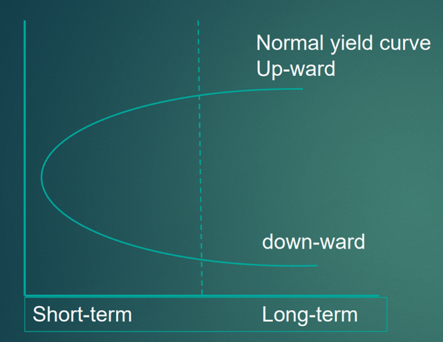
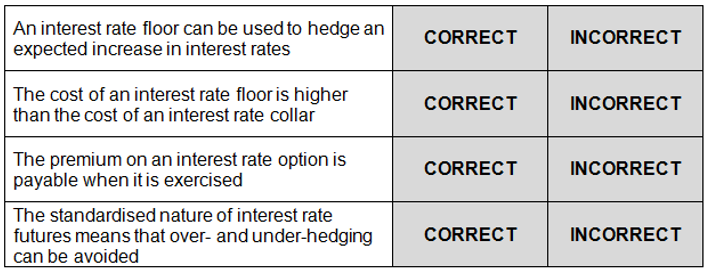
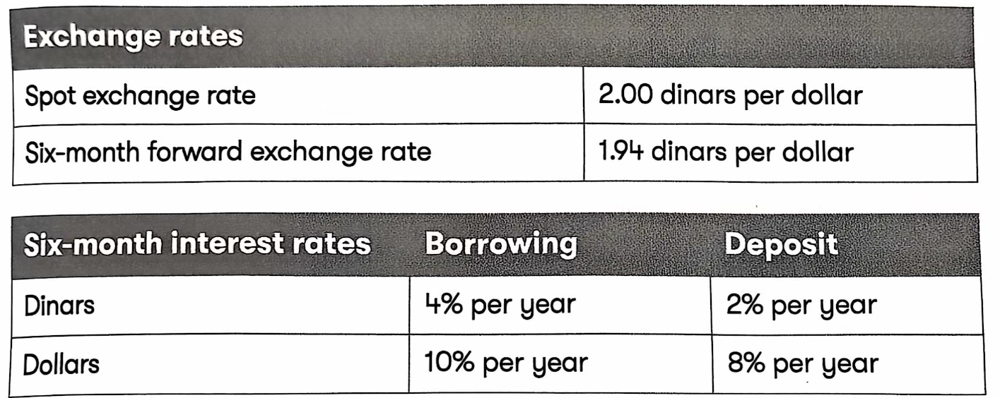
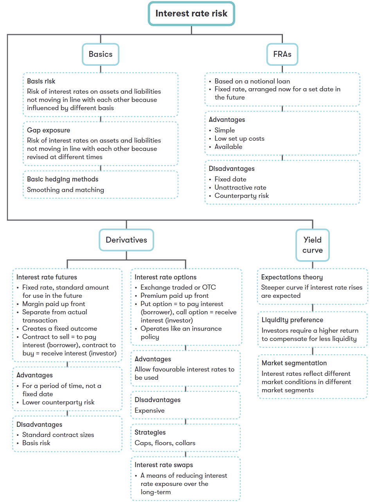

## Chapter 15 Interest Rate Risk

### Syllabus  {.pagebreak}
**G. Risk Management**

**1. The nature and types of risk and approaches to risk management**

b\) Describe and discuss different types of interest rate risk:

i. gap exposure

ii. basis risk.

**2. Causes of exchange rate differences and interest rate fluctuations**

c\) Describe the causes of interest rate fluctuations, including: 

i. structure of interest rates and yield curves

ii. expectations theory

iii. liquidity preference theory

iv. market segmentation.

4. Hedging Techniques for Interest Rate Risk

**4. Discuss and Apply Traditional and Basic Methods of Interest Rate Risk Management, Including:**

i. matching and smoothing 

ii. asset and liability management 

iii. forward rate agreements.

b\) Identify the main types of interest rate derivatives used to hedge interest rate risk and explain how they are used in hedging. (No numerical questions will be set on this topic)^[2]^

### 1 Interest Rate Risk {.pagebreak}

**Interest rate risk** refers to the risk of an adverse movement in interest rates and thus a reduction in the company's cash flow.

**Gap Exposure**

Gap exposure is the difference between the *amounts* of interest-sensitive assets and liabilities (i.e. their market prices are vulnerable to changes in interest rates).

An organization's gap exposure can be identified through \"gap analysis\", grouping interest-sensitive assets and liabilities according to maturity dates. Two different types of gap may occur:

- **Negative exposure --** arises when the amount of liabilities maturing at a specific time exceeds assets maturing simultaneously. This will result in a net exposure if interest rate rise by the time of maturity;
- **Positive exposure** — arises when the amount of assets maturing at a specific time exceeds liabilities maturing simultaneously. The company will face the risk of interest rate falls by maturity.

**Basis Risk**

Even if a company has matched its assets and liabilities with a variable rate of interest, there may still be a risk if the variable interest rates are determined on different bases**.** For example, deposit may be linked to one-month LIBOR rate, and borrowing may be based on the 12-month LIBOR rate. It is unlikely that these rates will move perfectly in line with each other and therefore this is a source of interest rate risk.

This is an example of basis risk.

**Example 1**

> Which of the following is a description of gap exposure?
>
> A The difference between short-term and long-term interest rates
>
> B The difference between the amounts of interest-sensitive assets and liabilities
>
> C The difference between spot interest rates and futures interest rates
>
> D The difference between fixed and floating interest rates

:::

### 2 Causes of Interest Rate Fluctuations

#### 2.1 Influences

Factors Determining the interest rate for a particular financial instrument are:

- General level of interest rates in the economy: These rates are affected by: 

-Inflation;

-Government monetary policy;

-The demand for borrowing;

-Investors' preference for cash;

-International factors (e.g. interest rates overseas and exchange rate movements).

- Level of risk: the higher the level of risk, the greater return an investor will expect.
- Duration of the loan: the longer the length of the loan, the higher the interest rate will be. This is because lending money in the longer term exposes the lender to additional risk (e.g. the risk of default increases).
- The need for the financial intermediaries to make a profit.
- Size: if a large sum of money is lent or borrowed, a lender may be willing to offer a lower interest rate to a borrower than would normally be the case if a smaller amount were transacted. 
- Term structure of interest rates: the return provided by a security will vary according to the length of time before the security matures.

#### 2.2 Yield Curve

The term structure of interest rates refers to how the yield on a security varies according to the borrowing term. If the graph shows the yield to maturity of various government securities against the number of years to maturity, the following "yield curve" might result.

Normally, the yield curve is upward sloping, the longer the term to maturity, the higher the rate of interest is. Occasionally, the yield curve is downward sloping, interest rates may be higher for short-term maturities than long-term maturities.

{width="2.917361111111111in" height="2.2506944444444446in"}**Yield curve**

**Theories Explaining the Shape of Yield Curve**

\(1\) Liquidity preference theory

Yields will rise as the term to maturity increases, as investors require higher returns to compensate for increased illiquidity of long-term bonds.

The upwards sloping yield curve can be explained by liquidity preference theory.

\(2\) Expectations theory

This theory states that the interest rates reflect expectations of future change in interest rates. If the interest rates are expected to rise in the future, the yield curve may rise even more steeply. On the other hand, the curve may fall if interest rates are expected to fall.

\(3\) Market segmentation theory

different investors have a preference for and are interested in different segments of the yield curve. For example,

- Short-term yields are of interest to financial intermediaries such as banks. Therefore, the shape of the yield curve in that segment reflects the attitudes of the investors active in that sector.
- Pension fund managers often prefer investing in long-dated bonds to match against the long-term liabilities of the fund. This can drive up the price of long-dated bonds, lower their yield and possibly result in an inverted (falling) yield curve.
- Where two sectors meet, there is often a disturbance or apparent discontinuity in the yield curve, as shown in the above diagram.

**The Significance of Yield Curve**

Financial managers need to be aware of the shape of the yield curve, as it indicates the likely future movements in interest rates; therefore, it assists in the choice of finance for the company.

For example, a yield curve sloping steeply upwards suggests that interest rate will rise in the future, Long-term fixed rate borrowing may be more appropriate.

### 3 Managing Interest Rate Risk

#### 3.1 Internal Techniques

Internal techniques to hedge interest rate risk include:

(1) Asset and liability management

Not only links assets and liabilities to the same interest rate, but also attempts to match the maturity of assets and liabilities.

\(2\) Matching

this approach aims to have a common interest rate for liabilities and assets.

For example, subsidiary A of a company might be investing in money markets at LIBOR and subsidiary B is borrowing through the same markets. If LIBOR increases, the increase in interest paid can be almost offset by the increase in interest received.

\(3\) Smoothing

Smoothing is where a company keeps an appropriate balance between fixed-rate and floating-rate loan (or deposit). For example, if interest rates rise, only the variable rate loans will cost more and this will have less impact than if all borrowings had been at variable rate.

#### 3.2 External Techniques

##### 1. Forward Rate Agreement (FRA)

An agreement by a bank to enter into a notional loan or accept a notional deposit from a customer for a specified period.

Forward rate agreements (FRAs) allow companies to fix, in advance, either a future borrowing rate or a future deposit rate, based on a notional principal amount over a given period.

**Terms of FRA**

A \$5m 3-9 FRA at 5%

- \$5m: Size of loan (or deposit)
- 3-9: begins in 3 months and ends after 9 months
- agreed interest rate

The FRA can be with same financial institution or a different institution.

Steps of FRA：

1) the actual loan contract is signed and Interests on the loan are paid according to actual interest rate
2) Compensation relates to FRA:

- If the actual interest rate is higher than the rate in the FRA, the FRA bank **pays the company the difference**.
- If the actual interest rate is lower than the FRA rate, the company **pays the** FRA **bank** the difference.

::: {.callout-tip}
**Example 2**

> It is now 1 January. Enfield need a￡10m bank loan for 6 month fixed rate loan from 1 April. Enfield wants to hedge its exposure to the risk of interest rise before April using an FRA. A 3-9 FRA at 6% is agreed.
>
> Calculate the interest payable if in three months' time the market rate is: 9% or 5%.

:::

::: {.callout-tip}
**Example 3**

> Interest rates are currently 5%. A company needs a \$4m 6-month loan in 3 months' time and buys a 3-9 FRA at 8%. When A signs the loan it agrees to a rate of 7%.
>
> What is the payment or receipt A company will make or receive under the FRA?
>
> A A pays the bank \$40,000
>
> B A pays the bank \$20,000
>
> C A receives \$40,000 from the bank
>
> D A receives \$20,000 from the bank

:::

##### 2. Interest Rate Futures

Exchange-traded contracts whose value is determined by interest rates.

The difference between the interest rate in the futures contract and the spot interest rate is known as the *basis* in the futures contract. The basis in a futures contract will naturally amortize to zero by the contract's delivery date.

Interest rate futures are priced at 100 minus the implied interest rate. Therefore, if interest rates rise, the price of interest rate futures falls.

**Steps of Hedge Against Rising Interest Rates:**

Future markets:

- Sell interest rate futures today
- close out the futures by buying the same contracts that were originally sold.

actual transactions:

- Take a loan at the market interest rates;
- Pay interest on the principal the actual borrowing contract
- will have a loss (or profit) due to interest rate movement

if interest rate rise, there should be a gain on futures (sold high and buy low), and this will offset the higher interest payments the company will pay on its debts.

**Basis Risk**

In practice, futures price does not move exactly with interest rates. Therefore, the result of futures hedge cannot be known in advance, this is known as **basis risk.**

##### 3. Interest Rate Options

**An interest rate option** gives the option holder the right, but not obligation to deal at an agreed interest rate a future maturity date.

Interest rate options allow businesses to protect themselves against adverse interest rate movements while allowing them to benefit from favorable movements.

- pay a non-refundable premium to acquire the options
- If interest rates move in an unfavorable direction, exercise the option
- If interest rates move favorable, just ignore the option

**Interest Rate Caps, Floors and Collars**

**Interest rate cap --** borrowers can set a maximum on the interest they have to pay by buying an interest rate cap (put option). It protects against interest rate rises for a borrower.

**Interest rate floors --** lenders can set a minimum on the interest they receive by buying an interest rate floor option (call options). It protects against interest rate falls for an investor.

**Interest rate Collar --** this combination of an interest rate cap and a floor keep an interest rate between an upper and a lower limit. A **borrower** pays a premium to buy a cap and at the same time sells a floor, thereby offsetting the cost of buying a cap. A depositor would buy a floor and sell a cap.

This is a cheaper hedge than just using a cap or a floor.

::: {.callout-tip}
**Example 4**

> Which of the following statements are correct?
>
> 1 interest rate options allow the buyer to take advantage of favorable interest rate movements
>
> 2 a forward rate agreement does not allow a borrower to benefit from a decrease in interest rates
>
> 3 borrowers hedging against an interest rate increase will buy interest rate futures now and sell them at a future date
>
> A 1 and 2 only
>
> B 1 and 3 only
>
> C 2 and 3 only
>
> D 1, 2 and 3

:::

::: {.callout-tip}
**Example 5**

Indicate, by clicking on the relevant boxes, whether the following statements about interest rate risk hedging are correct or incorrect?

{width="5.390573053368329in" height="2.0103073053368328in"}
:::

##### 4. Interest Rate Swaps

An interest rate swap is an exchange between two parties of interest obligations or receipts in the same currency on an agreed amount of notional principal for an agreed period.

Interest rate swaps are a flexible method for companies to change the interest rate profile of their underlying loans or investments or to hedge against adverse interest rate movements.

The most common interest rate swap is a plain vanilla swap, where fixed interest payments based on a notional principal are swapped for floating interest payments based on the same notional principal.

**Why bother to swap?**

- To manage exposure to interest rate risk.
- To take advantage of a comparative advantage of finance in different markets.
- Terminating an original loan early may involve significant fee and taking out a new loan will involve issue costs, arranging a swap can be significantly cheaper.
- Arranging a swap can be significantly cheaper.

Lecture Example

> A company has a \$200m floating loan and the treasurer believes that the interest rates are likely to rise over the next five years. He could enter into a five-year swap with a counter-party to swap into a fixed rate of interest for the next five years. From year six onwards, the company will once again pay a floating rate of interest.

::: {.callout-tip}
**Example 6**

> Which of the following derivative instruments are characterized by a standard contract size?
>
> \[ \] future contracts
>
> \[ \] exchange-traded option
>
> \[ \] forward rate agreement
>
> \[ \] swap

:::

::: {.callout-tip}
**Example 7**

> Herd Co has in issue loan notes with a total nominal value of \$4m which can be redeemed in 10 years' time. The interest paid on the loan notes is at a variable rate linked to LIBOR. The finance director of Herd Co believes that interest rates may increase in the near future.
>
> As regards the interest rate risk faced by Herd Co, which of the following statements is correct?
>
> A In exchange for a premium, Herd Co could hedge its interest rate risk by buying interest rate options
>
> B Buying a floor will give Herd Co a hedge against interest rate increases
>
> C Herd Co can hedge its interest rate risk by buying interest rate futures now in order to sell them at a future date
>
> D Taking out a variable rate overdraft will allow Herd Co to hedge the interest rate risk through matching

:::

::: {.callout-tip}
**Example 8-Wren Co (Sep/Dec 2022)**

The home currency of Wren Co is the dollar (\$) and the company has a supplier in a foreign country whose currency is the dinar (D). In six months' time, Wren Co must make a payment to the supplier, of D3 million, and the company is concerned about exchange rate risk.

{width="4.9174573490813644in" height="1.9596412948381452in"}

Wren Co wants to compare making a lead payment of D3 million now, with taking out a forward exchange contract for D3 million, that can be exercised in six months' time. As the company is short of cash, it would need to borrow money for any exchange rate risk hedging.

Wren Co is considering raising \$500,000 in three months' time in order to ease its cash flow problems. The company would borrow the money for a period of six months and it would hedge interest rate risk by using a forward rate agreement (FRA). Wren Co has been offered two different FRAs by its bank: a 3-9 FRA at 10.0 - 8.0 and a 3 - 6 FRA at 9.8 - 7.8, but the company is also considering interest rate derivative hedging.

\(1\) In relation to interest rate derivatives, which of the following statements is correct?

A interest rate futures hedges can be closed out any time

B Forward rate agreements fix the interest rate on future long-term borrowing

C if interest rate options are allowed to lapse, there is no overall cost to the holder

D Buying both an interest rate cap and an interest rate floor is an example of an interest

\(2\) Considering future values on the D3 million payment date, and comparing the lead payment with the forward exchange contract (FEC), which of the following statements is true?

A The FEC costs \$46,392 more than the lead payment

B The FEC costs \$28.608 more than the lead payment

C The lead payment costs \$46,392 more than the FEC

D The lead payment costs \$28,608 more than the FEC

(2) if Wren Co takes out the relevant FRA and borrows at a base rate of 10.5% per year, in three months' time, what is the company's net cost of borrowing?

A S20,000

B S25,000

C \$24,500

D \$27,500

\(4\) According to the four-way equivalence model, which of the following statements is correct?

A if the exchange rate is 2.00 dinars per dollar, a relative increase in dollar interest rates will cause the dollar forward rate to appreciate against the dinar

B The international Fisher effect states that the expected change in the spot rate is equal to the expected difference in inflation rates

C Forward exchange rates reflect interest rate parity.

D Purchasing power parity relates exchange rates and long-term interest rates

(5) In relation to foreign currency risk, which of the following statements is/are correct?

(1) Economic risk is exchange rate risk that can be avoided by operating in domestic markets only

(2) Exchange rate risk arises because of changes in exchange rates that have not been

anticipated

A 1only

B 2only

C Both 1 and 2

D Neither 1 nor 2

{width="5.768055555555556in" height="7.679258530183727in"}**Technical articles**

- [Foreign currency risk and its management](https://www.accaglobal.com/gb/en/student/exam-support-resources/fundamentals-exams-study-resources/f9/technical-articles/forex.html)
- [Hedging techniques for interest rate risk](https://www.accaglobal.com/gb/en/student/exam-support-resources/fundamentals-exams-study-resources/f9/technical-articles/hedging.html)

