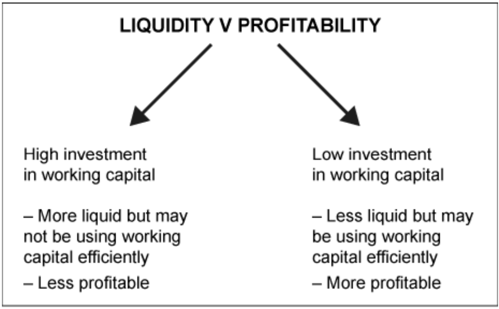
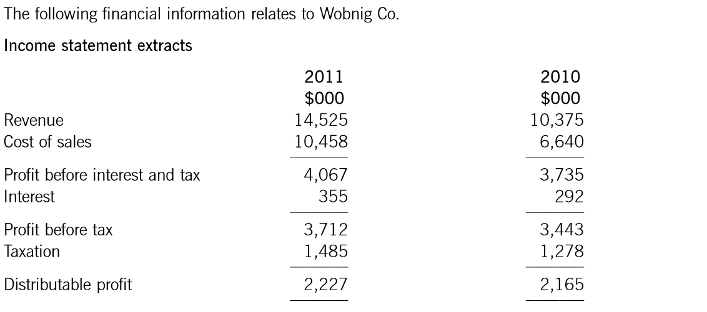
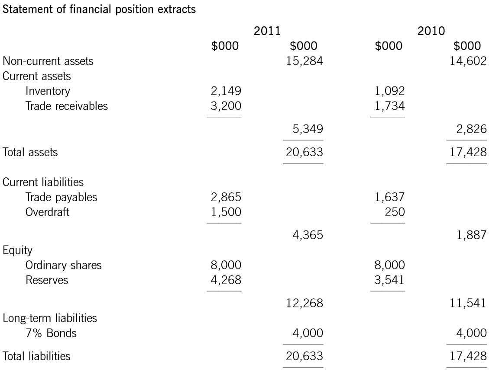
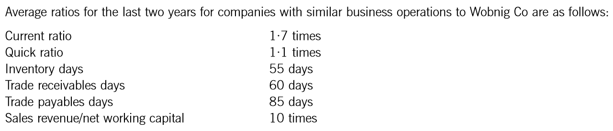
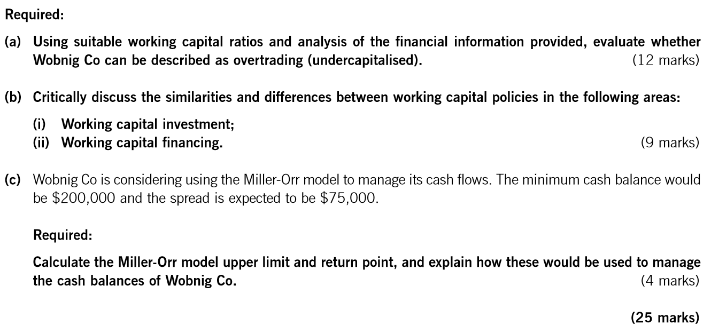
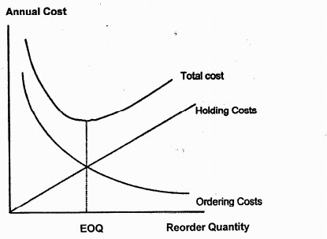
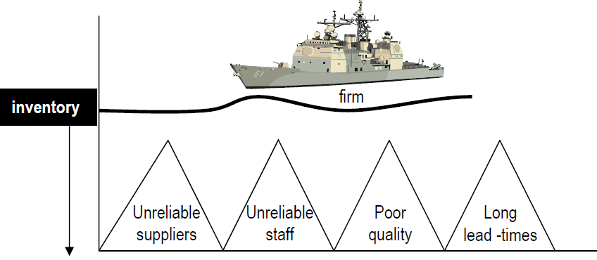

## 3 Working Capital Management

### Syllabus

**1. The Nature, Elements and Importance of Working Capital**

a\) Describe the nature of working capital and identify its elements.[1]

b\) Identify the objectives of working capital management in terms of liquidity and profitability, and discuss the conflict between them.[2]

c\) Discuss the central role of working capital management in financial management.[2]

**2. Management of Inventories, Accounts Receivable, Accounts Payable and Cash**

a\) Explain the cash operating cycle and the role of accounts payable and accounts receivable.[2]

b\) Explain and apply relevant accounting ratios, including:[2]

i\) current ratio and quick ratio

ii. inventory turnover ratio, average collection period and average payable period[1]
iii\) sales revenue/net working capital ratio.

c\) Discuss, apply and evaluate the use of relevant techniques in managing inventory, including the Economic Order Quantity model and Just-in-Time techniques.[2]

d\) Discuss, apply and evaluate the use of relevant techniques in managing accounts receivable, including:

i\) assessing creditworthiness[1]

ii\) managing accounts receivable[1]

iii\) collecting amounts owing[1]

iv\) offering early settlement discounts[2]

v\) using factoring and invoice discounting[2]

vi\) managing foreign accounts receivable.[2]

e\) Discuss and apply the use of relevant techniques in managing accounts payable, including:

i\) using trade credit effectively[1]

ii\) evaluating the benefits of early settlement and bulk purchase discounts[2]

iii\) managing foreign accounts payable.[1]

**3. Determining Working Capital Needs and Funding Strategies**

a\) Calculate the level of working capital investment in current assets and discuss the key factors determining this level, including:[2]

i\) the length of the working capital cycle and terms of trade

ii\) an organization's policy on the level of investment in current assets

iii\) the industry in which the organization operates.

### 1 Working Capital

Working capital represents the net current assets which is available for day-to-day operational activities.

It is defined as a business's current assets (e.g. inventories, trade receivables and cash) less its current liabilities (e.g. trade payables).

#### 1.1 Importance of Working Capital

Management must ensure that a business has sufficient working capital. The consequences of too little will be cash flow problems highlighted by:

- Exceeding an agreed overdraft limit.
- Failing to pay suppliers (including employees) on time.
- Inability to take advantage of discounts for prompt payment.

In the long run, a business with insufficient working capital cannot meet its current obligations. It will be forced to cease trading even if it remains profitable on paper.

On the other hand, if a business ties up too much resource in working capital, it will earn a lower-than-expected rate of return on capital employed. Again, this is not a desirable situation.

Working capital management is crucial to the effective management of a business because:

- Current assets may be a high proportion of total assets.
- Failure to control working capital, and therefore liquidity, is a major cause of business failure.

Two major questions must be considered:

- How much to invest in working capital?
- How to finance working capital?

::: {.callout-tip}
**Example 1**

> Which TWO of the following are correct descriptions of net working capital?
>
> A Current asset -- current liabilities
>
> B Inventory days + accounts receivable days -- accounts payable days
>
> C Current assets / current liabilities
>
> D The long-term capital invested in net current assets

:::

#### 1.2 Objectives of Working Capital Management

The two main objectives of working capital management are:

- To ensure the organization has sufficient liquid resources to continue in business.
- To increase its profitability.

However, the objectives of liquidity and profitability can conflict.

{width="3.687276902887139in" height="2.2886548556430446in"}

Therefore, when determining the appropriate level of working capital there is a **trade-off between liquidity and profitability**.

Businesses must avoid the extremes:

- Overtrading arises when there is insufficient working capital to support the level of business activity. This also can be described as under-capitalization and is characterized by an increasing proportion of short-term to long-term finance.
- Over-capitalization is an excessive level of working capital, leading to inefficiency.

#### 1.3 Working Capital Investment Policy

Even within the same industry sector, companies will have different policies regarding the level of investment in current assets, depending on management's attitude to risk.

(1) **conservative approach**

This approach involves investing a relatively high level of net working capital. A firm allows high levels of receivables and inventories, and keeps payables low. This policy will reduce the risk of liquidity problems, and would be also less profitable.

This approach is more appropriate if cash flows are erratic and unpredictable.

(2) **aggressive approach**

This approach involves investing a relatively low level of net working capital. A firm choose to keep inventories and receivables as low as possible, and payables are maximized. This policy would potentially be more profitable, and would also be more risky. A moderate approach falls between the conservative and aggressive approaches.

This approach is more appropriate if cash flows are very predictable.

(3) Moderate approach

A moderate approach falls between the conservative and aggressive approaches.

### 2 Measurement of Working Capital

#### 2.1 Working Capital Ratios

##### 1. Liquidity Ratios

**Current Ratio** = $\frac{Current\ Assets}{Current\ Liabilities}$

If the current ratio falls below 1 this may indicate problems in meeting obligations as they fall due. Even if the current ratio is above 1 this does not guarantee liquidity, particularly if inventory is slow moving. On the other hand, a very high current ratio is not to be encouraged as it may indicate inefficient use of resources.

**Quick Ratio (acid test)** = $\frac{Current\ Assets\  - inventory}{Current\ liabilities}$

This measure is particularly useful where inventory moves slow and cannot be converted into cash quickly. The quick ratio is particularly relevant where inventory is slow moving. A company with slow-moving inventory should ideally have a quick ratio of at least 1. For a company with fast-moving inventory, the quick ratio can be less than 1 without suggesting that it is facing cash-flow problems.

##### 2. Efficiency Ratios

**Receivables collection period** $= \frac{average\ trade\ receivables}{annual\ credit\ sales} \times 365$

It is the time taken for customers to pay. Everything else being equal a business would prefer a shorter period.

**Receivable Turnover** $= \frac{annual\ credit\ sales}{average\ trade\ receivables}$

This shows how quickly receivable is converted into cash.

::: {.callout-tip}
**Example 2**

> The management of Lamara Co has annual credit sales of \$20m and accounts receivables of \$4m. working capital is financed by an overdraft at 12% interest per year. Assume 365 days in a year.
>
> Calculate the annual finance cost saving if management reduces the collection period to 60 days (to the nearest dollar)

:::

**Inventory holding period** $= \frac{average\ inventory}{annual\ cost\ of\ sales} \times 365$

The time taken for inventory to be sold. Everything else being equal a business would prefer a shorter period.

**Inventory Turnover** $= \frac{cost\ of\ sales}{average\ inventory}$

This shows how quickly inventory is sold; higher turnover reflects faster-moving inventory.

In exam questions: Use year-end figures in the statement of financial positions if averages are not available.

::: {.callout-tip}
**Example 3: Sep 2016, Q5**

> Crag Co has sales of \$200m per year and the gross profit margin is 40%. Finished goods inventory days vary throughout the year within the following range:
>
> |                  | Maximum | Minimum |
> | ---------------- | ------- | ------- |
> | Inventory (days) | 120     | 90      |
>
> All purchases and sales are made on a cash basis and no inventory of raw materials or work in progress is carried. Crag Co intends to finance its current assets with its overdraft.
>
> In relation to finished goods inventory and assuming a 360-day year, how much finance will be needed from the overdraft?
>
> A \$10m
>
> B \$17m
>
> C \$30m
>
> D \$40m

:::

For a manufacturer, there are three types of inventories: raw materials, work-in-progress, and finished goods. In this case, inventory holding period can be calculated as:

$$
Raw\ Materials\ holding\ period\ \  = \frac{raw\ materials\ inventory}{annual\ raw\ materials\ purchases} \times 365
$$

$$
WIP\ production\ period\  = \frac{WIP\ inventory\ held}{annual\ cost\ of\ goods\ sold} \times 365
$$

$$
finished\ goods\ holding\ period\  = \frac{finished\ goods\ inventory}{annual\ cost\ of\ goods\ sold} \times 365
$$

If production cost cannot be calculated, cost of goods sold gives a good approximation.

**Payables payment period =** $\frac{average\ trade\ payables}{average\ credit\ purchase} \times 365\ days$

The time taken to pay suppliers. A business would prefer to increase its payables days, unless this proves expensive in terms of lost settlement discounts or leads to other problems such as a damaged reputation.

**Example 4: Dec 2016,Q11**

> Mile Co is looking to change its working capital policy to match the rest of the industry. The following results are expected for the coming year:
>
> |               | \$'000   |
> | ------------- | -------- |
> | Revenue       | 20,500   |
> | Cost of sales | (12,800) |
> | Gross profit  | 7,700    |
>
> Revenue and cost of sales can be assumed to be spread evenly throughout the year. The working capital ratios of Mile Co, compared with the industry, are as follows:
>
> |                 | Mile Co | Industry |
> | --------------- | ------- | -------- |
> | Receivable days | 50      | 42       |
> | Inventory days  | 45      | 35       |
> | Payable days    | 40      | 35       |
>
> Assume there are 365 days in each year.
>
> If Mile Co matches its working capital cycle with the industry, what will be the decrease in its net working capital?
>
> ○\$624,600
>
> ○\$730,100
>
> ○\$835,600
>
> ○\$975,300
>

**Sales/net working capital** = $\frac{annual\ sales}{average\ working\ capital}$

It indicates how efficiently a business uses its working capital to generate sales. Everything else being equal, management would prefer sales/working capital to rise.

Always bear in mind that ratios are of little value unless compared with industry averages.

#### 2.2 Cash Operating Cycle

The cash operating cycle is the period between paying suppliers and receiving cash from customers.

**Cash Operating Cycle** = Inventory holding period +Receivable collection period -- Payables payment period

The longer the operating cycle, the greater the resources 'tied up' in working capital, so the more adverse cash flow difficulties an organization will face. All other things being the same:

- the shorter the cycle is, the higher the profitability is
- the longer the cash cycle, the more financing is required
- when sales volume increase, the funds required for working capital will increase in approximate proportion to sales

#### 2.3 Influences on Working Capital Investment Level

Different business will have different level of working capital investment. And this may be due to

- industry factors; and
- Company-specific factors

**General Factors Affecting**

- Nature of the industry - A supermarket will receive much of their sales in cash, so it can be able to operate with minimal receivables. However, this is would not be possible for a construction company.
- Industry norm (policies of competitors) - If competitors offer more favorable credit terms, it may be difficult for the company to reduce receivables without losing business.
- Seasonal factors -- there may be a need to allow inventory to be higher as a season of peak sales approaches.

**Company Specific Factors**

- Management's risk attitude and working capital investment policy -- a conservative investment policy will result in relatively high level of working capital.
- Terms of trade - such as the credit period offered to customers.
- Efficiency of working capital management - weak credit control and inefficiency in inventory managing will also lead to high level of working capital.

#### 2.4 Overtrading

Although an optimal level of working capital may exist it may not be achievable due to factors beyond management's control, such as an unreliable supply chain influencing inventory levels. However, businesses must at least avoid the extremes:

- Overtrading
- Over-capitalization

##### 1. Overtrading

Overtrading occurs when a company tries to support a large volume of trade from a small working capital base. Also called undercapitalization, it often occurs when a business grows rapidly without an increase in long-term finance.

It can bring serious liquidity problem, and often happen at the start of new business, because:

- Offer a long credit period to attract customers and break into the market
- Rapid sales expansion in a niche market
- Often lack management skills to maintain adequate control over debt collection and production period.

So, the amount of cash required will increase, but companies will find it hard to raise long-term finance; hence, overtrading and business failure may result.

**Indicators of Overtrading**

- rapidly increase in sales revenue, often declining profit margin
- increasing inventory holding period
- increasing receivables collection period
- declining cash holding and increasing short-term borrowing and overdraft
- an increasing ratio of sales / net working capital
- declining liquidity ratios (or below industry average)

If a business suffers from liquidity problems due to overtrading, the aim will be to reduce the length of the cash operating cycle. Possibilities to consider include:

- Reduce the level of sales growth to a more suitable level
- Increasing the level of long-term finance, such as equity or debt issue, or listing
- Improve working capital management

> -reducing inventory holding period and credit period offered to customers
>
> -increasing the period of credit taken from suppliers
>
> -using factor, discounting invoice, cash discounts to speed cash collection.

##### 2. Over-capitalization

Over-capitalization -- an excessive level of working capital, leading to inefficiency.

::: {.callout-tip}
**Example 5: 2012 JUNE- Wobnig (a)-Overtrading**

{width="5.76875in"}

{width="5.76875in"}

{width="6.16425in"}

{width="5.76875in"}
:::

### 3 Managing Inventory

#### 3.1 Objective of Inventory Management

Inventory is a major investment for most companies. Manufacturing companies' inventories may amount to a substantial proportion of total assets.

Inventory Costs include:

- **Ordering Costs ---** administrative cost; delivery costs
- **Holding costs** --- cost of capital; Warehouse cost; Insurance; Deterioration and obsolescence
- **shortage costs** --- contribution from loss of sale; extra cost of emergency orders of inventory
- **Purchasing costs** ---relevant particularly when calculating discounts for bulk purchase

Keeping inventory levels high will lead to high holding cost, however, keeping inventory levels too low will face high stockout cost, reorder cost and lost bulk purchase discounts. So, in practice, there should be a balance between holding costs on one hand and stockout and reorder costs on the other hand.

#### 3.2 Inventory Models/systems

##### 1. EOQ Model

The Economic Order Quantity (EOQ) is the optimal quantity of inventory that should be ordered each time a purchase order is placed. This quantity will minimize the total costs relevant to ordering and holding inventory.

**EOQ Formula**

**C~h~** = cost of holding one unit inventory for one year

D = annual demand

Q = order quantity

C~o~ = cost of placing one order

Then average number of units held can be expressed as Q/2, and number of orders in a year can be expressed as D/Q.

Annual total relevant cost:

|                       |                             |
| --------------------- | --------------------------- |
| Annual Holding costs  | C~h~ × Q /2               |
| Annual ordering costs | C~o~ × D/Q                |
| Total relevant costs  | C~h~ × Q /2+ C~o~ × D/Q |

**Total cost is minimized when** EOQ=$\sqrt{\frac{2Co\ D}{Ch}}$

EOQ graph

{width="3.294815179352581in" height="2.460579615048119in"}

**Drawbacks of the EOQ Model:**

- Assumes constant demand (there may be fluctuation in demand in reality)
- Assumes constant purchase price per unit and no bulk purchase discounts
- assumes zero lead times
- no risk of stock-outs
- assumes order cost per unit and holding cost per unit is constant

these assumptions are critical and should be discussed when considering the validity of the model and its conclusions. In practice, demand and lead time may vary.

**Bulk Purchase Discounts**

If bulk purchase discounts are available, purchase costs are relevant and the decision whether the discount is worthwhile can be dealt with as follows.

|                | EOQ policy | Bulk purchase policy |
| -------------- | ---------- | -------------------- |
| Holding costs  | X          | X                    |
| Ordering costs | X          | X                    |
| Purchase costs | X          | X                    |
| Total costs    | X          | X                    |

Inventory related costs = purchase cost + ordering cost + holding cost

Select the order quantity that minimizes inventory related costs.

::: {.callout-tip}
**Example 6: Nesud (b) (Sep 2016)**

> From a different supplier, Nesud Co purchases \$2·4 million per year of Component K at a price of \$5 per component. Consumption of Component K can be assumed to be at a constant rate throughout the year. The company orders components at the start of each month in order to meet demand and the cost of placing each order is \$248·44. The holding cost for Component K is \$1·06 per unit per year.
>
> \(b\) Evaluate whether Nesud Co should adopt an economic order quantity approach to ordering Component K. (6 marks)
>
> \(c\) Critically discuss how Nesud Co could improve the management of its trade receivables. (10 marks)

:::

**Buffer Inventory**

In reality, a company may hold buffer inventory to reduce the risk of stock-outs. If buffer inventory is required, the average inventory level becomes B+Q/2

##### 2. Re-Order Level System

Use this method to build safety inventory and minimizes the risk of running out of inventory.

**Re-order level** (ROL) -- the level to which inventory should fall before placing a purchase order for replenishment.

- **Re-order level =** maximum usage ×maximum lead time

**Lead time** -- the time between placing and receiving an order.

Maximum inventory level

=Re-order level- (minimum usage ×minimum lead time) +Re-order quantity

Minimum inventory or Buffer safety inventory

=Re-order level- (average usage × average lead time)

Average inventory

= Buffer safety inventory +Re-order quantity/2

##### 3. Just-in-time

A just-in-time *purchasing* system aims to minimize the cost of holding inventory by placing orders so that delivery is timed for when the goods are needed.

A JIT *production* system aims to minimize the cost of manufacturing by only producing goods as they are needed. Such a system should have only minimal inventory of raw materials and minimal wait time in production.

JIT *inventory management* aligns purchasing and production to weekly, or even daily sales demand. It aims to create a continuous flow of raw materials inventory into work-in-progress, which becomes finished goods to go immediately to the customer.

To operate a JIT inventory system, there are certain necessary conditions to be met: sufficiently flexible and reliable suppliers; close working relationships with suppliers and, if possible, geographical proximity for immediate deliveries; significant investment by suppliers, etc.

**Benefits of JIT**

A successful JIT system will reduce holding costs, and allows a firm to compensate for inefficient processes; this failure to deal with its inefficient processes is seen as **hidden costs** of holding inventory.

Examples of hidden costs include: failing to deal with unreliable suppliers, defective production process and poor labor relations.

{width="3.9316863517060368in" height="1.7155610236220473in"}

1. reliable suppliers/staff, good quality, no lead-time[2]
   **Drawbacks of JIT**

JIT will not be appropriate if **production processes and suppliers are unreliable,** and especially where the consequences of a stock-out are serious. for example, in a hospital, a stock-out could be fatal.

### 4 Managing Account Receivables

A company will have to decide whether to offer credit to its customers and if so on what terms. These are important decisions and need to be carefully considered by senior management.

**Offering credit** can result in higher profits, however, it comes at a cost which include:

- Finance cost-interest charged on an overdraft to fund the receivables
- The possibility of bad debt
- Administrative costs of debt collection
- Cash discount if offering cash discount

Whether or not offer credit (extend credit) should be assessed by comparing whether the benefit from higher sales is greater than the costs associated with higher receivables.

#### 4.1 Methods of Speeding Cash Collection

##### 1. Early Settlement Discount

Offering customers a percentage discount on an invoice for early settlement of amounts due.

**Whether Settlement Discounts Should be Offered to Customers?**

**(1) Annual Effective Cost**

- Calculation the cost of discount (i.e. the **annual effective cost**)
- Compare the annual cost of offering discount to the cost of financing account receivables (e.g. overdraft rate), if the cost of discount is larger than the overdraft rate, then the discount should not be offered.

Annual effective cost = ${(1 + \frac{d}{1 - d})}^{\frac{365}{n}} - 1$

Where: d = discount (i.e. d%)

n = credit period --discount period

::: {.callout-tip}
**Example 7**

> A company offers its customers 30 days credit, but customers are taking 45 days credit on average. To speed up cash collection, the company is considering introducing a 1.5% discount for payment within 15 days. The company's working capital requirement is financed with an overdraft at an annual cost of 10%.
>
> Required: Determine whether the discount should be offered.

:::

Note: the AER is calculated using compound interest, the simple interest = $\frac{d}{1 - d}$×$\frac{365}{t}$ would also be acceptable in the exam.

**(2) Annual Cost/Benefit**

|                            | \$          |
| -------------------------- | ----------- |
| **Annual benefit**   |             |
| Finance cost savings (W1)  | x           |
| Profits on extra sales     | x           |
| **Annual cost**      |             |
| Extra administration costs | (x)         |
| Discount cost              | (x)         |
| **Net benefit**      | **X** |

If the net benefit is positive, a company should offer discount on financial grounds.

Working 1: finance cost savings on reduced receivables

|                              | Existing | Revised |
| ---------------------------- | -------- | ------- |
| Receivable collection period |          |         |
| Receivables                  |          |         |
| Annual finance cost          | X~1~    | X~2~   |

Annual finance cost saving = X~1~ − X~2~

::: {.callout-tip}
**Example 8 Melvin**

> Melvin Co has annual revenue of \$900,000 (90% of which is on credit). The receivables collection period is 42 days despite offering only 30 days' credit. Melvin Co has a contribution margin of 30% and finances receivables using an overdraft with an annual interest rate of 8%.
>
> Melvin Co is considering introducing an early settlement discount while extending its standard credit terms to 50 days. Under the scheme:
>
> - Customers will be offered a 1% discount for payment within 14 days.
> - It is anticipated that 40% of customers will take the discount, while those who do not will keep to the new standard credit terms.
> - As a result of the extended credit terms, credit sales are expected to rise by 10%.
>
> due to the extra administration involved, administration costs are expected to rise by \$10,000 a year.
>
> **Required:** **Evaluate whether Melvin Co should offer the discount.**

:::

**Key Advantages** of offering cash discounts:

- If customer take the discount and pay earlier, so the company receives the cash sooner, and by encouraging early payment, the risk of bad debts is reduced.
- by offering a choice of payment terms, the company is likely to satisfy more customers

**Key problems** of offering cash discounts:

- it is difficult to decide on suitable discount terms.
- the introduction of such a discount will make the management of the sales ledger more complex and costly to run and is likely to make the budgeting of receipts from customers more difficult as the company could not be sure whether the discount will or will not be taken.
- Too often customers will abuse the discount by taking it despite not paying early.

##### 2. Factoring

Businesses offering a range of services in the area of sales administration and the collection of amounts due from customers.

A debt factor may offer three closely integrated services:

(1) **Administration** -- the factor will maintain the sales ledger accounting function, and is responsible for chasing the customers and speeding up the collection of debts.

As factors have significant expertise, debts will be collected from customers more quickly. The factor will charge a fee for its service.

(2) **insurance against bad debts**- the factor takes over the risk of loss from bad debts, this is known as a **[non-recourse factoring]{.underline}**. In effect, the company is insured against bad debts. Fees are higher for non-recourse factoring.

> **Factor with re**-course: bad debt remains the company's problem.

(3) **Finance against sales** - the factor **advances** a percentage of the sales value immediately on invoicing.

**Evaluate Whether Use the Factor**

|                             | \$          |
| --------------------------- | ----------- |
| **Annual cost**       |             |
| Factor fees (% of sales)    | (x)         |
| **Annual benefit**    |             |
| Administration cost savings | x           |
| Reduced bad debt            | x           |
| Finance cost savings (W1)   | x           |
| **Net benefit**       | **X** |

If the net benefit is positive, it will be financially acceptable to use the factor's service.

Working 1: finance cost savings on reduced receivables

|                              | Existing | Revised |
| ---------------------------- | -------- | ------- |
| Receivable collection period |          |         |
| Receivables                  |          |         |
| Annual finance cost          | X~1~    | X~2~   |

Annual finance cost saving = X~1~ − X~2~

**Advantages of Using a Factor:**

- Reduced administrative burden: outsourced debt collection saves time and effort.
- Improved cash flow: conversion of receivables into immediate cash, and this can be very useful to a growing company
- Access to expertise: the factor's expertise in credit management and collections can reduce the risk of bad debts and improve the overall efficiency of accounts receivable management

**Disadvantages of Using a Factor:**

- the factor's fees may be relatively high
- difficult to rebuild its own sales ledger function at a later date
- damage to customer relationships: loss of control over customer interactions and factor's "vigour" manner may damage customer relationship
- selective factor: if the business cannot factor all receivables, managing accounts will be fragmented.

::: {.callout-tip}
**Example 9 Velmin Co**

> Velmin Co has a turnover of \$700,000. Receivable days are currently 48 despite the company only offering 30-days' credit and bad debts are currently 3% of turnover. Velmin Co finances its receivables using its overdraft which has an annual interest cost of 8%. Velmin is considering the use of a factor.
>
> The factor would charge 4% of turnover for a non-recourse agreement and would expect to reduce receivable days to 34 and bad debts to 2%. The factor would lend Velmin 75% of the outstanding receivables and would charge Velmin 1% above their current overdraft interest cost. It is anticipated that using the factor would reduce administration costs by \$6,000 per annum.
>
> Required: Evaluate whether or not Velmin Co should use the factor.

:::

##### 3. Invoice Discounting

The selling of selected sales invoices to a third party for a discounted cash sum, while retaining full control over the receivables ledger.

When a business enters into an invoice discounting arrangement, a finance company will provide a cash advance as a percentage of the outstanding sales invoices -- usually in the region of 80%. As customers pay their invoices or new sales invoices are issued, the amount advanced will fall or rise to maintain the level of finance at 80% of the receivables.

**Advantages of Invoice Discounting**

- improved cash flow: the business receives a significant proportion of invoice amounts upfront.
- Flexibility: the business can choose which invoices to discount, accessing funds when needed (e.g. to cover a temporary cash shortage).
- Confidentiality: customers are unaware that the business borrows against sales invoices.

**Disadvantages of Invoice Discount**

- Fees and interest charges make it an expensive form of financing compared to an overdraft or bank loan.
- As the finance company has a legal charge over the receivable balances, the business has fewer assets to secure other borrowings.

#### 4.2 Framework for Managing Receivables

The key areas of accounts receivable management are assessing creditworthiness, setting credit terms, monitoring and effective cash collection.

##### 1. Assessing Creditworthiness

The company must balance the risk inherent in granting credit against the necessity to allow enough credit to support the level of business.

To assess the creditworthiness of a customer or potential customer, a company may consider the following information sources:

- **Bank references -** a bank reference can be fairly easily obtained
- **trade references** -a trade reference from other company who has dealings with your potential customer
- **credit rating agency -** are professional business which sell information about companies and individuals.
- **financial statements** -- financial statements of a company are publicly available information and can be quickly and easily obtained
- **information from the financial media** - information in the national and local press, and in suitable trade journals and on the internet, may give an indication of the current situation of a company.
- A visit to discuss their exact needs and impress them with good customer service and to "get a feel" for whether the business should be given credit.

##### 2. Setting Credit Terms and Monitoring Account Receivables

Once the decision has been taken to grant credit, then suitable credit terms must be set and the receivables that arise must be monitored efficiently if the costs of giving credit are to be kept under control.

Initially, a suitable credit limit should be set for each customer. This credit limit should only be allowed to grow slowly as your faith in the customer grows and all attempted breaches of the credit limit should be brought to the attention of the credit controller.

The accounts receivable should be continuously monitored. In order to do this a number of reports are useful:

- an aged receivables list -- this shows the length of time outstanding amounts have been owed. This is useful because it highlights breaches of credit terms, where amounts are "past due" and debt collection procedures need to be implemented.
- A credit utilization report -- this shows the proportion of each customer's credit limit that is currently utilized. it indicates credit limits that may need to be reviewed and revised (upwards or downwards) and breaches of credit limits.

In larger organizations, customers may be classified by trade and country as it is then possible to evaluate exposure by both country and trade.

##### 3. Collection Cash

Methods to help ensure customers pay on a timely basis include:

- Send out the invoice quickly-- The receipt of your invoice is the first indication a company gets of the efficiency of your debt collection system.
- chasing letters -- directed to a specific person, preferably at a reasonably senior level. However, preparing and sending reminders and final demands is costly (if there are many debtors), and their impact may be limited.
- chasing phone calls -- A credit controller who regularly contacts a suitably senior person and politely but firmly demands payment for overdue amounts can often achieve good results.
- personal approach -- a personal approach from a senior person in the company to a senior person at the customer can often yield results.
- stopping supplies -- this may be a powerful tool if, in the short term, the customer depends on the organization's goods or services. However, the customer may source an alternative supplier in the longer term.
- legal action -- the process can be time consuming and costly (and likely to lead to the loss of the customer). However, just one letter from a solicitor can often be sufficient to obtain payment for fear of further legal action.
- external debt collection agency -- fees can be high, and is likely to lead to the loss of the customer.

#### 4.3 Managing Foreign Accounts Receivables

**Default Risk**

The risk of default on exports may be greater than on domestic sales.

Two risks exporter faced:

- Export credit risk: the risk of failure or delay in collecting payments due from foreign customers. May be caused by Insolvent customers, Bank failure, Unconvertible currencies, Political risk.
- Foreign exchange rate exposure (will be covered in chapter 15)

It is harder for a business to pursue any overdue amounts from a business in another country with a different legal system. Therefore, the exporter needs to carefully consider the payment method to minimize default risk and finance the export.

**Payment Methods**

foreign account receivables can be paid in various ways:

(1) **Bill of exchange**

A document drawn by the exporter and sent to the customer, who signs to accept responsibility to pay the amount specified on the stated date.

Documents of title to the goods are not released to the customer until the customer has accepted a bill of exchange.

The exporter may choose to:

- Hold the bill until maturity (and then receive payment from the customer); or
- Discount the bill with a bank to receive the cash earlier.

However, if the customer does not pay the bill, the bank will have recourse to the exporter (i.e. default risk stays with the exporter).

(2) **Forfaiting (票据买断\\未偿债务买卖)**

Forfaiting involves a bank discounting a series of bills of exchange without recourse to the exporter if the customer does not pay (i.e. default risk is transferred to the bank):

- The non-recourse aspect makes this an attractive arrangement for businesses, but as a result, the cost of forfaiting is relatively high.
- Is usually only available for large, medium-term or longer transactions.
- The cost of forfaiting is relatively high, and it is usually only available for large, medium-term or longer transactions.

(3) **Letters of credit/ (**银行开立的有条件承诺付款的信用证)

A Payment guarantee backed by one or more banks.

> steps of arranging a letter of credit:
>
> 1\. Both parties agree terms and conditions
>
> 2\. The purchaser (importer)'s bank issues a letter of credit in the seller's favor
>
> 3\. The letter of credit is issued to the seller's bank, guaranteeing payment to the seller once the conditions specified in the letter have been complied with. Typically, the conditions relate to presenting shipping documentation and dispatching the goods before a certain date
>
> 4\. The goods are dispatched to the customer and the shipping documentation is sent to the purchaser's bank
>
> 5\. The bank then issues a banker's acceptance
>
> 6\. The seller can either hold the banker's acceptance until maturity or sell it on the money market at a discounted value

**Advantages**

- Letters of credit provide a high level of payment assurance for the seller.
- Sellers can negotiate favorable payments such as shorter payment periods to improve cash flow.
- The seller's exposure to credit risk is significantly reduced (because the buyer's bank, rather than the buyer, is responsible for payment)

**disadvantages**

- Set up can be complex and take a significant amount of time before the sale occurs.
- It is costly to purchasers and restricts their flexibility compared to other payment methods: payment must be made when due and buyers may be required to provide security.

(4) **Other methods**

- **Export credit insurance** - protects against risks that could result in non-payment by a foreign customer. It helps reduce the impact of non-payment, but premiums are high, and insurance does not typically cover 100% of the value of the foreign sales.
- **Countertrading (对等贸易)-** In a countertrade arrangement, goods or services are exchanged for other goods or services instead of for cash. This can facilitate conservation of foreign currency and can help a business enter foreign markets. The main disadvantage is that the value of the goods or services received in exchange may be uncertain.
- **Export factoring --** factors buy the trade receivable from the exporter and charge a commission on the transaction. Other service, such as operating the receivables ledger and credit insurance, may also be offered.

### 5 Managing Trade Payables

Businesses generally use trade credit as a flexible source of short-term finance. A business may even decide to pay suppliers late. However, trade credit is not without cost.

**Should early settlement discounts be accepted?**

(1) **Annual Effective Cost**

- Calculate the annual effective cost of refusing a discount
- If the EAC of refusing the discount exceeds the overdraft rate, the discount should be accepted

Annual effective cost of refusing discount = ${(1 + \frac{d}{1 - d})}^{\frac{365}{n}} - 1$

Where: d = discount (i.e. d%)

n = payable days -- discount days

(2) **Annual benefit/cost of accepting the discount**

Annual cost of accepting early settlement discounts

- Current account payables x
- New account payables if discount taken x
- Increased interest expense on reduced payables x

Annual benefit of accepting early settlement

- Discounts received x

**Net Benefit X**

If the net benefit is positive, the early settlement discount should be accepted on financial grounds.

::: {.callout-tip}
**Example 10 Dec 2016, Q15**

> Swap Co is due to receive goods costing \$2,500. The terms of trade state that payment must be received within three months. However, a discount of 1.5% will be given for payment within one month.
>
> \(1\) Which of the following is the annual percentage cost of ignoring the discount and paying within three months?
>
> ○6.23%
>
> ○9.34%
>
> ○6.14%
>
> ○9.49%
>
> \(2\) If the cost of overdraft is 8%, whether or not should Swap accept the early settlement discount?

:::

::: {.callout-tip}
**Example 11 Nesud (SEP 2016)**

> Nesud Co has credit sales of \$45 million per year and on average settles accounts with trade payables after 60 days. One of its suppliers has offered the company an early settlement discount of 0·5% for payment within 30 days. Administration costs will be increased by \$500 per year if the early settlement discount is taken. Nesud Co buys components worth \$1·5 million per year from this supplier.
>
> Nesud Co finances working capital from an overdraft costing 4% per year. Assume there are 360 days in a year。
>
> (a)Evaluate whether Nesud Co should accept the early settlement discount offered by its supplier.

:::
