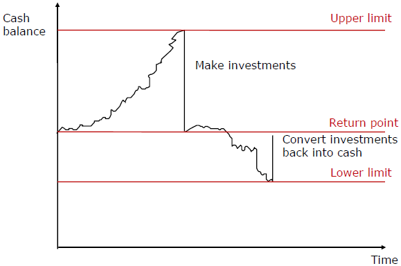
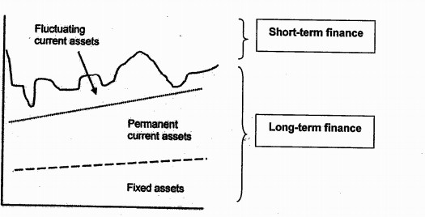
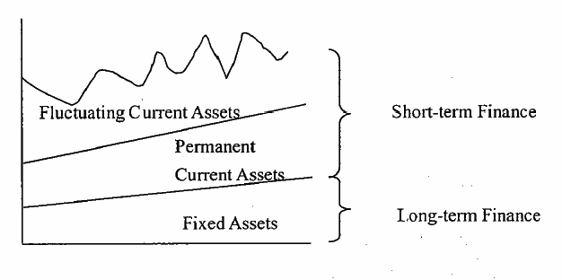
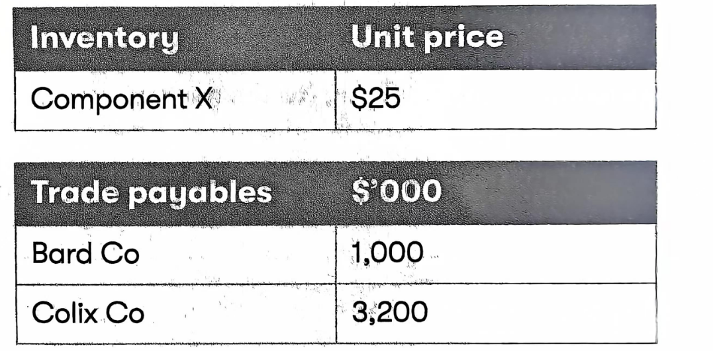

## Chapter 4 Cash Management and Working Capital Finance

### Syllabus  {.pagebreak}
**2. Management of Inventories, Accounts Receivable, Accounts Payable and Cash**

f\) Explain the various reasons for holding cash, and discuss and apply the use of relevant techniques in managing cash, including:\^\[2\]\^

i\) preparing cash flow forecasts to determine future cash flows and cash balances

ii\) assessing the benefits of centralized treasury management and cash control

iii\) cash management models, such as the Baumol model and the Miller-Orr model

iv\) investing short-term.

**3. Determining Working Capital Needs and Funding Strategies**

b\) Evaluate and discuss the key factors in determining working capital funding strategies, including:

i\) the distinction between permanent and fluctuating current assets\^\[2\]\^ 

ii\) the relative cost and risk of short-term and long-term finance\^\[2\]\^ 

iii\) the matching principle\^\[2\]\^ 

iv\) the relative costs and benefits of aggressive, conservative and matching funding policies\^\[2\]\^ 

v\) management attitudes to risk, previous funding decisions and organisation size.\^\[1\]\^

### 1 Treasury Management {.pagebreak}

Treasury management&nbsp;-- the efficient management of liquidity and risk in a business including the management of funds (generated from internal and external sources), currencies and cash flow.

As companies and financial markets have become larger, more sophisticated and increasingly international, there has been a trend towards establishing separate treasury departments where cash control is centralised to ensure efficient use.

#### 1.1 Treasurer's Role

Good cash management aims to have the right amount available at the right time. The treasurer will be involved in:

- accurate cash flow forecasting, so that shortfalls and surpluses can be anticipated;

- planning short-term borrowing when necessary;

- planning investments of surpluses when necessary;

- cost-efficient cash transmission;

- dealing with foreign currency issues;

- optimising banking arrangements;

- planning major finance-raising exercises; and

- accounts receivable/accounts payable policies.

In addition, the treasurer is often involved in risk assessment and insurance.

#### 1.2 Centralized Treasury Management

Many organizations use **centralized** treasury department, which has several advantages.

- Management by specialized staff with appropriate qualifications, expertise and experience.

- economies of scale - as specialists are employed centrally, reducing duplication and maximizing the use of skilled human resources and financial management systems.

- Ability to use \"pooling\", the netting of cash deficits against surpluses, to save interest expense from short-term financing.

- Increased negotiating power with banks, as the amounts borrowed or deposited would be more substantial as a group.

- More efficient foreign exchange risk management because the treasury department at the head office can find the group's net position on each currency and then consider an external hedge on this balance.

The treasury department of a large company may still have a degree of decentralization to ensure that decisions taken are appropriate to local circumstances.

### 2 Cash Management

#### 2.1 Reasons for Holding Cash 

Three main reasons for holding cash.

**(1) transactions motive --** where cash is held to provide sufficient liquidity to meet current day-to-day financial obligations (e.g. the purchase of raw materials)

**(2) Precautionary motive --** where cash reserve is held as a cushion against unexpected expenditures (e.g. unforeseen downturn in sales, or disruption to production).

**(3) speculative motive -** where cash is held to take advantage of potential investment opportunities quickly.

However, cash holding must not be excessive as this leads to inefficiency. Cash balances belong to shareholders expecting to receive a significant investment return. So, the financial manager must try to **balance between liquidity and profitability**.

Therefore, any long-term surplus of cash should be either reinvested into projects with a positive net present value or returned to shareholders via:

- dividends (regular or special dividend); or

- share buy-back programmes.

##### Cash Flow Forecasting

A major task for the treasurer is cash flow forecasting. It will allow the business to **plan how to deal with expected cash flow surpluses or shortages.**

##### 1. Cash Flow Forecasting

(1) **Typical format**

|                              | January | February | March |
|------------------------------|---------|----------|-------|
|                              | \$      | \$       | \$    |
| **Cash Inflows**             |         |          |       |
| Cash from Sales (W1)         | X       | X        | X     |
| Non-current asset disposals  | X       | X        | X     |
| Share/debt issues            |         | X        |       |
| **Total Cash Inflows**       | **X**   | **X**    | **X** |
| **Cash Outflows**            |         |          |       |
| Cash payments to supplier(W2)| \(X\)   | \(X\)    | \(X\) |
| Wages                        | \(X\)   | \(X\)    | \(X\) |
| Dividends                    | \(X\)   |          |       |
| Purchase of non-current assets|        |          | \(X\) |
| Interest/principal on debt   | \(X\)   | \(X\)    | \(X\) |
| **Total Cash Outflows**      | **(X)** | **(X)**  | **(X)** |
|                              |         |          |       |
| Net Cash flow                | X       | X        | \(X\) |
| Opening balance              | X       | X        | X     |
| Closing balance              | X       | X        | \(X\) |

Workings

W1: cash from sales

|                        | Jan | Feb | Mar |
|------------------------|-----|-----|-----|
| Cash sales             | X   | X   | X   |
| Cash from receivables  | X   | X   | X   |
| Cash sales for the month| X  | X   | X   |

W2: cash payments to suppliers

|                             | Jan | Feb | Mar |
|-----------------------------|-----|-----|-----|
| cash purchase               | X   | X   | X   |
| cash payments of payables   | X   | X   | X   |
| Cash payments for the month | X   | X   | X   |

::: {.callout-tip}
**Example 1: Flit-(a) (Dec 2014)**

> Flit Co is preparing a cash flow forecast for the three-month period from January to the end of March. The following sales volumes have been forecast:
>
> {width="4.997571084864392in" height="0.48730424321959753in"}
>
> Notes:
>
> 1\. The selling price per unit is \$800 and a selling price increase of 5% will occur in February. Sales are all on one month's credit.
>
> 2\. Production of goods for sale takes place one month before sales.
>
> 3\. Each unit produced requires two units of raw materials, costing \$200 per unit. No raw materials inventory is held. Raw material purchases are on one months' credit.
>
> 4\. Variable overheads and wages equal to \$100 per unit are incurred during production, and paid in the month of production.
>
> 5\. The opening cash balance at 1 January is expected to be \$40,000.
>
> 6\. A long-term loan of \$300,000 will be received at the beginning of March.
>
> 7\. A machine costing \$400,000 will be purchased for cash in March.
>
> Required:
>
> (a)Calculate the cash balance at the end of each month in the three-month period. (5 marks)
>
> (c)If Flit Co expects to have a short-term cash surplus during the three-month period, discuss whether this should be invested in shares listed on a large stock market. (3 marks)

:::

(2) **Analysis of cash flow Risk**

Simulation models (e.g. Monte Carlo) can simulate future economic scenarios to estimate the&nbsp;*probability*&nbsp;that cash flows will be higher/lower than expected. Through generating probabilities, such models provide a better analysis of cash flow risk.

::: {.callout-tip}
**Example 2**

Zombie Co is worried about exceeding its overdraft limit of \$5m.

The company has used Monte Carlo analysis to produce the following forecasts of net cash flows for the next two periods and their associated probabilities.

| Period 1 Cash flow (\$000) | Probability (Period 1) | Period 2 Cash flow (\$000) | Probability (Period 2) |
|---------------------------|------------------------|---------------------------|------------------------|
| 6,000                     | 20%                    | 8,000                     | 35%                    |
| 3,000                     | 50%                    | 4,000                     | 40%                    |
| (2,500)                   | 30%                    | (8,000)                   | 25%                    |

Zombie Co expects to be overdrawn at the start of period 1 by \$1.5m.

Required:

(a)Calculate:

(1) the expected value of the period 2 closing balance;

(2) the probability of a negative cash balance at the end of period 2; and

(3) the probability of exceeding the overdraft limit at the end of period 2.

(b)Comment on how this analysis can assist Zombie Co in managing its cash flows

:::

##### 2. Investing/Borrowing Short-term

Having completed a cash flow forecast the treasurer may identify a short-term cash shortage. Potential sources of short-term funding include:

- Debt factoring and invoice discounting to accelerate cash inflows

- A bank overdraft

- Short-term loans

Alternatively, a treasurer may discover that the company has a cash surplus for a short-term period. Surplus funds may arise due to the following:

- overfunding -- proceeds which are not yet fully required may have already been received from a share/debt issue;

- disposal of surplus assets or divisions; and

- operating surpluses.

Cash surpluses should not simply be held in a bank account, which provides low returns.

- Long-term surpluses should be invested into positive NPV projects or used to pay a dividend.

- For short-term surpluses, the general rule is to invest in short-term, low-risk, highly liquid investments (money market instruments such as Treasury bills, Short-term deposit, CDs, Commercial paper).

#### 2.2 Cash Management Models 

Cash management models aim at indicating the **optimal amount of cash** that a company should hold.

##### 1. Baumol Model

The Baumol model is derived from EOQ model and can be applied when there is a constant demand for cash. It assumes that cash is steadily consumed over time and cash is regular transferred from short-term investments into a current account when needed.

The model considers:

- The annual demand for cash = D

- The cost of each transfer from short-term investment into cash = C~o~

- the opportunity cost of holding cash (the interest rate difference between rate on short-term investment and the rate paid on current account) = C~h~

then use the EOQ formula to calculate the optimum amount of funds to transfer each time as short-term investments are converted into cash.

Economic transfer = $\sqrt{\frac{2C_{o}D}{C_{h}}}$

By optimizing the amount of funds to transfer, the model minimizes the opportunity cost of holding cash in the current account, thereby reducing cash management costs.

Drawbacks of the Baumol model

- The assumption of constant demand for cash is unrealistic. A cash management model which can accommodate a variable demand for cash, such as the Miller-Orr model, is more relevant.

- In reality, interest rates and transaction costs are not constant; interest rates, in particular, can change frequently.

- The model assumes a&nbsp;constant&nbsp;use of cash financed by selling investments. This is unlikely in reality.

::: {.callout-tip}
**example 3 - 2015 June**

> A company needs \$150,000 each year for regular payments. Converting the company's short-term investments into cash to meet these regular payments incurs a fixed cost of \$400 per transaction. These short-term investments pay interest of 5% per year, while the company earns interest of only 1% per year on cash deposits.
>
> According to the Baumol Model, what is the optimum amount of short-term investments to convert into cash in each transaction?
>
> A \$38,730
>
> B \$48,990
>
> C \$54,772
>
> D \$63,246

:::

##### 2. Miller-Orr Model

Miller-Orr model can accommodate a variable demand for cash may be more relevant.

The Miller-Orr model allows for uncertainty in cash receipts and payments. It works as follows:

- management set the lower limit for cash balance;

- Calculation an allowable range or spread of cash flow fluctuations and establish the upper limit;

- The cash balance is assumed to vary between a lower limit and upper limit. When the **lower limit** is reached, an amount of cash equal to the difference between return point and the lower limit is raised by selling short-term investments.

- If the upper limit is reached, an amount of cash equal to the difference between the upper limit and the return point is used to buy short-term investment.

{width="3.7569444444444446in" height="2.4915135608048993in"}

The model helps decrease the risk of running out of cash, while avoiding the loss of profit caused by unnecessarily high cash balances.

**Formula:**

$$spread = 3\left( \frac{3}{4} \times \frac{transaction\ cost \times variance\ of\ cash\ flows}{interest\ rate} \right)^{\frac{1}{3}}$$

Return point = lower limit+ 1/3×spread

Where: spread = upper limit-lower limit

Transaction cost = the fixed cost of buying or selling marketable securities

Variance = variance (i.e. standard deviation2) of the net&nbsp;daily&nbsp;cash flows

Interest rate = daily&nbsp;interest rate on marketable securities (i.e. daily opportunity cost of holding cash)

**Drawbacks of Miller-Orr Model**

- Subjectivity in setting a lower limit.

- In practice, commissions for buying/selling short-term investments will likely be at least partly variable.

- The complexity of estimating future volatility of cash flows.

::: {.callout-tip}
**example 4**

> if a company sets its minimum cash balance at \$8,000 and estimate the following:
>
> - Transaction cost = \$50 per sale
>
> - Daily cash flow variance = \$4m; and
>
> - daily interest rate = 0.025%
>
> (a) Calculate the spread, the upper limit and the return point;
>
> (b) Interpret the result.

:::

### 3 Working Capital Financing

**Source of Finance**

Source of finance can be divided into short-term and long-term finance.

Short-term finance: Overdraft, Short-term bank loan, Account payables

Long-term finance: Equity, Debt

Short-term finance may be relatively cheaper. However, short-term finance may face the risks of:

- renewal problems - short-term finance may need to be continuously renegotiated and renewal may not always be guaranteed.

- unstable interest rate-when renew the funding arrangement, the company may face a fluctuation in short-term interest rates.

So long-term finance provides higher security to the borrower than short-term finance.

Therefore, it may be wise to at least partly use long-term finance as, although generally more expensive, it reduces exposure to renegotiation risk.

**Types of Assets**

assets will be divided into three different types.

- Non-current assets

- permanent current asset - Some proportion of \"current\" assets may be more permanent. It represents the minimum current asset base (e.g. inventory, receivables) required to sustain normal trading activity.

- Fluctuating current assets - total current assets will naturally fluctuate above the minimum permanent level -- only this excess is truly short-term

**Strategies for Funding Working Capital**

(1) **Conservative financing strategy**

This would to use long-term finance not only for the permanent current assets but also for part of the fluctuating current assets. This may be relatively expensive but is of **lower risk.** Therefore, a conservative policy is consistent with high risk-averse management.

{width="3.9361646981627296in" height="2.0091491688538934in"}

(2) **Aggressive financing strategy**

This would be to use short-term finance not only for all fluctuating current assets but also for some of the permanent current assets. This is potentially a cheap financing strategy but may at the expense of **higher risk**.

{width="3.8in" height="1.8939293525809273in"}

(3) **Matching policy**

The matching policy of working capital financing argue that any permanent current assets should be matched with long-term finance, and the fluctuating current assets should be matched with short-term finance. the **matching policy** is consistent with management accepting a moderate level of risk.

**Factors Affecting Working Capital Finance Strategy**

(1) management attitude to risk

short-term finance is higher risk to the borrower because it may not be available in the future when needed.

(2) Strength of relationship with the bank

a strong relationship will encourage the use of short-term finance as overdraft will be available when required to provide short-term finance.

(3) Ability to raise long-term finance

if long-term finance is hard to access, it means there is a greater need to use short-term finance.

**Working Capital Investing Policy Versus Funding Policy**

Working capital investment policy is concerned with the level of investment in current assets, with one company being compared with another. Working capital funding policy is concerned with the relative proportion of short-term and long-term finance used by a company.

Both working capital investment policy and funding policy use the terms conservative, moderate and aggressive. In investment policy, the terms are used to indicate the comparative level of investment in current assets on an inter-company basis. In funding policy, the terms are used to indicate the way in which fluctuating current assets and permanent current assets are matched to short-term and long-term finance sources.

::: {.callout-tip}
**example 5: Sep 2016, Q7**

> Pop Co is switching from using mainly long-term fixed rate finance to fund its working capital to using mainly short-term variable rate finance. Which of the following statements about the change in Pop Co's working capital financing policy is true?
>
> A Finance costs will increase
>
> B Re-financing risk will increase
>
> C Interest rate risk will decrease
>
> D Overcapitalization risk will decrease

:::

::: {.callout-tip}
**Example 6 march/Jun 2021**
:::

::: {.callout-tip}
**Example 7-Amax Co (March/June 2022)**

Amax Co is a multinational company which has been reviewing its working capital

{width="3.236686351706037in" height="1.5958048993875766in"}

Amax Co has received an offer of a discount for bulk purchase from Bard Co, one of its major suppliers. Bard Co has offered a 0.5% discount on orders of 60,000 units or more of Component X. Amax Co currently consumes 240,000 units of Component X each year and places orders of 20,000 units at the end of each month. Holding cost for Component X is \$1 per unit per year and ordering costs are \$250 per order. Amax Co does not maintain any buffer inventory of component X.

Colix Co, a major supplier of Component M to Amax Co, has offered a 1% early settlement discount for payment within 30 days.

Amax Co currently takes 72 days to settle outstanding invoices with Colix Co. Amax Co has a cost of short-term finance of 6% through an overdraft and no surplus cash. Assume that there are 360days in each year.

Amax Co currently has decentralized treasury operations, but is considering implementing a centralized treasury department.

(1) Using months as a basis, what is the financial consequence of accepting the bulk purchase discount?

A Benefit of \$8,000 per year

B Benefit of \$12,000 per year

C Cost of \$13,000 per year

D Cost of \$8,000 per year

(2) Using days as a basis, what is the financial consequence of accepting the early settlement discount?

A Benefit of \$48,000 per year

B Cost of \$32,000 per year

C Cost of \$80,000 per year

D Benefit of \$80,000 per year

(3) In relation to managing foreign accounts receivable, which of the following statements is correct?

A company expecting to receive foreign currency from foreign accounts receivable will be concerned about the risk of the foreign currency appreciating against the domestic currency

B the safest way to conduct business with foreign accounts receivable is by making a sale where goods are shipped and delivered before payment is due (open account)

C there is no need to assess the creditworthiness of foreign customers if a company has export credit insurance for foreign accounts receivable

D discounting bills of exchange can reduce foreign accounts receivable default risk

(4) In relation to Amax Co's proposed change to treasury management operations, which of the following statements is correct?

A Local management will be incentivised to maximise profitability

B Amax Co will be more responsive to localised needs for currency hedging

C Amax Co will suffer a loss of autonomy at a local level

D The change should increase the cost of hedging foreign currency risk for Amax Co

\(5\) In relation to working capital funding strategy, which of the following statements is

correct?

A An aggressive strategy seeks to maximize liquidity at the expense of profitability

B Short-term finance has a higher cost than long-term finance

C Fluctuating current assets should be financed from a short-term source

D A moderate or matching strategy finances current assets from a short-term source.
:::
