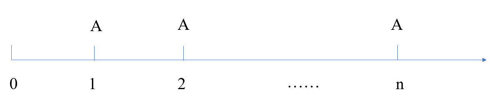
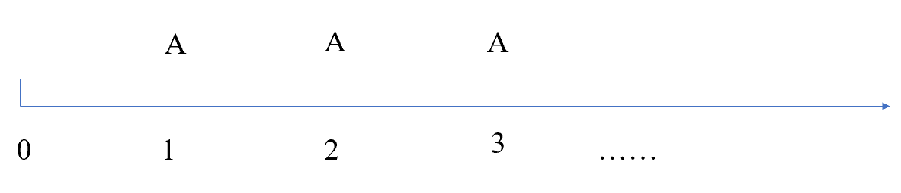
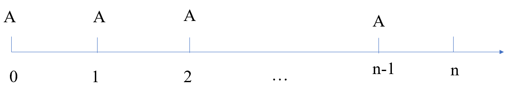
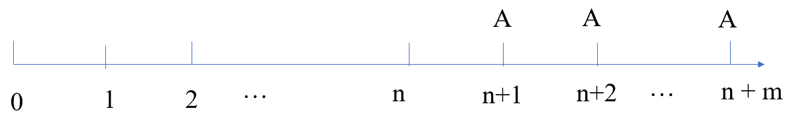

## Chapter 5 Investment Decision

### Syllabus

**D. Investment Appraisal**

**1. Investment Appraisal Techniques**

b\) Calculate payback period and discuss its usefulness as an investment appraisal method.\^\[2\]\^

d\) Calculate return on capital employed (accounting rate of return) and discuss its usefulness as an investment appraisal method.\^\[2\]\^

e\) Calculate net present value and discuss its usefulness as an investment appraisal method^.\^\[2\]\^

f\) Calculate internal rate of return and discuss its usefulness as an investment appraisal method.\^\[2\]\^

g\) Discuss the superiority of discounted cash flow (DCF) methods over non-DCF methods.\^\[2\]\^

h\) Discuss the relative merits of NPV and IRR.\^\[2\]\^

### 1 Decision-Making Process

**Expenditure Types**

Asset (capital) expenditure -- incurred in the acquisition or improvement of non-current assets.

Expenses (revenue) expenditure -- incurred to maintain non-current assets (e.g. repairs).

**Decision-making Process and Investment Appraisal's Role**

**Idea Creation -** proposals can be stimulated by a regular review of the company's competitive environment.

**Project Screening -** To screen out unsuitable proposals by looking at the impact of the project on stakeholders and whether they support the organization's strategy.

**Financial Analysis —** To analyze the financial viability of proposals by estimating relevant cash flows and applying investment appraisal techniques such as NPV, IRR, and payback period.

**Monitoring & review** - a post-completion review aims to learn from mistakes that have arisen in the project appraisal process.

Investment appraisal plays a key role in analyzing and evaluating investment proposals by using NPV, payback period, ROCE or IRR methods which will be covered later.

### 2 Simple Appraisal Techniques

#### 2.1 Return on Capital Employed (ROCE)

**ROCE** is also called accounting rate of return **(ARR)** or return on investment **(ROI)**. ROCE compares the average annual operating profit from a project to the initial (or average) investment.

It is calculated as:

**ROCE**= average annual operating profit/ average investment × 100% or

= average annual operating profit/ initial investment × 100%

Where:

Average annual profit= total PBIT over the life of the project / years of project

Average investment= (Initial investment +scrap value) / 2

**The decision rule of ROCE is**:

- Accept the project if ROCE is greater than target ROCE
- Reject the project if ROCE is less than target ROCE

**Advantages and Disadvantages of ROCE**

Advantages:

- Simple to understand and calculate
- It is a percentage measure and is easy to compare two options even if they are of different size
- It considers the whole life of the project
- It uses readily available accounting information
- It is often used by financial analysts to appraise performance.

Disadvantages:

- It is based on accounting profit rather than cash flow. Profits are affected by accounting policy choices.
- it ignores the time value of money
- it is a relative measure; it gives no information about the absolute change in shareholder wealth
- the target rate is subjective.

::: {.callout-tip}
**Example 1**

> NW company is considering investing \$46,000 in a new delivery lorry that will last for 4 years, after which time it will be sold for \$7,000. Depreciation is charge on a straight-line basis. Forecast operating profits/losses to be generated by the machine are as follows.
>
> | Year | 1 | 2 | 3 | 4 |
> |---|---|---|---|---|
> | \$ | 16,500 | 23,500 | 13,500 | (1,500) |
>
> What is the ROCE for the lorry (using the average investment method)?
>
> A 70%
>
> B 28%
>
> C 49%
>
> D 36%
:::

#### 2.2 Payback Period

**Payback period** is the time it takes for the operating cash flows from a project to pay back the initial investment.

The calculation of payback period is:

- constant annual cash flow: Payback period = initial investment / annual cash flow
- uneven cash flow: using **cumulative cash flow**

| Year | 0 | 1 | 2 | ... | n | n+1 | ... |
|---|---|---|---|---|---|---|---|
| Related cash flow | | | | | | | |
| Cumulative cash flow | | | | | | | |

**The decision rule for payback period** is:

- Accept if project payback period is less than target payback period
- Reject if project payback period is greater than target payback period

::: {.callout-tip}
**Example 2**

> The same information with example 1.
>
> what is the payback period for this investment (to the nearest month)?
>
> A 1 year 7 months
>
> B 2 years 7 months
>
> C 1 year 5 months
>
> D 3 year 2 months
:::

**Advantages of Payback Period**

- It is easy to understand
- It is based on relevant cash flows
- it focusses on earlier cash flows which are more certain and are more useful if a company has liquidity concerns
- It can be used as the first Screening device

Payback is often used as part of initial screening of projects. A project with a long payback is considered to be uncertain because it relies on cash flow in the distant future and are highly uncertain.

**Disadvantages of Payback Period**

- Ignores cash flows after the payback period
- It ignores the time value of money
- The target payback period is subjective
- It gives no information about the change in shareholder wealth
- It may lead to excessive investment in short-term projects; a project should not be evaluated using payback alone.

Possible improvement:

Discounted payback period allows for the time value of money, which will be covered later.

### 3 Interest and Discounting

#### 3.1 Interest

**Simple interest** -- interest accrues only on the initial amount invested.

**Compound interest** -- interest is reinvested alongside the principal.

The formula to find the future value (FV) for simple interest is:

FV = P(1+nr)

The formula to find the future value (FV) for compound interest is:

FV = P(1+r)^n^

Where: P=initial principal

n=years for which the principal is invested

r=annual rate of interest

**Effective Annual** **Interest Rate -** If interest is charged on a non-annual basis, then we should distinguish between stated annual interest rate and Effective Annual Rate (EAR), which is calculated as follows:

EAR=${(1 + \frac{r}{m})}^{m} - 1$

Where: r= annual stated interest rate,

m=number of periods in a year

::: {.callout-tip}
**Example 3**

> A bank loan of \$100m at the interest rate of 12%. Interest will be paid monthly. Calculate the effective annual rate of this bank loan.

:::

The EAR is an important concept that it gives the true interest rate associated with an investment or loan. This has implications for the cost of capital.

#### 3.2 Discounting and Present Value

**Discounting** calculates the sum which must be invested now (at a fixed interest rate) to receive a given sum in the future.

The formula for **present value** is:

$$
PV = \frac{CF}{(1 + r)^{n}} = CF(1 + r)^{- n}
$$

Where: PV=the present value of a future cash flow

r=discount rate or annual rate of interest

n=number of years before the cash flow arises

The formula for **simple discount factor** is provided at the top of the present value table in the exam as (1+r)^-n^.

::: {.callout-tip}
**Example 4**

> What's the present value of \$4000 in 4 years' time if the interest rate is 9%? Using the annuity tables

:::

Conventions in Discounting CF:

- Cash flow arising now (at time 0), ie the start of first year, the discount factor will be 1
- Time 1 is poi in time exactly one year after time 0
- A cash flow which occurs at the start of a year is taken to occur at the end of the previous year.

#### 3.3 Annuities and Perpetuities

**1)Annuities -** A series of identical cash flows arising each year for a finite period.

{width="3.6460575240594926in" height="0.7607294400699912in"}

The present value of annuity: PV=CF × Annuity factor (r, n)

Where: r = discount rate

n= number of periods of cash flow

CF=cash flow received each year

::: {.callout-tip}
**Example 5**

> A payment of \$1000 is to be made at the end of each year for 15 years. The interest rate is 12%. Calculate the PV of the annuity.

:::

**2)Perpetuities -** A series of identical cash flows arising each year to infinity.

{width="4.200333552055993in" height="0.9062117235345581in"}

The present value of a perpetuity:

PV = CF × 1/r

If a series of cash flow does not have an end and is growing at a constant rate, and this is known as a growing perpetuity, the present value will be:

PV = cash flow at period 1 × 1/(r-g)

Where: g=growth rate

::: {.callout-tip}
**Example 6a**

> (1)A payment of \$1000 is to be made at the end of each year for the foreseeable future. The interest rate is 12%. Calculate the PV of the perpetuity.
>
> \(2\) The payment grows by 3% in the second year and the growth rate remains constant.

:::

**3)Advanced Annuity -** If cash flows occur at the beginning of each period this is known as advanced annuity.

{width="3.7753849518810148in" height="0.72998687664042in"}

The present value of advanced annuity: P=A +A×AF (r, n-1)

The present value of **advanced perpetuity**

PV=A +A × 1/r

::: {.callout-tip}
**Example 6b**

> Paulo plans to buy a holiday villa in five years' time for cash. He estimates the cost will be \$1.5m. He plans to set aside the same amount of funds each year for five years, starting immediately and earning a rate of 10% interest per year compound. To the nearest \$100, how much does he need to set aside each year?

:::

**4) Delayed Annuity -** If a series of equal cash flows start at a time period later than period 1 this is known as a delayed annuity or perpetuity.

{width="4.654271653543307in" height="0.7951377952755906in"}

The present value of delayed annuity:

P=A×AF (r, m) ×DF(r, n)

P=A×AF (r, m+n) - A×AF(r, n)

The present value of delayed perpetuities:

{width="4.654271653543307in" height="0.7951377952755906in"}

::: {.callout-tip}
**Example 7**

> An investor has a cost of capital of 10%. She is due to receive a 5-year annuity starting in 3 years' time of \$7,000 per annum.
>
> What lump sum amount would you need to offer today to make her indifferent between the annuity and your offer?
>
> A \$26,537
>
> B \$19,936
>
> C \$16,667
>
> D \$21,924

:::

Loan Amortization（贷款偿还）

The process of providing for a loan to be paid off by making regular principal reduction is called amortizing the loan.

- Equal repayment of principal: the borrower pays the interest each period plus some fixed amount of the principal;
- Fixed-payment mortgage: the borrower makes a single, fixed payment every period.

::: {.callout-tip}
**Lecture Example 8**

A loan of \$100,000 to be repaid to the bank, over five years in equal annual instalments made up of capital repayments and interest rate at 9%.

The annual payment=100,000/AF(9%,5) =100,000/3.890=\$25,707

Each payment can be split between the repayment of capital and interest.

| Year | 1 | 2 | 3 | 4 | 5 |
|---|---|---|---|---|---|
| Beginning Balance | 100,000 | 83,293 | 65,082 | 45,232 | 23,596 |
| Interest rate @9% | 9,000 | 7,496 | 5,857 | 4,071 | 2,124 |
| Annual payment | 25,707 | 25,707 | 25,707 | 25,707 | 25,707 |
| Capital paid | 16,707 | 18,211 | 19,850 | 21,636 | 23,583 |
| Closing balance | 83,293 | 65,082 | 45,232 | 23,596 | 0 |

If the loan is repaid in equal principal installments, the interest and capital will be as follows.

| Year | 1 | 2 | 3 | 4 | 5 |
|---|---|---|---|---|---|
| Beginning Balance | 100,000 | 80,000 | 60,000 | 40,000 | 20,000 |
| Interest rate @9% | 9,000 | 7,200 | 5,400 | 3,600 | 1,800 |
| Capital | 20,000 | 20,000 | 20,000 | 20,000 | 20,000 |
| Annual payment | 29,000 | 27,200 | 25,400 | 23,600 | 21,800 |
:::

### 4 Discounted Cash Flow (DCF) Techniques

The **Time value of money** concept is fundamental to discounted cash flow methods. It is based on the assumption that investors prefer to receive \$1 today rather than \$1 in one year, i.e., it has a time value.

Possible reasons underlie this assumption:

- Liquidity preference: money received today can be reinvested to earn more. Therefore, investors have a preference for having cash today.
- Inflation: the value of future cash flows may be eroded by inflation.
- Risk: future cash receipts may be uncertain.

Two DCF methods can be used to evaluate projects, i.e. for investment appraisal.

- Net present value
- Internal rate of return

#### 4.1 Net Present Value

This method compares the **present value of all the cash inflows** from the project with the **present value of all the cash outflows**. The difference, the NPV, represents the **change in wealth** of the investor as a result of investing in the project.

$$
\mathbf{NPV} = \sum_{\mathbf{1}}^{\mathbf{n}}\frac{\mathbf{CF}_{\mathbf{i}}}{{(\mathbf{1} + \mathbf{r})}^{\mathbf{i}}} - \mathbf{CF}_{\mathbf{0}}
$$

(It can also be seen as the sum present value of relevant cash flow from the projects.)

usually, the cost of capital is used as the discount rate in NPV method of investment appraisal, as it is the minimum return needed to justify an investment.

The **NPV method** is applied as follows:

1. forecast the relevant cash flows from the project\^\[2\]\^
2. estimate the discount rate and discount each cash flow to its present value\^\[2\]\^
3. sum present value to give the NPV of the project\^\[2\]\^
4. the decision rule of NPV:\^\[2\]\^

- If NPV is positive, accept the project as it provides a higher return than investor require (i.e. the cost of capital);
- if NPV is negative, reject the project as it provides a lower return than investor require

**Two possible layouts for NPV calculation**.

- Layout 1: the cash flow layout is most appropriate for more complex questions.

+----------------------------+--------------+--------------+--------------+--------------+--------------+
| Year                       | 0            | 1            | 2            | 3            | 4            |
+============================+==============+==============+==============+==============+==============+
| Cash Flow from the project | (x~0~)       | x~1~         | x~2~         | x~3~         | x~4~         |
+----------------------------+--------------+--------------+--------------+--------------+--------------+
| Discount factor (r)        | 1            | (1+r)^-1^    | (1+r)^-2^    | (1+r)^-3^    | (1+r)^-4^    |
+----------------------------+--------------+--------------+--------------+--------------+--------------+
| Present value of cash flow |              |              |              |              |              |
+----------------------------+--------------+--------------+--------------+--------------+--------------+
| NPV                        | =sum(the sum of PV of cash flow)                                         |
+----------------------------+--------------------------------------------------------------------------+

The **NPV function** to calculate NPV in CBE:

Present value of future cash flow =NPV(r,value1,value2,...)

+-----------------------------------+-----------+-----------+-----------+-----------+-----------+
| Year                              | 0         | 1         | 2         | 3         | 4         |
+===================================+===========+===========+===========+===========+===========+
| Cash Flow from the project        | (x~0~)    | x~1~      | x~2~      | x~3~      | x~4~      |
+-----------------------------------+-----------+-----------+-----------+-----------+-----------+
| Present value of future cash flow | = NPV (r, x~1~,x~2~,x~3~,x~4~)                            |
+-----------------------------------+-----------------------------------------------------------+
| NPV                               | = NPV (r, x~1~,x~2~,x~3~,x~4~)- x~0~                      |
+-----------------------------------+-----------------------------------------------------------+

Any cash flows now (e.g. the initial investment) will still require adjustment to get NPV.

- Layout 2: simplified layout when cash flows involve annuities.

| Year | | Cash flow | Discount factor @ r% | Present value |
|---|---|---|---|---|
| 0 | Investment | (x~0~) | 1 | = (x~0~) × 1 |
| 1-n | contribution | x~1~ | AF(r,n) | |
| 1-n | Fixed costs | (x~2~) | AF(r,n) | |
| n | Scrap value | x~n~ | DF(r,n) | |
| NPV | | | | =sum( ) |

::: {.callout-tip}
**Example 9**

> JCW company is appraising an opportunity to invest in some new machine that has the following cash flows.
>
> Initial investment \$40,000
>
> Net cash inflows for 5 years in advance \$12,000 per annum
>
> Decommissioning costs after 5 years \$15,000
>
> At a cost of capital of 10% what is the NPV of this project (to the nearest \$100)?
>
> A negative \$3,800
>
> B positive \$14,800
>
> C positive \$700
>
> D negative \$11,275

:::

**Meaning of NPV**

A project's NPV shows the theoretical change in the dollar value of the company due to the project. Therefore, it indicates the change in shareholder wealth due to the project. As the main objective of financial management is to maximize shareholder wealth, shareholder wealth is increased if projects with positive NPV are accepted, and shareholder wealth will be maximized if a company invests in all such projects.

Therefore, NPV is considered the superior technique in investment decision making.

#### 4.2 Internal Rate of Return

A discounted rate at which the present value of a project's cash flows is zero.

**IRR** represents a project's average annual cash flow return as a percentage and the highest acceptable finance cost.

**Calculating IRR**

1)if a project has equal annual cash flows received in perpetuity:

IRR=$\frac{annual\ cash\ inflows}{initial\ investment}$ ×100

2\) linear interpolation formula

when cash flows are not perpetuities or annuities, the IRR is estimated as follows:

Step 1. calculate the NPV of the project at a chosen discount rate

Step 2. if NPV is positive, recalculate the NPV at a higher discount rate (or if the NPV is negative, recalculate the NPV at a lower discount rate).

Step 3. using the following formula to estimate the IRR:

Where: a = lower discount rate

B= higher discount rate

NPV~a~ = NPV at rate a

NPV~b~ = NPV at rate b

Note: when using linear interpolation, the answer should always be approximately rounded due to the inherent inaccuracy of this method. The IRR calculated is only approximated based on the simplifying assumption that there is a linear relationship between the NPV and the discount rate.

3)spreadsheet function

The calculations are simplified using the function in the CBE spreadsheet:

+----------------------------------+-----------+-----------+-----------+-----------+-----------+
| Year                             | 0         | 1         | 2         | 3         | 4         |
+==================================+===========+===========+===========+===========+===========+
| Cash Flow from the project       | (x~0~)    | x~1~      | x~2~      | x~3~      | x~4~      |
+----------------------------------+-----------+-----------+-----------+-----------+-----------+
| IRR                              | = IRR (x~0~, x~1~,x~2~,x~3~,x~4~)                         |
+----------------------------------+-----------------------------------------------------------+

IRR=IRR(values1,values2,...), where: values is the range of cash flows.

**Decision Rule of IRR:**

- If IRR \> cost of capital, accept the project.
- If IRR \< cost of capital, reject the project.

::: {.callout-tip}
**Example 9- continued**

> What is the internal rate of return of the project (to the nearest whole %)?
>
> A 12%
>
> B 10%
>
> C 14%
>
> D 9%

:::

#### 4.3 NPV Compared to IRR

Relative merits of IRR

- IRR is a relative measure so that it can be compared with the company's cost of capital, and this is easy for non-financial manager to understand.
- It is easy to calculate because it does not require the calculation of a cost of capital.

Relative disadvantages of IRR

- IRR is a relative measure and does not show an absolute change in shareholder wealth.
- May result in multiple IRRs when cash flows of projects are **unconventional**, e.g. the sign of cash flows changes in successive periods.
- Takes no account of the relative size of a project, therefore, it cannot be relied on when projects are **mutually exclusive** **(**or in situation of **capital rationing)**
- The limitation of **reinvestment assumption** in IRR -- there is an assumption in the IRR model that the interim cash inflows can be reinvested at the IRR. Therefore, an IRR that is significantly higher than a realistic reinvestment rate will be an overestimate the project's actual return.

Relative merits of NPV

- An absolute measure (\$), and shows \$ change in shareholder wealth.
- Provide a unique solution, i.e. a project has only one NPV
- Always reliable for decision making

Generally speaking, the **NPV method is superior**, it provides a single correct answer for decision-making in all circumstances.

**Example 10**

Which project should you choose if the given discount rate is 25%?

| Cash flow | 0 | 1 | NPV@25% | IRR |
|---|---|---|---|---|
| project A \$ | -10m | 40m | 22m | 300% |
| project B \$ | -25 | 65m | 27m | 160% |

#### 4.4 Advantages and Limitations of DCF Methods

DCF methods of appraisal are superior to non-DCF methods because they:

- Take into account the time value of money (unlike ROCE and payback)
- Take into account all cash flows over the whole life of the project; and the timing of cash flows.
- Provide a more objective basis for evaluating projects as they are unaffected by financial accounting policies.

As an absolute measure, NPV is regarded as the best single measure of the value of an investment. However, despite the theoretical superiority of DCF methods, many managers prefer to use non-DCF methods such as payback or ROCE. Possible reasons for this reluctance to use DCF methods include:

- The potentially complex and time-consuming process of calculating NPV or IRR.
- Difficulty in explaining DCF methods to non-financial managers.
- The complexity of estimating an appropriate discount rate particularly for unquoted companies.
- Managers may feel little connection between DCF methods and their reported performance and bonus systems.

**Example 11**

Four mutually exclusive projects have been appraised using NPV, IRR, ROCE, and PP. the company objective is to maximize shareholder wealth.

Which should be chosen?

| | | NPV | IRR | ROCE | PP |
|---|---|---|---|---|---|
| A | project A | \$1m | 40% | 34% | 4 years |
| B | project B | \$1.1m | 24% | 35% | 2.5 years |
| C | project C | \$0.9m | 18% | 25% | 3 years |
| D | project D | \$1.5m | 12% | 18% | 7 years |
