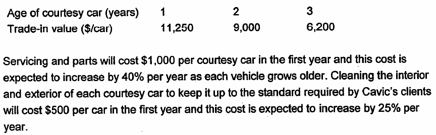
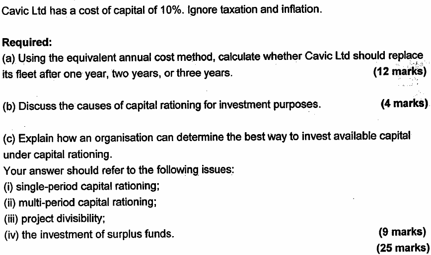
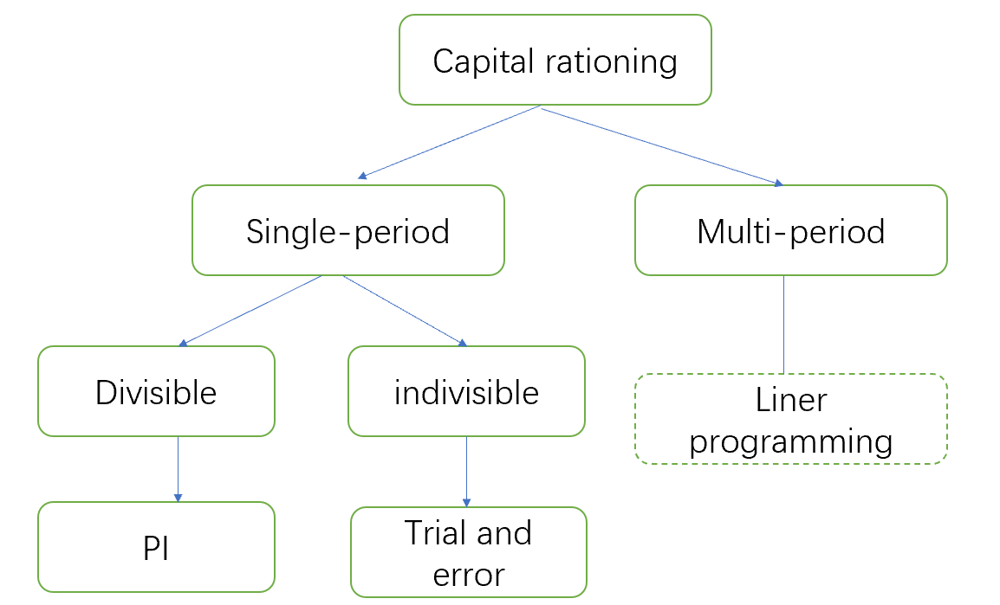
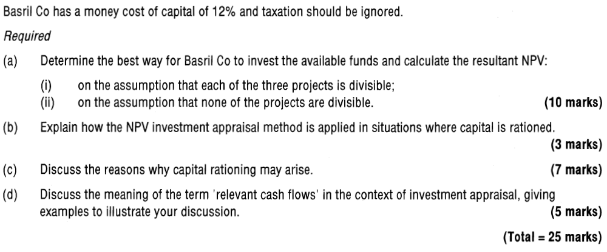

## Chapter 8 Specific Investment Decision

### Syllabus  {.pagebreak}
**D. Investment Appraisal**

**4. Specific Investment Decisions**

a\) Evaluate leasing and borrowing to buy using the before- and after-tax costs of debt.\^\[2\]\^

b\) Evaluate asset replacement decisions using equivalent annual cost and equivalent annual benefit.\^\[2\]\^

c\) Evaluate investment decisions under single-period capital rationing, including:\^\[2\]\^

i.  the calculation of profitability indexes for divisible investment projects

ii. the calculation of the NPV of combinations of non-divisible investment projects

iii. a discussion of the reasons for capital rationing.

**E. Business Finance**

**3. Source of Finance and Their Relative Costs**

d\) assess the impact of sources of finance on financial position, financial risk and shareholder wealth using appropriated measures, including

iii. leasing or borrowing to buy

### 1 Asset Replacement Decisions {.pagebreak}

#### 1.1 Asset Replacement Cycle

Assume a company has already decided it requires a particular non-current asset. A second decision is how often to replace the asset. For example, how often should the company replace its fleet of vehicles or its computer equipment? This is referred to as an asset replacement decision.

The calculation of equivalent annual costs is a tool that can be used to assist in this decision-making process.

**The EAC Method Involves the Following Steps:**

Step 1 -- calculate the net present value of cost for each potential replacement cycle.

Step 2 -- calculate the equivalent annual cost (EAC) for each potential replacement cycle.

Step 3 - choose the replacement cycle with the lowest EAC.

Equivalent annual cost - the annual cost of owning, operating and maintaining an asset over its entire life, can be calculated by the following formula:

Equivalent annual cost (EAC) = Annual factor (r, n)

Note: any revenues resulting from the use of the asset will be ignored since they will occur in any case, whatever the replacement cycles, and is therefore not a relevant cash flow.

{width="5.916841644794401in" height="0.8601334208223972in"}

{width="5.436228127734033in" height="1.6887543744531934in"}

{width="5.5483858267716535in" height="3.2917858705161853in"}

**Comments of Replacement Analysis**

NPV cannot be compared directly for projects with different life. The calculation of EAC takes account of the different lifespans, allowing comparisons to be made.

**Limitations:**

- The analysis assumes a like-with- replacement (in perpetuity), however, this is rarely possible in reality. Asset requirements may change over time.

- Changing technology may also require earlier replacement than the optimal solution suggests.

- Non-financial factors such as employees' satisfaction are ignored

- The analysis ignores the impact of tax and inflation
:::

#### 1.2 Equivalent Annual Benefit

For mutually exclusive projects, the general rule is to choose the project with the highest NPV. However, if the same situation is faced repeatedly and the projects have different lives, the equivalent annual benefit (EAB) can be used.

Equivalent Annual Benefit = NPV of project/ annuity factor

::: {.callout-tip}
**Example 2**

> Project A with an NPV of \$3.75m and a duration of 6 years, project B with an NPV of \$4.45m and a duration of 7 years. The cost of capital is 12%. Which project should be chosen?

:::

### 2 Capital Rationing

The NPV decision rule, to accept all projects with a positive NPV, assumes the existence of a perfect market in which access to funds for investment is not restricted. However, in practice, companies are likely to find that funds available for investment are restricted or rationed.

**C****apital rationing** -- a situation in which there is not enough finance available to undertake all projects with positive NPV. Therefore, capital has to be rationed.

The causes of capital rationing may be external (hard capital rationing) or internal (soft capital rationing).

#### 2.1 Causes of Capital Rationing

##### 1. Hard Capital Rationing

Hard capital rationing -- the capital markets limit the amount of finance available.

Reasons why capital markets may restrict the funds available to a particular company include:

- High country/political risk (concerns about corporate governance or state appropriation of assets)

- High business risk (company's operating cash flows are very sensitive to the economic cycle)

- High financial risk (the company already has high debt level)

- Lack of reliable independent information available about the company. this is especially relevant to small- and medium-sized entities.

##### 2. Soft Capital Rationing

Soft capital rationing -- the company internally sets limits on finance availability.

There are several reasons why company mangers might restrict available funds for investment:

- A preference for slower organic growth to a sudden increase in size arising from accepting several large investment projects. This particularly applies to family-owned business.

- Managers wish to avoid raising new equity finance if this will dilute the control of existing shareholders.

- Managers wish to avoid issuing new debt to keep gearing under control and meet future interest payment.

- To create an internal market for investment funds, thereby channel funds to projects with better chances of success and larger margins.

#### 2.2 Dealing with Capital Rationing 

Capital rationing may rise in a single-period or multi-period.

**Single-period capital rationing -** Capital is in short supply in only one period.

**Multi-period capital rationing --** Capital is rationed in two or more periods.

Dealing with multi-period capital rationing - use of **linear programming** model to find the optimal investments strategy.

Dealing with single-period capital rationing - depends on whether projects are divisible or not.

{width="3.789183070866142in" height="2.2951334208223972in"}

##### 1. Divisible Projects

A project is divisible if any partial or proportionate investment can be made in order to gain a pro rata NPV.

The three steps required for rationing capital to divisible projects are as follows:

1.  calculate a profitability index for each project:\^\[2\]\^
2.  rank projects according to their profitability index\^\[2\]\^
The profitability index is the ratio of the present value of the project's future cash inflows divided by the initial investment.

$$PI = \frac{PV\ of\ project\ net\ cash\ inflows}{initial\ investment}$$

3.  allocate funds starting with the highest ranking to maximize the NPV.

With this method, there will be no funds left over.

For **mutually exclusive divisible** projects, steps are the same as above, but bearing in mind that any feasible combination of projects can include only one mutually exclusive project.

##### 2. Non-Divisible Projects

A non-divisible project must be done 100% or not at all.

The three steps for rationing capital to indivisible projects are as follows:

- simply list all possible **combinations** of projects which can be utilized given the capital budget.

- choose the combination with the highest NPV.

With this approach, there will usually be some surplus funds remained. Surplus funds can be invested in the money markets (it is a problem of working capital management) in order to increase overall profitability.

**Practical Solutions to Capital Rationing**

- Delaying project to a subsequent period where capital rationing may be less of an issue

- Finding new source of financing such as leasing or government grants

- Entering into a joint venture with a partner

- Issuing new capital if soft capital rationing exists

{width="5.632926509186352in" height="2.980693350831146in"}

{width="5.710652887139108in" height="2.372425634295713in"}
:::

### 3 Lease or Buy

The decision of whether to lease or buy an asset is made once the decision has been made to acquire the asset for an investment project.

The "lease or buy" decision is **a financing decision** which should be considered **separately** from the investment decision.

- For investment decision, discount cash flows from using the asset at the company's WACC.

- For financing decision, discount cash flows specific to each financing options at the after-tax cost of debt.

> 

**Advantages of Leasing**

- For short-term leases, the lessor retains most of the risk of ownership, is responsible for servicing and maintaining the leased equipment

- Don't need to pay large amount of money at the beginning

- As a long-term of source of finance, leasing may be cheaper than a bank loan if the lessor obtains bulk purchase discounts

- Avoiding loan covenants.

**Relevant cash flows** of leasing:

- Lease payments (tax-allowable deductions)

- Tax relief on the lease payments

Relevant cash flow of buy:

- Purchase cost

- Residual value

- Running cost

- Tax relief on TAD and running cost

**Evaluation Whether Lease or Borrow to Buy**

**Steps:**

- Calculating the financing cash flows of leasing and buy

- Discounting these cash flows using the **post-tax cost of borrowing**

Post-tax cost of borrowing = cost of borrowing × (1-tax rate)

- Chose the decision with the **least cost**

Alternatively, you can compare:

NPV of the cost of using lease -- NPV of the benefit of using lease

If the resulting NPV is positive, it means the cost of lease is cheaper than the borrow to buy.

**Evaluation Using Pre-tax Cost of Debt**

If the company is not in a tax-paying position, the implication for lease or buy decision:

There would be no tax benefit from TAD, lease payments and no tax relief on debt. This means that the discount rate used to evaluate the financing options should be the pre-tax cost of debt.

{width="5.768055555555556in" height="4.2125in"}
:::

