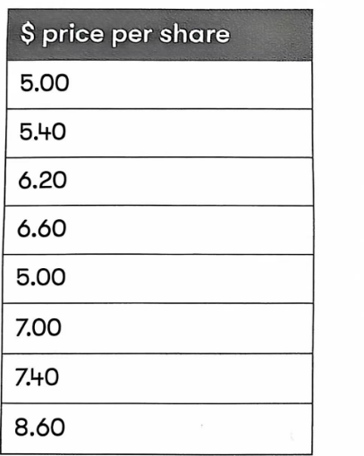
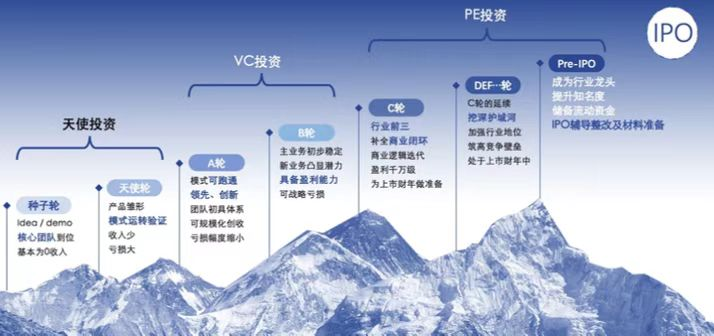
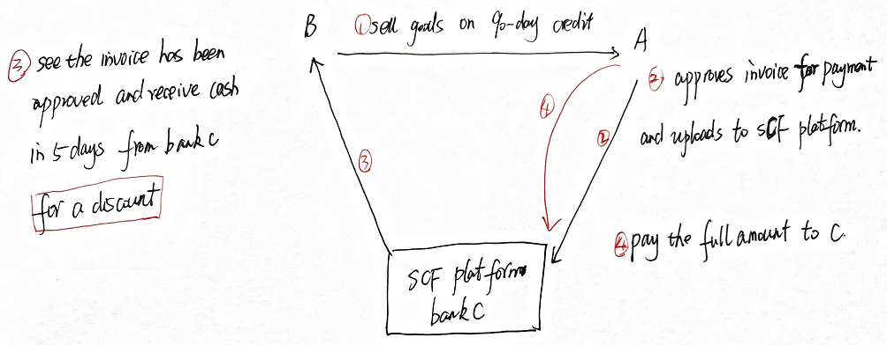

## 9 Source of Finance

### Syllabus  {.pagebreak}
**E. Business Finance**

**1. Sources of, and raising, business finance**

a\) Identify and discuss the range of short-term sources of finance available to businesses, including:[2]

i.  overdraft

ii. short-term loan

iii. trade credit

iv. lease finance.

b\) Identify and discuss the range of long-term sources of finance available to businesses, including:[2]

i.  equity finance

ii. debt finance

iii. lease finance

iv. venture capital.

c\) Identify and discuss methods of raising equity finance, including:[2]

i.  rights issue

ii. placing

iii. public offer

iv. stock exchange listing.

d\) Identify and discuss methods of raising short- and long-term Islamic finance, including:[1] 

i.  major differences between Islamic finance and the other forms of business finance.

ii. the concept of riba (interest) and how returns are made by Islamic financial securities.

iii. Islamic financial instruments available to businesses including:

1. murabaha (trade credit)
2. ijara (lease finance)
3. mudaraba (equity finance)
4. sukuk (debt finance)
5. musharaka (venture capital). (note: calculations are not required)

**5. Finance for small and medium sized entities (SMEs)**

a\) Describe the financing needs of small businesses.[2]

b\) Describe the nature of the financing problem for small businesses in terms of the funding gap, the maturity gap and inadequate security.[2]

c\) Explain measures that may be taken to ease the financing problems of SMEs, including the responses of government departments and financial institutions.[1]

d\) Identify and evaluate the financial impact of sources of finance for SMEs, including sources already referred previous and also[2] 

i.  Business angel financing

ii. Government assistance

iii. Supply chain financing

iv. Crowdfunding / peer-to-peer funding.

### 1 Short-term Finance {.pagebreak}

Source of finance can be classified as short-term and long-term finance.

Short-term finance mainly includes:

- bank overdrafts
- short-term bank loans
- trade payables

##### 1. Bank Overdraft

A bank overdraft is a borrowing facility with a current account. where bank overdraft is allowed, it is often the liquidity fallback of choice for SMEs.

**Advantages and Disadvantages of Overdraft:**

Advantages:

- flexible terms of borrowing and repayment allow companies to borrow funds as needed up to an approved limit, and repay when cash flow permits.
- It can be established relatively quickly, providing immediate access to cash.
- Interest paid on the amount of the facility used is more cost effective.

Disadvantages:

- Potential uncertainty as banks can withdraw or reduce facilities with little notice
- Overdrafts are unsuitable for long-term financing needs and ongoing cash flow issues.
- Interest rates can be higher than other forms of short-term financing, making overdrafts expensive if used regularly.

##### 2. Short-term Bank Loans

Advantages and disadvantages of short-term bank loan

Advantages:

- Quick access to funds for immediate financial needs
- Typically, unsecured
- Short-term interest rates are usually lower than long-term interest rates due to lower credit risk on short-term debt.

Disadvantages:

- Arrangement fees may be high when expressed as an annual effective cost
- Refinancing risk -- when short-term loan matures, the borrower faces the risk that it cannot be easily replaced or refinance or that interest rates have risen.

##### 3. Trade Payables

Customers can take advantage of trade credit by delaying payments to existing suppliers. It is obviously a very short period but very important source of finance.

**Advantages and Disadvantages of Trade Credit**

Advantages:

- It allows a company to delay payment, providing a free finance for a period
- Extending the time between receipt of goods/services and payment improves cash flow management.
- Adhering to terms can build supplier relationship, potentially leading to more favorable terms and discounts.

Disadvantages:

- The loss of settlement (prompt payment) discounts is potentially costly
- Late payments may result in penalties and damage supplier relationship.
- It is specific to purchase from suppliers; it does not meet other short-term needs.

### 2 Long-Term Finance

#### 2.1 Debt Finance

##### 1. Bank Loans

Bank loans -- companies agree to borrow from the bank at a fixed rate for a specified period and with an agreed repayment schedule.

**Advantages and Disadvantages of Bank Loan**

Advantages:

- As the loan is for a fixed term, there is no risk of early recall (unlike overdrafts that are repayable on demand). This helps with financial stability.
- A predetermined repayment schedule makes it easier to budget and plan for loan repayments. This helps cash flow management.
- Interest will be tax deductible, and is cost effective.

disadvantages:

- Terms and conditions are inflexible, fixed repayment schedule may be non-negotiable. A bank may also restrict how a loan can be used.
- Banks may require security (collateral). Assets are pledged as security will be at risk if the company defaults on the repayment schedule.
- It may require covenants to protect the debtholder, which are restrictions on the company (e.g. limits on dividend payments, limitations on future borrowing)
- Penalties or fees for early repayment may exist if a company want to repay a loan ahead of schedule.

A **mortgage loan** is typically a long-term loan secured by property.

Given the security, mortgage loans have a lower interest rate than short-term debt. However, there are likely to be restrictive covenants concerning the use of property and potential disposal. In the event of default on repayments, the lender may force the sale of property to recover the loan. This is a significant risk to the company.

##### 2. Bonds (Loan Notes, Debenture)

A negotiable security evidencing a debt governed by a contract which specifies, for example, the coupon rate, repayment schedule, security (if any), principal value, seniority (if subordinate to other debt) and other covenants.

Bonds may be **secured** by:

- A fixed charge over a specific asset (normally land or building), which cannot be sold unless the debt is repaid;
- A floating charge over a class of asset which changes. On default, the floating charge becomes fixed, and the asset class can no longer be traded until the debt is repaid. In event of default lenders appoint receiver（接管人制度）rather than lay claim to asset.

Bonds may redeemable or irredeemable.

Bonds are usually issued with a face (nominal/par) value of \$100. They can be traded on the bond market and reach a market price. Interest is usually a fix coupon expressed as a percentage of nominal value.

Interest payments = face value (\$100) × coupon rate

**Types of Bonds**

(1) Deep discount bonds

Bonds issued at a substantial discount to nominal value and redeemable at par value (or above) on maturity.

Investors receive a large capital gain on redemption but are paid a low coupon during the loan term. This is especially useful for financing projects which produce weak cash flows in the early years.

(2) Zero-coupon rate bonds

Bonds issued at a discount to nominal value and which pay no interest.

Advantages of zero-coupon rate bonds:

- The issuing company pays no cash interest; the only cash payout is at bonds maturity
- Return to investors is wholly a capital gain.

##### 3. Convertible Bonds

Bonds which can be converted into a pre-determined number of shares.

- Pay a fix coupon rate until converted
- May be converted into ordinary shares:

> -on a pre-determined rate
>
> -at a pre-determined rate (conversion ratio); and
>
> -at the holder's option

**Advantages of Convertible Bonds:**

- For the issuer, they can offer a lower coupon rate than would have to be paid on a straight bonds/preference share.
- For investors, they are a relatively low-risk investment with the opportunity to make high returns on conversion to ordinary shares.
- For newer companies, investors may not want to risk investing in equity but may be prepared to invest in less risky debentures. If the company does well, investors can opt to convert and benefit from capital growth or keep safe loan notes.

**Loan Notes with Warrants**

Warrant -- the investor's right, but not the obligation to purchase new shares at a future date at a fixed price (the exercise or subscription price).

Features of warrants:

- They may be attached to loan notes to make them more attractive
- They are an option to buy shares in the issuing company
- They may be separated from the underling debt and can be traded independently

Advantages of warrants:

- The coupon rate on the loan note will be lower than for comparable straight debt. This is because investors have the right to purchase new shares at an attractive price.
- They may make an issue of unsecured debt possible when the company has inadequate assets to secure the debt.

##### 4. Preference Shares

Shares with a fixed rate of dividend that have a prior claim on profits available for distribution.

Preference shares are legally equity they are often treated as debt (under IFRS accounting standards) as they are similar to debt.

**Features of Preference Shares:**

- Have a fixed percentage dividend payable before ordinary dividends. The dividend is expressed as a percentage of share's nominal value.
- The dividend is only payable if there are sufficient distributable profits. Any dividend arrears are payable before ordinary dividends.
- Dividends are not tax deductible.
- Preference shareholders rank before ordinary shareholders and after debt holders on liquidation.

**Advantages and Disadvantages of Preference Share**

Advantages:

- No voting rights; therefore, no dilution of control right
- Compared to the issue of debt:

-dividends do not have to be paid in any specific year, e.g. if profits are poor

-Preference shares are not secured on company assets

-non-payment of a dividend does not give holders the right to appoint a liquidator

Disadvantages:

- Dividends are not tax deductible (unlike interest on debt is tax deductible), so preference shares are a relatively rare source of finance in practice.
- To attractive investors to buy preference shares, the company must pay a higher return than debt to compensate for the additional risk.
- Creates extra risk for ordinary shareholders because the preference dividend has to be made before the ordinary dividend.

##### 5. Factors Influence What Types of Debt Finance is Sought

(1) Availability

Only listed companies are able to make a public issue of bonds. smaller companies are only able to obtain debt finance from a bank.

(2) Credit rating

Credit ratings are given to bond issues by credit rating agencies and this will affect the interest yield that investor will require.

(3) Amount-Bonds issue is usually for large amounts.

(4) Duration

If the loan is sought to buy a particular asset, the length of the loan should match the length of time that asset will be generating revenues.

(5) Fixed or floating rate

Expectation of interest rate movements will determine whether a company wants to borrow at a fixed or floating rate. Fixed-rate finance may be more expensive, but the business runs the risk of adverse upward rate movements if it chooses floating rate finance.

(6) Security and covenants

The choice of finance may be determined by the assets that the business is willing or able to offer as security, and by the restrictions in covenants that the lenders wish to impose.

#### 2.2 Equity Finance

Equity finance can be internal or external finance. Internal source of finance is retained earnings which will be covered in chapter of dividend policy.

A company can issue new shares to finance its projects, i.e. external finance.

##### 1. Methods of Share Issue

**(1) Options for Unquoted Companies**

For unquoted companies, methods of share issue include:

- To become quoted, raise new equity finance at the same time as becoming listed. This is known as initial public offering (IPO) or listing. It is an expensive process.
- To say unquoted, use a rights issue or private placing. However, sources of funds are limited to existing owners and new private investors.

**Advantages and Disadvantages of Listing**

Advantages:

- access to a wider pool of finance
- Improved marketability of shares
- Enhanced public images
- Easier to seek growth by acquisition.
- Original owners realizing part or all of their holdings

Disadvantages of listing:

- Greater public regulation, accountability and scrutiny.
- Additional cost involved in making share issue, including brokerage commissions and underwriting fees.
- Increase in costs arising from the strengthening of the company's reporting function (accountancy and auditing fee).
- Many factors will affect share price

**Ways of Become Listed**

- Initial public offer
- Introduction

  - Stock market grants a quotation, given that shares must already be wildly held, so that a market can be seen to exist.
  - No shares are made available to the market, so no new finance is raised.
  - Useful to gain greater marketability of shares, or further easier access to additional capital.

**Stock Exchanges for Different Sorts of Listing**

- London Stock Exchange-the Main Market and Alternative Investment Market (AIM). AIM focuses on helping smaller and growing companies raise the capital they need for expansion.
- NASDAQ: This is an electronic stock exchange in the US and has the NASDAQ National Market for large, established companies (market value at least \$70m) and the NASDAQ Capital market for smaller companies.

**(2) Options for Quoted Companies**

If a company is already listed, there are three main ways of issuing new shares and raising equity finance:

- Public offer

> -for subscription: a direct sale to the public. This is generally the most expensive method of issuing new shares.
>
> -for sale -- an indirect sale to the public is achieved by selling shares directly to an issuing house (investment bank), which then sells them to the public. (The issuing house guarantees to buy the shares.)

- Placing - Shares are offered to a selection of investors (usually pension fund and insurance companies) rather than the general public. This is generally the least expensive method of issuing new shares.
- **Right issue** -- an offer to existing shareholders to buy new shares in proportion to their existing holdings.

**Rights Issue**

In a right issue, the existing shareholders are offered new shares (usually at a discount to the current market price) in proportion to existing holdings.

**Theoretical Ex-Right Price (TERP)** - The expected share price after the right issue.

It is simply the forecast total market value of the company's equity after the rights issue divided into the number of shares that will be in issue after the rights issue.

TERP = $\frac{pre - existing\ value\ of\ equity + proceeds\ of\ rights\ issue + project\ NPV}{number\ of\ shares\ after\ the\ rights\ issue}$

Note for the calculation of TERP：

- Proceeds of the rights issue should be added net of any issue costs;
- If the project has already been announced, and if the market is semi-strong efficient, the project's NPV will *already* be reflected in the existing share price and it should **not** be included again in the formula above.

So, when issue costs are ignored and the project's NPV is already reflected in existing share price, calculation of TERP can be simplified as:

**TERP**= $\frac{N*\ share\ price\ before\ right\ issue\  + \ 1*issue\ price}{N + 1}$

Where: N is the number of shares required to have the right to buy 1 new share.

Value of a right = theoretical ex-right price -- issue price

The value of a right per existing share = the value of a right / N

**The actual market price** after a right issue may differ from the TERP. This will occur when expected yield from new funds raised are not equate to earnings yield form existing funds.

**Right Issue and Shareholder Wealth**

In theory, shareholders can take up or dispose of their rights, shareholder wealth will not change.

::: {.callout-tip}
**Example 1**

> Gopher has issued 3,000,000 ordinary shares of \$1 each, which are at present selling for \$4 per share. The company plans to issue rights to purchase 1 new equity share at a price of \$3.2 per share for every 3 shares held.
>
> Required:
>
> \(1\) Calculate the TERP
>
> \(2\) Value of rights
>
> A shareholder owns 900 shares in Gopher before the rights issue. Assuming that the actual market value of shares will be equal to the theoretical ex-rights price, what would the effect on the shareholder's wealth be if the shareholder
>
> \(1\) buy the new shares
>
> \(2\) sell the right
>
> \(3\) do nothing

:::

::: {.callout-tip}
**Example 2 (Sep/Dec 2020)**

Simon Co is planning a 1 for 4 rights issue. The value of rights has been calculated as \$0.40per existing share. Simon Co's market price is currently \$7.00 per share.

{width="1.8844674103237096in" height="2.3613713910761156in"}

What is the theoretical ex rights price (TERP) per share and the rights issue price pershare?

TERP = \$( )

Rights issue price \$( )
:::

> Summary: Public Offer, Placing and Right Issue Compared

- Public offer and placing will dilute the ownership existing shareholders, while right issue will not affect the voting right if shareholders all take up their right
- Public offer is more expensive than right issue, as the new issues can incur costs (such as underwriting, advertising costs), right issue is relatively cheaper and simpler than public offer

**(3) Other Types of Share Issue**

**Bonus Issue (****Scrip Issue)**

- Reserves are converted into share capital, which is distributed as new shares to existing shareholders in proportion to their existing holdings.
- **No finance is raised.**
- The purpose is to increase the marketability of shares, as it increases the number of shares and reduces their price.
- Signal a company's strength to the market.

**Stock Split**

Stock split occurs where ordinary shares are split in value (e.g. each of \$1 share is converted into two 50cent shares) this reduces the market price per share, increasing their marketability.

A stock split changes the share capital but does not raise any new equity finance for the company, and does not dilute the ownership interests of existing shareholders.

> **[Exam advice]{.smallcaps}**

If asked to recommend a suitable equity source of financing method, consider the following factors (in so far as the information permits):

\(1\) Availability

Quoted companies are able to use any of equity resources, unquoted companies are restricted to right issues, private placing, retained earnings

\(2\) Amount of finance

- Right issue
- Public offer

\(3\) Cost of issue procedure

- Internal funds
- Placing
- Right issue
- Public offer

\(4\) Pricing of the issue

- New issue: if the price is high, the issue may not be fully taken up; if it is underpriced, some of the benefits of the project will accrue to new shareholders
- Placing: price will be negotiated so as to be attractive
- Right issue: completely by-pass the price problem, as any gain on new shares would go to the existing shareholders
- Unquoted: more complex, as no existing market price to refer

\(5\) Control right

- There is no change with internal funds and right issue (if they are taken up by existing shareholders)
- Placing and public offer introduce new shareholders

There is no rigid rule concerning the choice. Use of Internal funds is the best, but subject to sufficient availability and dividend policy considerations. Of the new issue methods, the order of preference will be right issue, placing, and public offer.

#### 2.3 Leasing (Medium-term)

Under a lease contract, the lessee has the right to use an asset owned by the lessor in exchange for a series of payments.

Advantages of leasing

- Leasing offers more flexibility than borrowing to buy. Lease periods can be less than an asset's useful life. If technology changes and the asset becomes out of date before the end of its expected life, the lessee does not have to keep on using it.
- Some leasing includes repairs and maintenance; this helps reduce the costs of asset maintenance.
- Under the leasing contract, the risk of failing to achieve a disposal value would be transferred to the lessor.
- the company may have difficulty to obtain a bank loan to buy the asset, leasing may be the only way of getting use of the asset, but there are many leasing providers (often associated with asset manufactures).

Disadvantages of leasing:

- at the end of lease, the company typically does not own the asset unless it has an option to purchase it at an additional cost.

#### 2.4 Venture Capital

Venture capitalists are a potential source of finance for SMEs. venture capital is equity capital provided to small and growing business. It is a venture capital firm that manages a venture capital fund, or a high-risk, potentially high-return subsidiary of an organization with significant cash to invest. Typically, a \$1m minimum is involved for any one investment.

Venture capital trusts also serve as a potential financing source. VCTs are listed investment trust companies which invest at least 70% of their funds in a spread of small unquoted trading companies.

### 3 Finances for SMEs

#### 3.1 What Is an SME?

Characteristics of an SME

- is likely to be unquoted;
- ownership of the business is restricted to a few individuals, typically a family group;
- it is not a macro business, i.e. a very small business created for the self-employment of its owners.

Importance of SMEs

SMEs contribute in a significant way to many economies in the world. Besides generating income (often a large proportion of the gross national product), they are frequently major employers and the sector most identified with new ideas and entrepreneurial spirit. These latter factors help sustain and support growth rates in many economies.

#### 3.2 Difficulties in Raising Finance

**Funding Gap and Maturity Gap**

Initial owner finance is nearly always the first source of finance for an SME, whether from the owner or family connections. Many of assets be intangible at this stage, making external financing difficult. The **funding gap** is the difference between the finance available to SMEs and the finance they could productively use.

For small business, long-term loans are often easier to obtain than medium-term loans because the longer-term loans are easily secured with mortgage against property. As medium-term loans are hard to obtain for SMEs, and many resort to financing medium-term assets with short-term finance such as overdrafts, this is known as **maturity gap** as there is a mismatch of the maturity of the assets and liabilities within the business.

**Reasons of Difficulties in Raising Finance**

(1) perceptions of risk and uncertainty

SMEs are often viewed as unattractive investment opportunities because they have high levels of risk and uncertainty attached to them. Reasons include:

- SMEs typically do not have a track record
- SMEs often have no or very limited internal controls
- SMEs don't require audits, and the press is not interest in them. Therefore, they have fewer external regulatory and controls.
- The potential investors in an SME have much information about the business than its managers (i.e. information asymmetry) contributes to their perception of high risk.
- SMEs often have one dominant owner-manager whose decisions are rarely questioned
- SMEs often have limited assets to offer as security.

(2) absence of security

if an SME seeks a bank loan, the bank will require security available for any loan provided. Many SMEs are based in the service factor, where the main asset is likely the human capital rather than physical assets. Therefore, the directors may pledge personal asset (e.g. homes) to secure bank loans.

(3) shares lack marketability

the equity issued by small companies is unquoted and difficult to buy and sell. The lack of marketability means that small companies may be unable to offer new equity to anyone other than family and friends.

Therefore, SMEs have to rely on retained earnings for equity finance, but this source is limited, especially when profits are low. They may have to rely on debt if the amount of equity they can raise is restricted.

#### 3.3 Potential Sources of Finance

Government policy can influence the level of funds available.

- tax policy such as higher taxes on dividends or concessions to encourage companies to invest (e.g. tax-allowable depreciation)
- interest rate policy, for example, low rates, means borrowing is cheaper and the supply of funds increases as there is less incentive for investors to save.

##### 1. Debt Finance

Source of debt finance available to SMEs include:

- trade credit (obtaining goods from suppliers on credit terms).
- factoring and invoice discounting (whereby a company effectively raises finance against the security of its outstanding receivables)
- leasing is useful for SMEs as it avoids raising capital to acquire assets. For SMEs, leasing can be cheaper than borrowing because:

> -large leasing companies have bargaining power with suppliers, and so the reduced cost of assets can be partially passed on to lessees.
>
> -leasing companies can usually dispose of old assets more effectively than SMEs.
>
> -the finance cost to a large lease company will likely be less than that for an SME.

- Bank finance, typically an overdraft or longer-term loans secured on major assets, is usually supported by business plans and backed by personal guarantees of owner of the SME.

##### 2. Government Sources

governments are often keen to support SMEs in raising finance. government source include:

(1) Grants and subsidies

Depending on the location and nature of the SME, regional, national or even international grants may be available to help start up the business. Subsidiaries may take the form of government loans offered to SMEs at interest rates below commercial levels.

(2) government loan guarantee schemes

government loan guarantee schemes exist in various countries to support businesses and stimulate economic activity. for instance, the 'Enterprise Finance Guarantee' scheme in the UK, helping SMEs to finance from a bank.

(3) Providing equity investment

many countries have government-backed venture capital organizations that are willing to invest in the equity of SMEs.

##### 3. Business Angels

business angels are private individuals (or small groups of individuals) prepared to invest equity in small business with considerable potential. Angels provide not only finance, they also offer advice, experience and business contract.

{width="3.84375in" height="1.8076388888888888in"}

##### 4. Crowdfunding

Crowdfunding -- using a large, evolving, relatively open group of people (usually assembled via the internet) to provide finance for the project.

Under crowdfunding, there is no financial intermediary: each individual in the crowd has a direct relationship with the entity funded. Crowdfunding may be appropriate for the early stages of "seed" finance for an SME.

Crowdfunding can be very beneficial for SMEs as it allows them to reach out directly to investors who may be willing to take the risk associated with funding technologies and innovations often pioneered by SMEs.

Crowdfunding may also be debt-based.

##### 5. Supply Chain Financing

The use of financial instruments, practices and technologies to optimize the management of the working capital and liquidity tied up in supply chain processes for collaborating business partners.

SCF provide short-term credit that optimizes working capital for both the buyer and the seller. It generally involves using a technology platform to automate transactions and track invoice approval and settlement processes from initiation to completion.

{width="4.78125in" height="1.8645833333333333in"}

Obviously, SCF could be of great help to SMEs with a poor credit rating (or lacking a credit history) that supply goods or services to a large company with a good credit rating. It allows the SME to take advantage of its customer's superior credit rating and receive immediate payment at a small discount to the sales invoice's face value. The customer may also benefit from its bank offering extended payment terms on the invoice.

However, a disadvantage for SME suppliers is that large trading partners may be able to abuse their power by demanding lower prices from them in exchange for arranging SCF.

##### 6. Peer-to-peer Lending

A method of debt financing that enables individuals to lend money to small businesses without using an official financial institution as an intermediary.

P2P lending is also referred to as debt-based crowdfunding.

> **[Summary: debt finance compared to equity]{.smallcaps}**

Advantages of debt finance compared to equity

- debt is a cheaper source of finance
- debt will not dilute EPS and control right
- debt is quicker and cheaper to issue than a share issue
- interest payments attract tax relief
- the use of debt is a discipline on managers
- using debt can be interpreted as a signal of confidence in future cash flows

disadvantages of debt finance compared to equity

- debt creates higher variability in dividends ie higher financial risk
- using debt worsens interest cover and gearing ratios, and creates higher default risk
- debt payments must be paid even if the company is not making profit

> **[Exam advice]{.smallcaps}**

If asked to recommend a suitable financing method, consider the following factors (in so far as the information permits):

\(1\) Availability

Finance may be limited if recent performance is poor and an SME will find it difficult to raise equity.

\(2\) cash flow

Debt requires to pay out cash in the form of interest; therefore, the company's ability to generate cash will be relevant.

(4) control

raising equity will lead to a change in control, but debt will not.

(5) cost

debt finance is cheaper than equity finance, so if the company can take on more debt, there could be a cost advantage.

(6) ease and cost of issue

raising equity is more difficult, time consuming and expensive than raising debt.

(7) maturity

in general, the term of finance should match the term of needs. However, the maturity dates of existing debt should also be considered.

(8) risk

company must control the total risk. If business risk rises, the company may seek to reduce financial risk and vice versa.

(9) security and covenants

debt may require security (is this available?) or covenants (are these acceptable?) to maintain a certain liquidity level.

(10) yield curve

if the yield curve is getting steeper, there is an expectation that interest rate will rise. Therefore, fixed-rate debt may be appropriate if a company wishes to raise more debt.

### 4 Islamic Finance

#### 4.1 Background

**Islamic finance** -- a system of banking consistent with the principles of Islamic law (Sharia). Sharia prohibits:

- the payment or acceptance of interest (riba); and
- Investing in businesses that provide goods or services considered contrary to its principles.

Islamic finance is based on Islamic law, or Sharia. Sharia emphasizes justice and partnership.

**Main Principles**

- Wealth must be generated from legitimate trade and asset-based investment. The use of money for the purposes of making money is forbidden.
- Investment should also have a social and an ethical benefit to wider society beyond pure return.
- Risk should be shared
- All harmful activities should be avoided.
- Islamic banks must obtain their earnings through profit-sharing investments or fee-based returns. When loans are given, the lender should take part in the risk. Otherwise, the receipt of any gain over the amount loaned is regarded as interest.

**The Shariah Board**

The Shariah board is responsibility for ensuring that all products and services offered by that institution are compliant with the principles of Shariah law. Boards are made up of a committee of Islamic scholars and different institutions can have different boards.

**Developments**

The main problem is the absence of a single, worldwide body to set standards for Sharia compliance. Some financial aspects of Sharia law can be open to interpretation; therefore, a contract might be unexpectedly declared incompatible with Sharia law and rendered invalid.

In Malaysia, the world's biggest sukuk (debt finance) market, the Sharia Advisory Council ensures consistency to help create certainty across the market. Some industry bodies, notably the Accounting and Auditing Organization for Islamic Financial Institutions (AAOIFI) in Bahrain, also work towards common standards.

However, despite these movements towards consistency, some differences between national jurisdictions will likely remain.

#### 4.2 Prohibitions

- Charging and receiving interest (riba). (Islamic banking is based on profit sharing rather than interest.)
- Investment in companies with too much borrowing (debt totalling more than 33% of the company's stock market value).
- Investments in businesses dealing with alcohol, gambling, drugs, or anything else the Sharia considers unlawful or undesirable.
- speculating on the futures and options markets.
- selling something that one does not own, complex derivative instruments and short selling

#### 4.3 Islamic Financial Instruments

##### 1. Mudaraba (equity Finance)

A bank provides all the capital, and its customer provides expertise and knowledge and invests the capital. Profits are distributed in a predetermined ratio. Any losses are borne by the capital provider, thereby exposing the bank to considerable investment risk.

##### 2. Musharaka (venture Capital)

A joint venture or partnership between two parties provide both capital and expertise for financing new projects. Profits are shared on a pre-agreed ratio, with losses shared based on the relative amounts of equity invested.

##### 3. Murabaha (trade Credit)

Trade credit for asset acquisition that is structured to avoid the payment of interest. A bank buys the asset and then sells it to the customer on a deferred basis at a price that includes an agreed mark-up. The mark-up cannot be increased, even if the client does not take the asset within the time agreed in the contract.

##### 4. Ijara (lease Finance)

lease finance whereby the bank buys an item for a customer and then lease it to the customer over a specific period at an agreed amount. The customer's payments include a contribution to the purchase price, rent for use of the property and insurance charges. At the end of the finance term, the customer can exercise an option to have the property transferred into their name.

Ownership of the asset remains with the lessor bank, which will seek to recover the capital cost of the equipment plus a profit margin out of the rentals payable.

##### 5. Sukuk (debt Finance)

That involves Islamic bonds where the sukuk holder's return for providing finance is a share of the income generated by the project's assets. This entitlement to a share of the income generated by the assets (rather a return based on interest on money loaned) can make the arrangement sharia-compliant.

**Hibah (gift)**: this is where Islamic banks voluntarily pay their customers a \"gift\" on savings account balances. This gift represents a portion of the profit made using those balances in other activities.

**Qard hassan (good loan/benevolent loan)**: this involves a loan extended on a goodwill basis, and the debtor is only required to repay the amount borrowed. However, the debtor may, at their discretion, pay an extra amount to the creditor.

