## Example 1

1)  TERP=(3\*4+1\*3.2)/(3+1)

=15.2/4=\$3.80

2)  Value of the rights=3.80-3.2=\$0.6

The value of the rights attached to each existing share is: 0.6/3=\$0.2

The shareholder is able to sell the right for \$0.2 per existing share held.

3)  MV of shares cum-rights: 900\*4= \$3600

if take up the shares:

MV of shares ex- rights: (900+300)\*3.8=\$4,560

Additional cost: 300\*3.2 =(\$960)

Total shareholder wealth after issue=4,560-960=\$3600

The shareholder's wealth will not change if they take up the shares

Renounce the rights and sell them on the market

MV of ex-right shares: 900\*3.8= \$3420

Cash from selling rights: 900\*0.2= \$280

Total shareholder wealth= \$3420+280= \$3600

Shareholder wealth will not change if they sell their rights

Do nothing

MV of shares ex-rights: 900\*3.8=\$3,420

MV of shares cum-rights: 900\*4=\$3,600

Loss in wealth: 3600-3420=\$180

It follows that shareholder should either exercise their rights or sell them to other investors.

## Example 2 (Sep/Dec 2020)

TERP = price before right issue - value of a right per existing share

= 7-0.4 = \$6.6

Value of a right = TERP -- issue price

0.4 ×4 = 6.6 -- issue price, issue price = 6.6- 1.6 = \$5

Chapter 10

## Example 1

1)  EPS以权益资本成本进行投资

P0=E1(1-b)/Ke-Br

=0.8(1-0.5)/(0.2-0.5\*0.2)

=0.8/0.2=\$4

No change in share price, so dividends are irrelevant.

2)  EPS以大于权益资本成本进行投资

P0=E1(1-b)/Ke-Br

=0.8(1-0.5)/(0.2-0.5\*0.3)

=\$8

Share price rise because the extra earnings retained have been invested in a particularly valuable way.

3\) EPS以低于权益资本成本进行投资

P0=E1(1-b)/Ke-Br

=0.8(1-0.5)/(0.2-0.5\*0.1)

=0.8/0.2=\$2.67

## Example 2

  --------------------------------------------------------------------------
  Year                        4      3       2       1       Current year
  --------------------------- ------ ------- ------- ------- ---------------
  Dividend per share (\$)     0.11   0.13    0.12    0.15    0.148

  Payout ratio (%)            50     52      50      52      50
  --------------------------------------------------------------------------

There are mainly 3 type of dividend policy, constant dividend, constant growth rate and residual dividends.

The payout ratio of current dividend policy is 50%, it seem that the company take an constant growth rate policy, the dividends amount pay be affected by earnings and vary with earnings with this policy. But investors may prefer a stable dividend, and a decreased dividend may lead to a fall in share price. So the company should pay an amount of \$230,88(=444\*52%) dividend to remain the \$0.15 dividend per share as last year, so remain a unchanged dividend.

Chapter 11

## Example 1

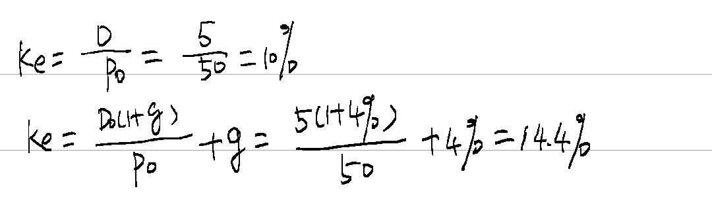{width="3.1834853455818024in" height="0.8872812773403325in"}

## Example 2

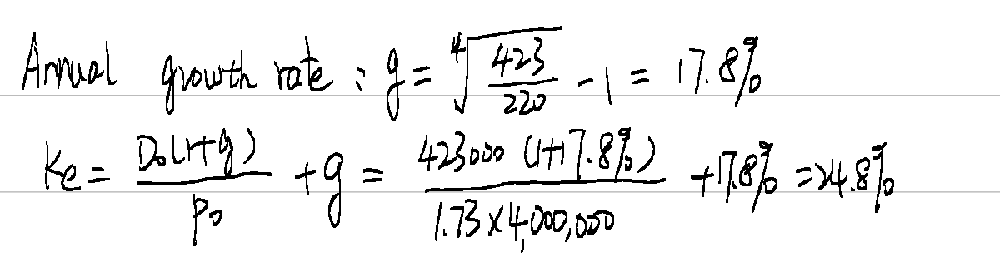{width="4.064549431321085in" height="1.066784776902887in"}

## Example 3

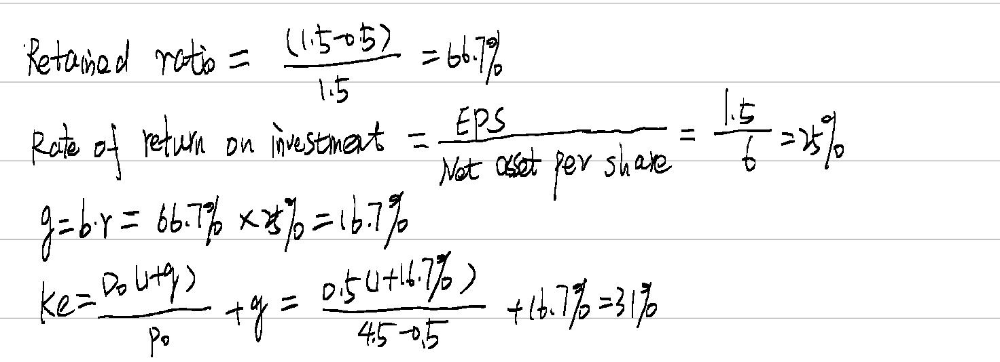{width="5.212823709536308in" height="1.8909514435695538in"}

## Example 4

8%=rf+1.2\*(7%-rf), rf=2%

Ke=2%+1.8(7%-2%)=11%

## Example 5

Kd=100\*9%/90 = 10%

Kdat=10%(1-30%)=7%

## Example 6

P0=6/kd, kd=6/95 (half year)

K=(1+6/95)^2^-1 = 13%

Kdat=13%(1-30%)=9.1%

## Example 7

  --------------------------------------------------------------------------
    Year       cash flow \$        DF(10%)     PV \$      DF(5%)     PV \$
  -------- --------------------- ------------ -------- ------------ --------
     0            \(90\)              1        \(90\)       1        \(90\)

    1-10        10(1-30%)=7         6.145      43.015     7.722      54.054

     10             100             0.386       38.6      0.614       61.4

                                               -8.385                25.454
  --------------------------------------------------------------------------

Kdat=5%+25.454/(25.454+8.385)\*(10%-5%) =8.76%

## Example 8

Conversion value=P0\*(1+g)\^n\*R=25\*3.5(1+3%)\^5=\$101.44

Conversion value \>\$100, the holder will convert into shares.

Finding the IRR using the trial and error method.

If the discount rate is 8%,

NPV1=100\*8%(1-30%)\*AF(8%,5)+101.44\*DF(8%,5)-82= 5.6\*3.993+101.44\*0.681-82=9.40

If the discount rate is 12%,

NPV1=5.6\*AF(12%,5)+101.44\*DF(12%,5)-82= 5.6\*3.605+101.44\*0.567-82=-4.25

Kdat=10.66%

## Example 9

Ex-dividend price=0.3-0.5\*8%=\$0.26

Kp=0.5\*8%/0.26 = 15.4%

No tax relief

## Example 10

WACC=kdat\*D/(D+E)+ke\*E/(D+E)

Cost of debt: Kd=13%\*100\*(1-30)/90=10.11%

Cost of equity: Ke=12%

Market value of equity: 5m/0.5 \*3= \$30m

Market value of debt: 7m/100\*90=\$6.3m

Total value of debt and equity: 30m+6.3m=%36.3m

Wacc=10.11%\*6.3/36.3+12%\*30/36.3=11.7%

## Past example paper: Burse(08/6)

(a) WACC=$\frac{E}{E + D_{1} + D_{2}}\ $K~e~+$\frac{D_{1}}{E + D_{1} + D_{2}}\ $K~dat1~+ $\frac{D_{2}}{E + D_{1} + D_{2}}\ $K~dat2~

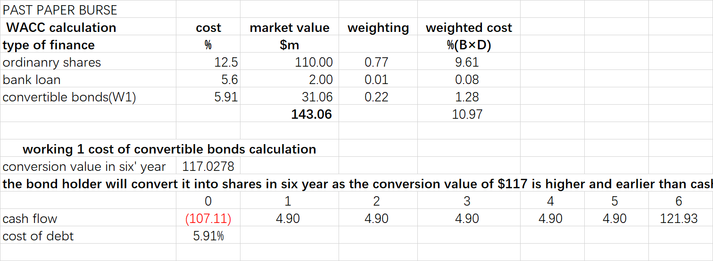{width="5.768055555555556in" height="2.1215277777777777in"}

(b) WACC can be used as a discount rate in investment appraisal only when

Same business risk

- The project is as in the same industry as the company, so they have similar business risk. Definition of Business risk

If they have different business risk, WACC cannot be used as a discount rate, risk adjusted cost of capital should be calculated.

Same financial risk

- The financial risk of the project is similar to the company; this means that they have the same financial risk.

Definition of financial risk

If not the case, the CAPM-derived project-specific cost of capital can be adjusted to reflect the financial risk of the project financing.

Relative small size

- A third constraint on using WACC in investment appraisal is that the proposed investment should be small in comparison with the size of the company. If this were not the case, the scale of the investment project could cause a change to occur in the perceived risk of the investing company, making the existing WACC an inappropriate discount rate.

\(c\)

Disadvantages of DVM

- Difficulties of estimating the cost of equity

- Assuming future dividend growth rate is constant which is not supported in practice

- Using historical data to estimate future dividend growth rate, which may not repeat the past

- assumes business risk, and the cost of equity, are constant in future periods, but these may subject to constant change

- does not consider risk explicitly in the same way as the CAPM

CAPM assumes all investors hold diversified portfolios and investors only seek compensation (return) for the systematic risk of an investment.

The CAPM represent the required rate of return (i.e. the cost of equity) as the sum of the risk-free rate of return and a risk premium reflecting the systematic risk of an individual company relative to the systematic risk of the stock market as a whole. This risk premium is the product of the company's equity beta and the equity risk premium.

The CAPM therefore tells us what the cost of equity should be, given an individual company's level of systematic risk. The individual components of the CAPM (the risk-free rate of return, the equity risk premium and the equity beta) are found by empirical research and so the CAPM gives rise to a much smaller degree of uncertainty than that attached to the future dividend growth rate in the dividend growth model. For this reason, it is usually suggested that the CAPM offers a better estimate of the cost of equity than the dividend growth model.

Chapter 12

## Lecture example 1

\$m Last year Forecast

Profits before interest and tax 12,000 6,000

\% change in PBIT = 6000/12000 x 100 = 50%

\% change in Dividends =1377/2000 x 100 = 69%

Dividends fall by more than PBIT because interest and preference share dividends have to be paid

## Lecture example 2a 

(1) Interest coverage ratio

Current interest cover=3,500/250=14 times

PBIT after 1 year=3,500,000×1.1=\$ 3.85m

Interest after 1 year=250,000+5m×8%=650,000

Interest cover after 1 year=3.85/0.65=5.9 times

Current interest cover is higher than average, however, after new issue of bonds, it falls to less than half of the average, and this indicate the company may have difficult to meet interest payments.

(2) Gearing

Current D/E=3,750/13,750=27.3% (book values)

Income statement after 1 year

  -----------------------------------------------------------------------
                                                   '000
  ------------------------------------------------ ----------------------
  PBIT                                             3,850

  interest                                         \(650\)

  PBT                                              3,200

  Tax                                              \(960\)

  PAT                                              2,240

  Preference dividends=1,250×0.06=75,000           \(75\)

  Ordinary dividends=0.17×2.5m×1.04=442,000        \(442\)

  Retained earnings                                1,723
  -----------------------------------------------------------------------

Gearing after 1 year=(3,750+5,000)/(13,750+1,723)=56.6%

Current gearing is less than the average. After issue of bonds, it will be more than the average. This indicates an increase in financial risk.

(3) Current EPS=(2,275-75)/2,500=0.88

EPS after 1 year=(2,240-75)/2,500=0.866

EPS will have a small decrease. However, this decrease will reverse as the future earnings increase quickly.

In conclusion, the issue of new bonds is likely to have a negative impact on the company's financial position at least in the short term.

## Lecture example 2b (March/June 2022)

The correct answer is \$0.399

New PAT = \$55m + 50m×\$1.5×8%×(1-20%) = \$59.8m

New no. of shares = 100m+50m = 150m

New EPS = \$59.8m/150m = \$0.399 per share

错误地方：PAT没调整，股票数量没有调整，或者权益融资额没有用股价✖股票数量

## Example 3

\(1\)

H O

  ----------------------------------------------------------------------------
  sales           6          12       18       6        12         8
  --------------- ---------- -------- -------- -------- ---------- -----------
  Variable cost   0.5        1        1.5      4.5      9          13.5

  Fixed cost      9          9        9        1        1          1

  PBIT            (3.5)      2        7.5      0.5      2          3.5
  ----------------------------------------------------------------------------

H: sales decrease by 50%, PBIT will decrease by 275%(=(2+3.5)/2)

\% change in PBIT/ % change in sales=275/50= 5.5 times

O: sales decrease by 50%, PBIT will decrease by 75%((2-0.5)/2)

\% change in PBIT/ % change in sales=75/50=1.5 times

(2)H company is more risk

(4) Operating gearing of H: (12-1)/2=5.5

Operating gearing of O: (12-9)/2=1.5

每股收益无差别曲线

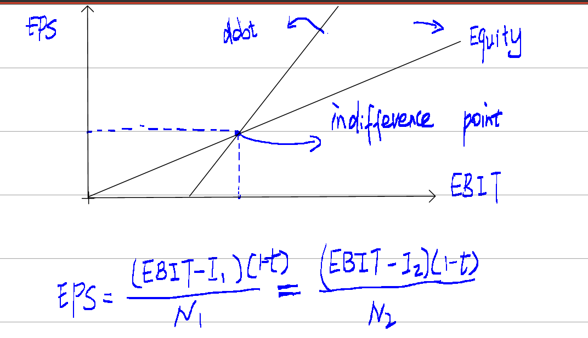{width="3.981200787401575in" height="2.2949660979877518in"}

供应链融资

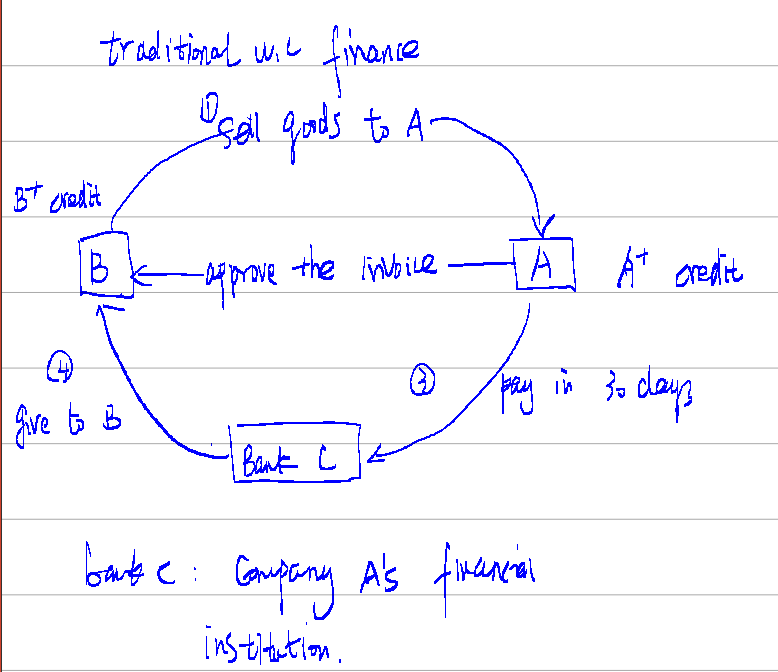{width="3.424856736657918in" height="2.9580938320209973in"}

SCF

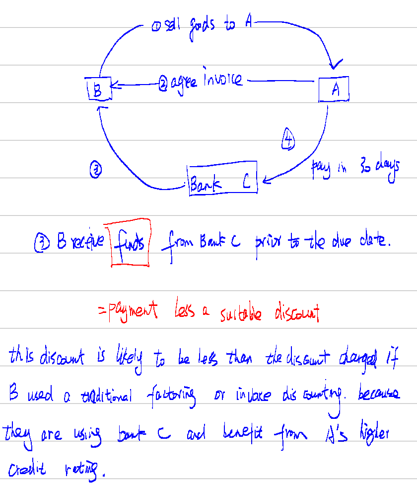{width="3.8210564304461943in" height="4.498688757655293in"}

Example 4

1 false

2 true

3 false

Asset beta and Business risk will be understated. The difference between an asset beta and an equity beta reflects the impact of financial risk, the difference will be higer if debt beta is assumed to be zero.

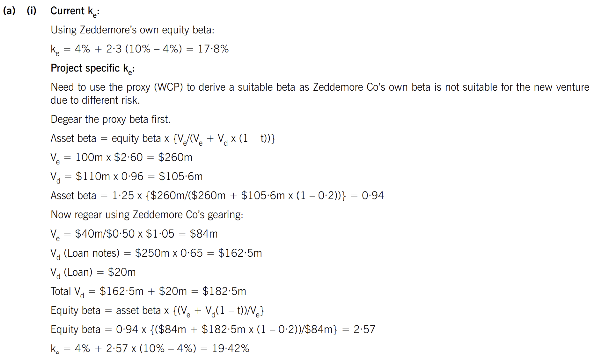{width="6.20751968503937in" height="3.7083683289588802in"}

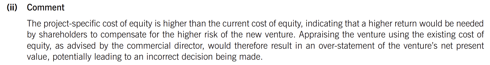{width="6.494755030621173in" height="0.8710761154855643in"}

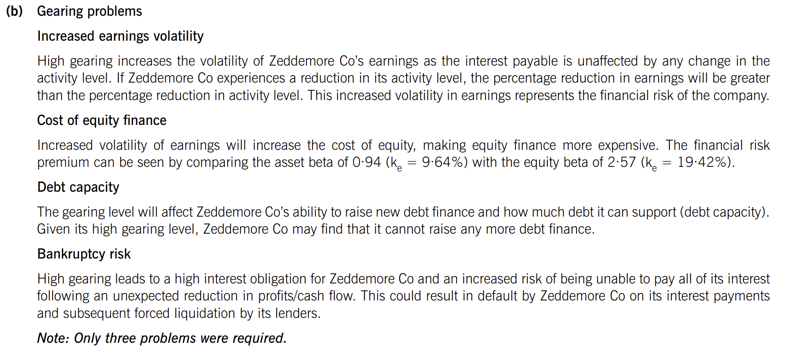{width="6.532456255468066in" height="2.8871478565179354in"}

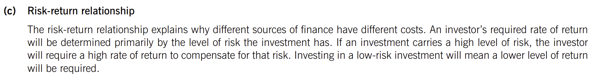{width="6.6898939195100615in" height="0.8545603674540683in"}

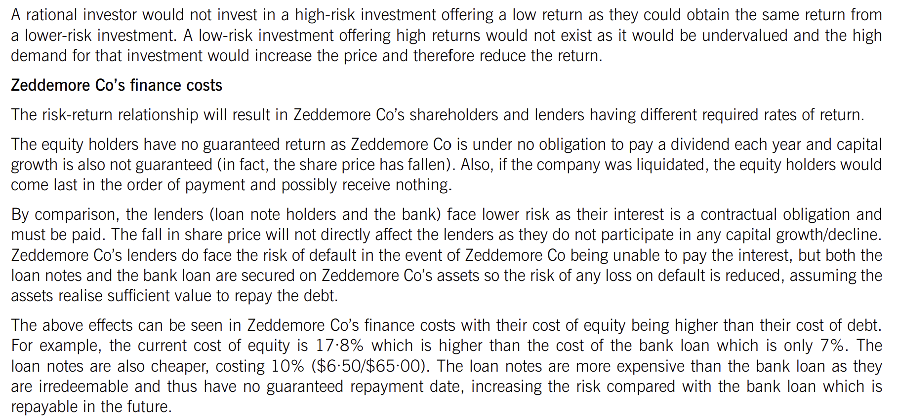{width="6.479926727909011in" height="3.0152799650043747in"}
