## Example 1 

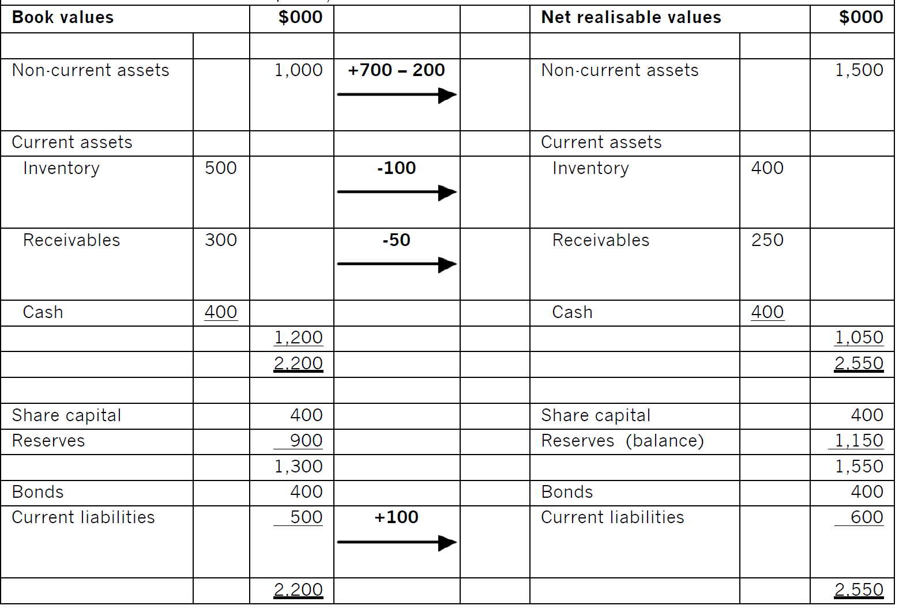{width="5.768055555555556in" height="3.9368055555555554in"}

The minimum amount that the shareholders should accept for this business is:

2,550,000 -- 400,000 -- 600,000 =\$1,550,000

Or the amount of share capital plus reserves after revaluation

## Example 2 

As large listed companies such as Tesco often have diversified activities, we should make sure that there is not too much distortion in the P/E ratio when using this information to estimate P/E ratio. Here we assume that any distortion is not material.

Usually, it is better to calculate the average P/E ratio of the selected listed companies. The average P/E ratio of the supermarket industry is 10.2.

The target company's post tax earnings are \$200,000. The value of equity would be: 10.2 x \$200,000 = \$2,040,000.

## Example 3

\(1\) First calculate the shareholders' rate of return in the listed company, and then apply that to the unlisted company.

Step1 listed company

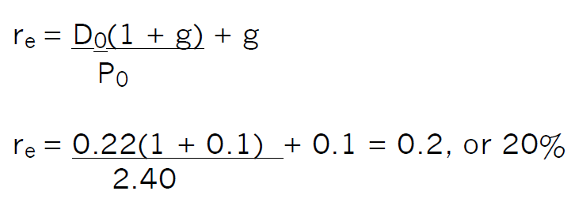{width="2.6282917760279965in" height="0.9448818897637795in"}

Step 2 unlisted company

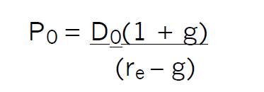{width="1.3555424321959755in" height="0.47244094488188976in"} 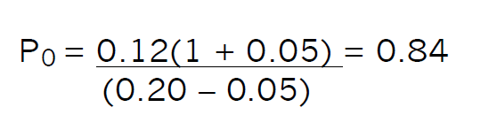{width="2.0278619860017497in" height="0.47244094488188976in"}

So, the value of a share in Company A is \$0.84.

\(2\) calculate the shareholders' required rate of return in the listed company using the CAPM:

re = Rf + β(Rm -- Rf) = 5% + 1.6(15% -- 5%) = 21%

This is the return required by the shareholders of a company geared in the ratio D:E = 2:5. However, Company B is ungeared, so 21% is inappropriate for the shareholders of that company. So we need to adjust beta values to take account of gearing difference.

Step 1 convert the beta value of the geared listed company to the asset beta value of the ungeared company:

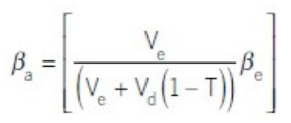{width="1.4821686351706036in" height="0.6299212598425197in"}

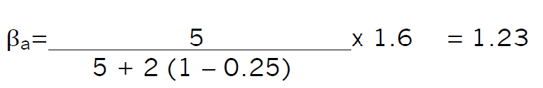{width="2.9096358267716536in" height="0.47244094488188976in"}

Step 2 calculate the cost of equity of an ungeared company in the same business using the CAPM:

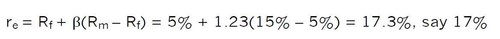{width="4.994002624671916in" height="0.3937007874015748in"}

Step 3 calculate the value of a share in the unlisted, ungeared Company B:

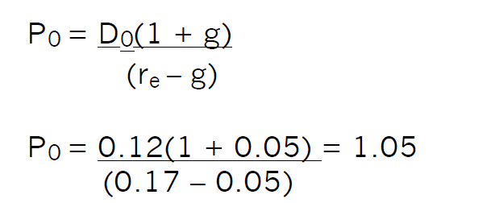{width="2.2062871828521433in" height="0.905511811023622in"}

remember that this calculation would be a starting point for negotiation

## Example 4

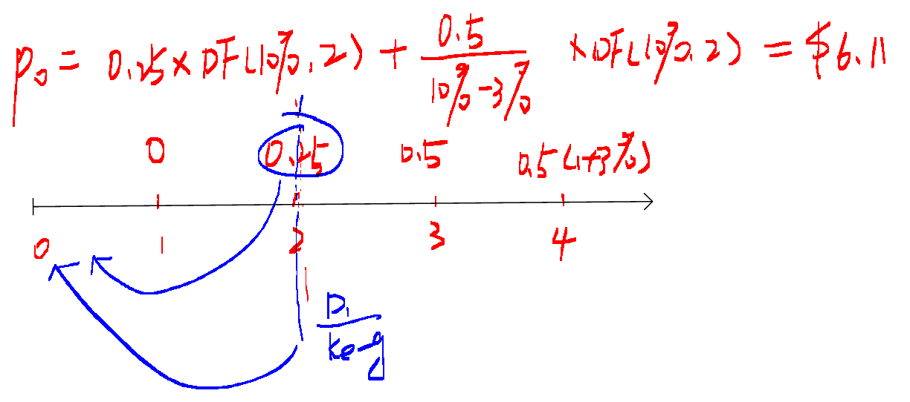{width="3.4396653543307085in" height="1.5231266404199475in"}

## Example 5 

\(1\)

  -----------------------------------------------------------------------------
       year            0          1         2         3         4         5
  --------------- ----------- ---------- -------- --------- --------- ---------
     Cash flow     (100,000)   (80,000)   60,000   100,000   150,000   150,000

      DF(15%)          1        0.870     0.757     0.658     0.572     0.494

   Present value   (100,000)   (69,600)   45,360   65,800    85,800    74,550

        NPV        \$101,910                                          
  -----------------------------------------------------------------------------

The maximum price that the company will pay for shares of D is \$101,910.

\(2\) present value of cash flows from year 6 onwards in perpetuity

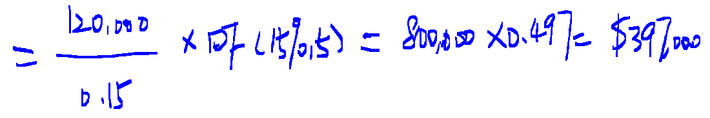{width="3.238041338582677in" height="0.5414916885389326in"}

This increases the valuation from \$101,910 to \$499,510.

Note: business valuations depend on assumptions that are used to reach the valuation.

## Example 6 C

## Example 7 B

## Example 8 (1) completely inefficient

## Example 9 D random walk

Example 10-2014 Dec C

## Example 11

P0=100\*7%\*AF(9%,7)+100\*(1+5%)\*DF(9%,7)

=7\*5.033+105\*0.547=\$92,666

## Example 12

Conversion value in 5 year= 2.5\*(1+4%)\^5\*35 =\$106.46

As the conversion value is higher than the nominal value, so the holder will convert it into shares.

P0 =100\*9%\*AF(10%,5)+106.46\*AF(10%,5) = 9\*3.791+106.46\*0.621 = \$100.23

Floor value =100\*9%\*AF(10%,5)+100\*AF(10%,5) =9\*3.791+100\*0.621 = \$96.22

Current conversion value = 2.5\*35 = \$87.5

Conversion premium = MV of bonds -- current conversion value

= \$100.23-\$87.5= \$12.73

## Example 13

(1) Share price increase 4% per year

Conversion value in 7 years = 6.5\*1.04^7^\*11 =\$94.05

Redemption value in 8 years = 100+7 =\$107

Discounting redemption value as at the end of 7 years: \$ 107\*0.926 =\$99.08

Obviously, investors will likely hold bonds until redemption after eight years.

P0 =100\*7%\*AF(8%,8)+100\*DF(8%,8) = 7\*5.747+100\*0.540 = \$94.23

This is also the floor value of the bonds

(2) Share price increase 6% per year

Conversion value in 7 years = 6.5\*1.06^7^\*11 =\$107.47

Redemption value discounted at the end of 7 years: \$ 107\*0.926 =\$99.08

Obviously, investors will prefer to conversion in 7 years as it is higher than the redemption value in year 7 terms.

P0 =100\*7%\*AF(8%,7)+107.47\*DF(8%,7) = 7\*5.206+107.47\*0.583 = \$99.10

## Past paper example-Bluebell Co (Mar/Sep 2019)

\(1\) 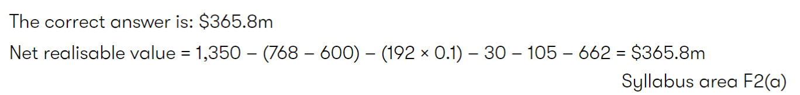{width="5.768055555555556in" height="0.6909722222222222in"}

\(2\)

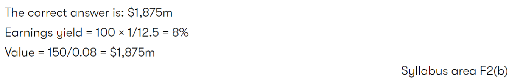{width="5.768055555555556in" height="0.8875in"}

\(3\)

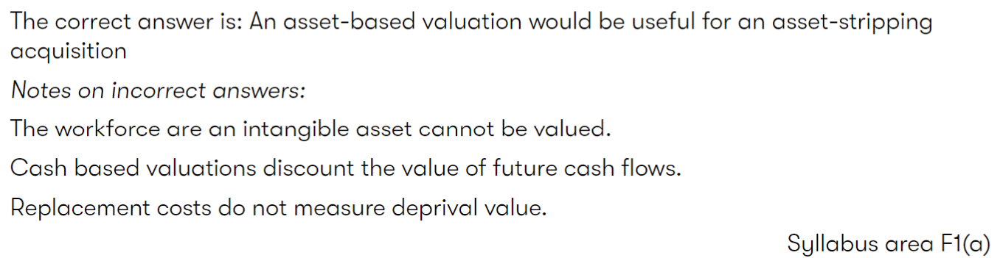{width="5.768055555555556in" height="1.4930555555555556in"}

Asset-stripping acquisition:资产剥离式并购

Deprival value:剥夺价值，概念的法律意义大于会计意义，当企业业主被剥夺了该资产时，他为了获得补偿而需要得到的现金总额。

可以理解为：重置成本和可收回金额当中较低的那个（谨慎性原则）。可收回金额是未来现金流量和可变现净值中较高的那个（经济学里理性经济人假设）。

\(4\)

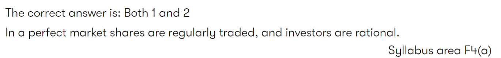{width="5.768055555555556in" height="0.6694444444444444in"}

\(5\)

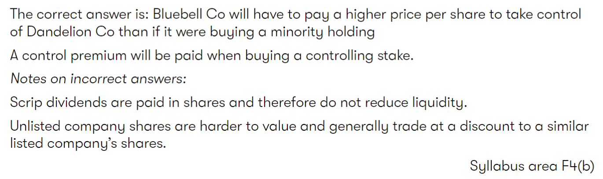{width="5.768055555555556in" height="1.7131944444444445in"}
