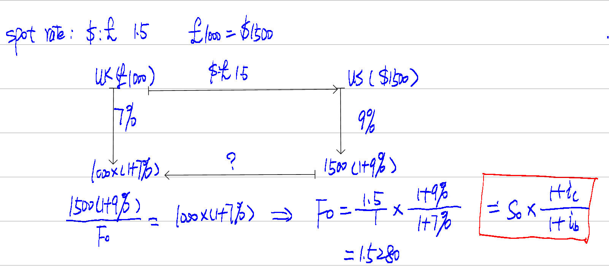
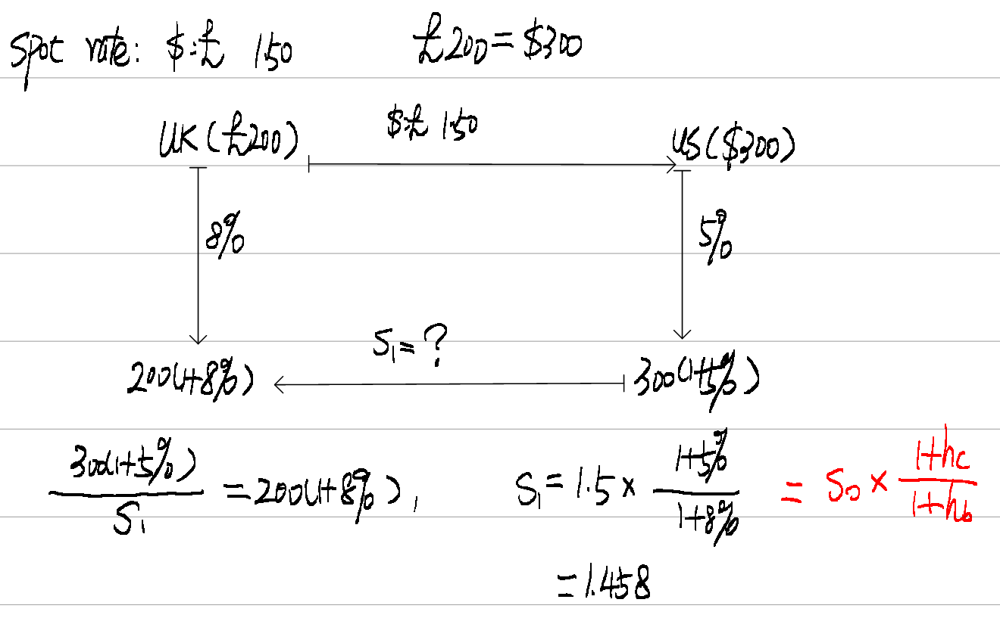
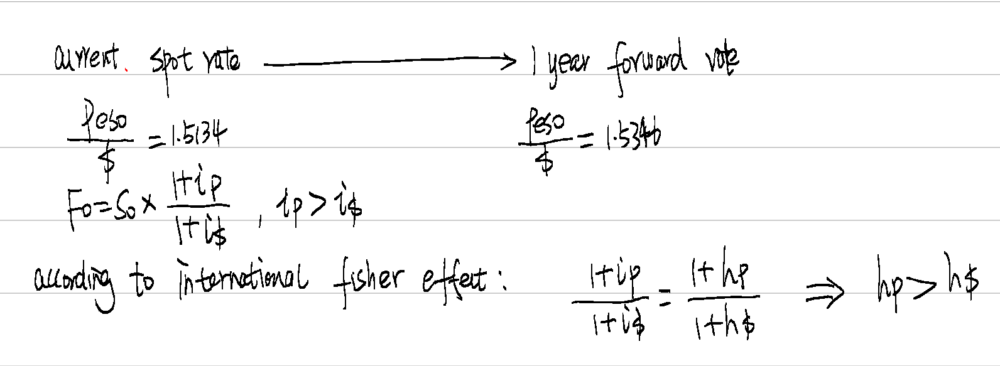
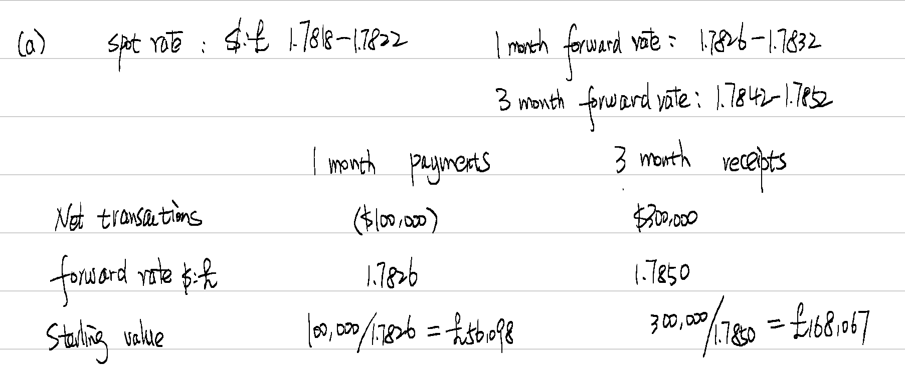
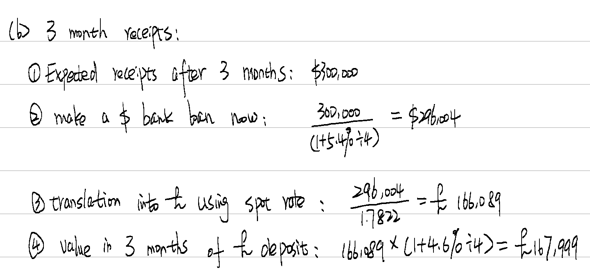
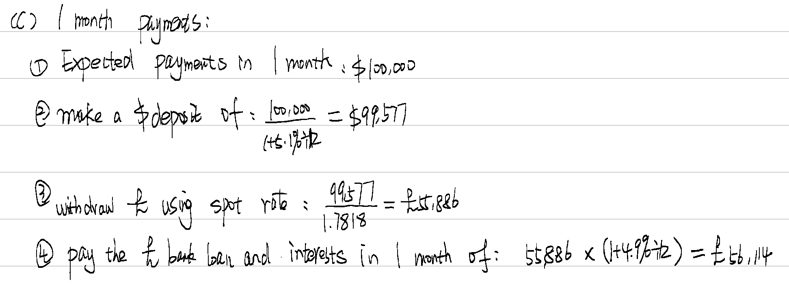
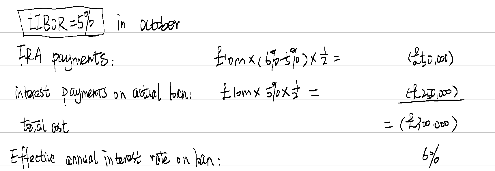
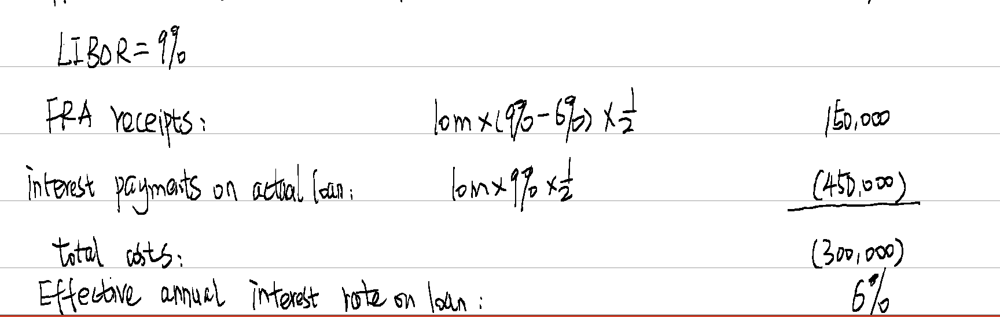

## Example 1

Expecting to receive 100,000/1.5= £66,667

Actually receipt 100,000/1.8= £55,556

Will loss £11,111

Expecting to receive 100,000/1.5= £66,667

Actually receipt 100,000/1.2= £83,333

Will gain £16,666

## Example 2

{width="3.8871478565179354in" height="1.7226804461942258in"}

## Example 3

{width="2.930631014873141in" height="1.8139140419947506in"}

## Example 4

{width="4.407043963254593in" height="1.6140409011373578in"}

## Example 5 both are incorrect

## Example 6

{width="5.471520122484689in" height="2.233798118985127in"}

{width="4.897074584426947in" height="2.2834536307961506in"}

The forward market hedge should be used for 3 month receipts.

{width="5.613487532808399in" height="2.0308847331583553in"}

Using forward rate for 1 month payments.

## Example 7 C

## E**xample 8 A**

# Chapter 15 

## Example 1 B

## Example 2

{width="5.57280293088364in" height="1.933639545056868in"}

{width="5.545636482939632in" height="1.761971784776903in"}

Note: the FRA and loan need not to be with the same bank.

## Example 3 B

4m\*(8%-7%)\*1/2=\$20,000

## Example 4 A 1 and 2 are correct

## Example 5 all are incorrect

1)  Use interest rate cap

2)  Cost of interest rate floor is Lower than collar

3)  When purchase

4)  Can not be avoided

## Example 6 both 1 and 2 are standard

## Example 7 A

## Example 8 Wren Co(Sep/Dec 2022)

\(1\) A

Forward rate agreements are not long-term instruments.

Interest rate options have to be paid for whether exercised or not.

Buying a cap and selling (not buying) a floor would be an example of a collar

\(2\) D

FEC cost = D3m/1.94 = \$1,546,392

The six-month dollar borrowing rate = 10% ➗ 2 = 5%

Lead payment cost in six-months\' time= D3m ➗ 2 x1.05 = \$1,500,000 x1.05 = \$1,575,000

FEC cost -lead payment cost =\$1,575,000-\$1,546,392=\$28,608

The lead payment costs \$28,608 more than the FEC.

A significant number of candidates selected the first option, which does not address the requirement of making the comparison on the future payment date and the fact that the money for the lead payment would have to be borrowed.

\(3\) B

Using the 3 v 9 FRA

Interest paid on loan =500,000x0.105x6/12=\$26,250

Payment from bank=500,000x0.005x6/12=\$1,250

Net interest payment =26,250-1,250=\$25,000

A significant number of candidates selected \$24,500, which is incorrect because this is based on selecting the wrong FRA, Some candidates also selected \$27,500, suggesting they added the FRA compensation payment to the interest cost on the loan.

\(4\) D

It is correct that forward exchange rates reflect interest rate parity.

Average six month interest rates are as follows

Dollar = (4%+2%) x 6/12=1.5%

Dinar = (10%+8%) x 6/12=4.5%

Interest rate parity predicted forward rate = 2.00 x1.015/1.045=1.94 dinars per dollar

Notes on incorrect answers:

Some candidates selected the first option, but increasing dollar interest rates would cause the dollar to depreciate. to the requirements of local business.

The second option was also a popular choice for candidates, but this statement relates to purchasing power parity rather than the international Fisher effect.

Similarly, the final option reflects interest rate parity rather than purchasing power parity.

(5) B

Organizations which only operate in domestic markets are still subject to economic risk as long-term currency movements can make foreign exporters more competitive in the domestic market, so statement 1 is incorrect.

Unanticipated changes in exchange rates are a cause of exchange rate risk, so statement 2 is correct.
