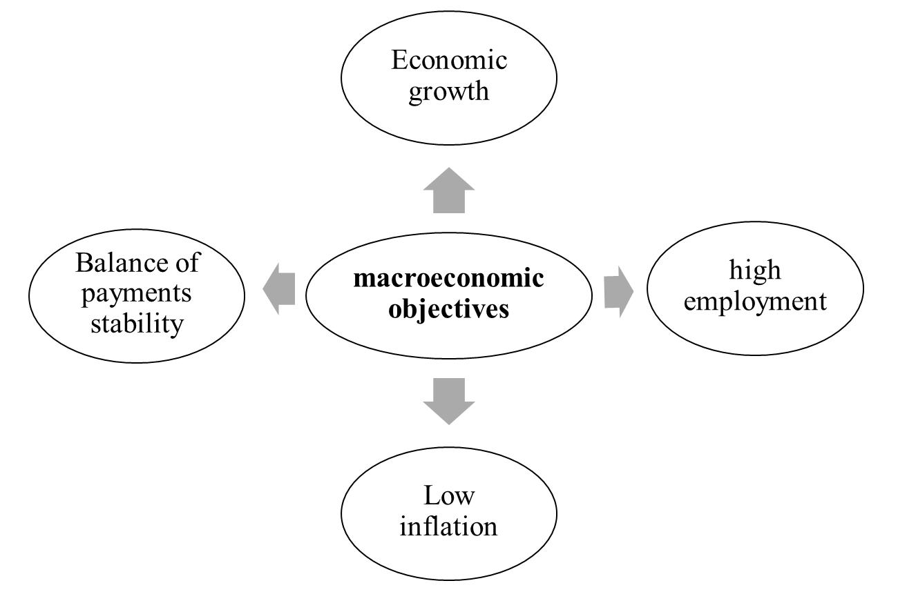
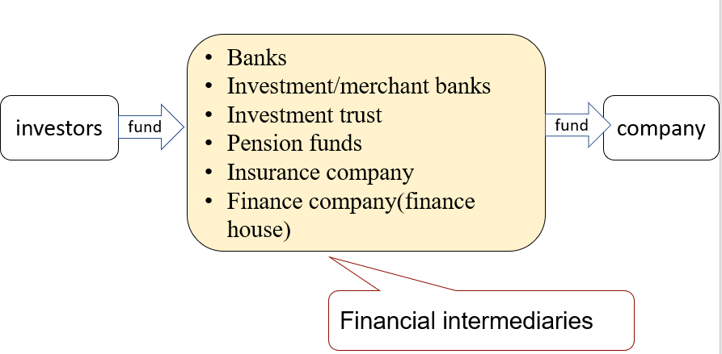
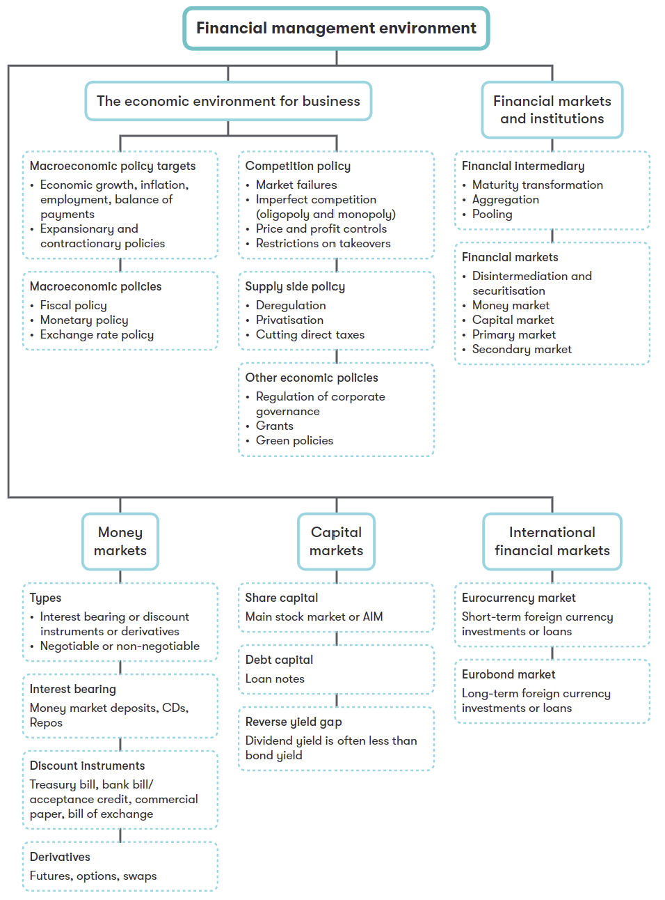

## Chapter 2 Financial Management Environment

### Syllabus

**B. Financial Management Environment**

**1. The economic environment for business**

a\) Identify and explain the main macroeconomic policy targets.\[1\]

b\) Define and discuss the role of fiscal, monetary, interest rate and exchange rate policies in achieving macroeconomic policy targets.\[1\]

c\) Explain how government economic policy interacts with planning and decision-making in business.\[2\]

d\) Explain the need for, and the interaction with, planning and decision-making in business of:1

**2. The Nature and Role of Financial Markets and Institutions**

a) Identify the nature and role of money and capital markets, both nationally and internationally.^\[2\]^^\[2\]^

b) Explain the role of financial intermediaries.^\[1\]^^\[1\]^

c) Explain the functions of a stock market and a corporate bond market.^\[2\]^^\[2\]^

d) Explain the nature and features of different securities in relation to the risk/return trade-off.^\[2\]^^\[2\]^

e) Explain the impact of Fintech in changing the nature and role of financial markets and institutions.^\[1\]^^\[1\]^

**3. The Nature and Role of Money Markets**

a) Describe the role of the money markets in:^\[1\]^^\[1\]^

1. providing short-term liquidity to the private sector and the public sector
2. providing short-term trade finance
3. allowing an organization to manage its exposure to foreign currency risk and interest rate risk

b) Explain the role of banks and other financial institutions in the operation of the money markets.^\[2\]^^\[2\]^

c) Explain and apply the characteristics and role of the principal money market instruments:^\[2\]^^\[2\]^

1. interest-bearing instruments
2. discount instruments
3. derivatives

### 1 Economic Environment

#### 1.1 Macroeconomic Policy

**Macroeconomic policy**-- the setting of economic objectives by the government (e.g. full employment, economic growth, the avoidance of inflation) and the use of control instruments to achieve those objectives (e.g. fiscal policy and monetary policy).

**Objectives**

Macroeconomic policies are adopted to achieve the following objectives

{width="3.3256944444444443in" height="2.1951388888888888in"}

The above objectives can often conflict (e.g. economic growth can lead to excess resource demand and an increase in inflation), so the government has to trade-off between objectives.

#### 1.2 Monetary Policy

**Monetary policy** -- the set actions taken by the government or the central bank to achieve economic objectives using monetary instruments.

**Monetary Policy Actions**

- Directly control the amount of money supply; or
- Indirectly affect the demand for money through its price (interest rate)

**Influence on Business**

Increasing interest rate increase the cost of borrowing, therefore a lower rate of return on investment, this will deter companies' expansion.

Increasing interest rate increase the cost of borrowing, this will decrease the demand for goods and inflation rate.

#### 1.3 Fiscal Policy

**Fiscal policy** -- government actions to achieve economic objectives through the fiscal instruments of taxation, public spending and the budget deficit or surplus. Governments can use public **expenditure** and taxation to regulate the level of demand within the economy.

**Fiscal Policy Actions**

If the economy is in recession (overheating), fiscal policy can be used to reflate the economy by taking the following actions:

- Increase(reduce) government spending to increase(decrease) the level of demand in the economy directly.
- Reduce(increase) taxation to boost(reduce) both consumption and investment.

#### 1.4 Exchange Rate Policy

**Exchange rate** is the rate at which one country's currency can be traded in exchange for another country's currency.

Systems of exchange rate

- Fixed exchange rate - A fixed exchange rate regime is one in which the rate is kept fixed against another currency, or basket of currencies. No fluctuations are permitted; the central bank interveness to maintain the exchange rate.
- Floating exchange rate -- a free-floating exchange rate means that the currency's value is allowed to move freely with demand and supply market forces.
- Managed floating exchange rates -- the exchange rates are allowed to float, but the central bank intervenes to prevent major fluctuations.

#### 1.5 Government Intervention

**Market mechanism**: the interaction of supply and demand can result in a market clearing price and quantity supplied/demanded. **Market failure** occurs when the market mechanism fails to result in economic efficiency, and there for the outcome is sub-optimal.

Types of market failure (where need government intervention)

\(1\) imperfect competition

\(2\) Social costs

\(3\) imperfect information

\(4\) fairness

##### 1. Competition Policy

**Imperfect Competition**

There are two market structures where large firms are often viewed as having excessive market power that may restrict consumer choice, and where competition is weak.

- Monopoly- one large firm dominates the market; in practice any firm with a market share of above 25% is viewed as having monopoly power.
- Oligopoly-a few large firms dominate the market.

A large company can benefit from the kinds of economies of scale; however, monopolies often have several adverse consequences:

- large companies can charge high prices, and
- have no incentive to improve their products or offer a wide range of products or to improve the efficiency of its use resources.

**Competition Policy**

Government regulatory authorities (eg the Competition and Markets Authority In the UK) must decide whether the monopoly is acting against the public interest. A prospect merger may be made to the Competition and Markets Authority for investigation if a larger company will gain more than 25% market share and a merger is likely to lead to a substantial decrease in competition.

##### 2. Green Policy and Sustainability Issues

**Social Costs / Externalities**

These are impacts on a third party of an economic transaction. The failure of the free market to recognize positive and negative externalities ( eg pollution) may lead to government action.

**Green Policy**

The need for green policy arises from the existence of external environmental costs associated with some production or consumption. There are several policy approaches to pollution, such as polluter pays, tax on petrol, subsidies and direct legislation.

**Sustainability**

meeting the needs of the present without compromising the ability of future generations to meet their own needs.

For investors, sustainable investing means investing in progress and recognising that companies solving the world's biggest challenges can be best positioned to grow. Investors from global institutions to individuals now take a sustainable approach to pursuing their investment goals based on environmental, social and governance (ESG) insights.

However, increasing demand for eco-friendly products and environmentally ethical business practices has led to increased greenwashing (i.e. making people believe that a company is doing more to protect the environment than it is).

##### 3. Regulation

**Regulation** can be defined as any form of state interference with the operation of the free market. The government may also resort to regulation to **improve social justice**, eg concerns about the fairness of expensive housing.

### 2 Financial Markets and Institutions

A firm can obtain finance directly from investors through the financial markets or indirectly through financial institutions (intermediaries).

#### 2.1 Financial Intermediaries

A financial intermediary brings together potential lenders and borrowers by obtaining deposits from lenders and then re-lending them to borrowers.

{width="4.677103018372703in" height="2.2991338582677163in"}

**The Role of Financial Intermediary**

- Maturity Transformation - a continuing stream of short-term deposits can be used to lend monies in the long term.
- Aggregation of fund - smaller deposits are combined and lent to large borrowers
- Risk diversification - risk is spread by investing in a range of investments across different markets

The role of financial institutions as intermediaries that facilitate the flow of funds between two parties is threatened by the emergence of Fintech.

#### 2.2 Financial Markets

The financial markets include the capital markets (for medium- and long-term capital) and the money markets (for short-term capital). The following activities take place in these markets:

- Primary market activity − selling new securities to raise new funds.
- Secondary market activity − trading existing securities.

##### 1. Money Markets

The money market is not a physical market; it is the term used to describe trading between banks and other financial institutions. Although the money markets principally involve borrowing and lending by banks, some large companies and the government are engaged in money market operations.

(1) **Money market instruments**

There are 3 types of money market instruments:

- \(a\) interest-bearing
- \(b\) discount instruments and
- \(c\) derivatives

**Interest-bearing Instruments**

**Money market deposits-**very short-term loans normally between banks. The rate at which banks lend to each other in the London market is called Sterling Overnight Index Average (SONIA) and is the most widely used reference rate for short-term interest rate for the settlement of money market derivatives.

**Certificates of deposit (CDs)** - A saving certificate issued by a commercial bank entitling the holder to receive interest. A CD bears a maturity date and a specified fixed interest rate and can be issued in any denomination. CDs are fully negotiable, the holder can:

- hold it until maturity; or
- resell it on the secondary market

**Repurchase Agreements (Repos)** -- short-term loans (normally for less than two weeks and often for one day) arranged by selling securities to an investor with agreement to repurchase them at a fixed price on a specified date.

::: {.callout-tip}
**Example 1**

> A listed company is to enter into a sale repurchase agreement on the money market. The company has agreed to sell \$10m for treasury bills for \$9.6m and will buy them back in 50 days' time for \$9.65m.
>
> Assume a 365-day year.
>
> What is the implicit annual interest rate in this transaction (to nearest 0.01%)?

:::

The examining team advice to use **Method 2** in all areas of FM syllabus, this is technically correct method. However, all questions involving **risk management calculations** in the FM exam will be assessed using **method 1** as it is simpler. For example, considering money market hedge, the case Marigold, which was published in Sep/Dec 2020.

**Discount Instruments**

These instruments do not pay interest. They are issued and traded at a discount to the face value and redeemed at par value at maturity.

Discounted instruments include:

**Treasury bills --** short-term debt instruments issued by government with maturity ranging from 3 to 12 months. These are issued at a discount to nominal value and pay a zero coupon.

**banker's acceptance --** a short-term debt issued by a company that is guaranteed by a commercial bank. BA are issued at a discount to nominal value, pay zero coupon and are traded on a secondary market. They are considered relatively safe investments because the bank and the borrower are liable for the amount due when the instrument matures.

**Commercial paper --** unsecured, but high-quality corporate debt issued by large corporations with good credit ratings. It is sold at a discount to nominal value and pays a zero coupon. Commercial paper allows companies to raise large amounts of finance quickly but is only available to those companies with very high credit ratings.

It is a negotiable instrument.

**Bills of exchange --** a short-term financial instrument consisting of a written order addressed by the seller of goods to the buyer requiring the latter to pay a certain sum of money on demand or at a future time. Bills of exchange are often used in international transactions, and the holder may convert it immediately into cash by selling it to a bank at a discount.

It is a negotiable instrument.

**Calculation of Discount Instruments**

The relation between annual rate and period rate can be expressed as:

1+R = (1+r) ^n^

Where R is the annualized interest rate, r is the period interest rate, and n is the number periods in a year.

(不考虑货币时间价值的年收益率= r × 365/n)

::: {.callout-tip}
**Example 2 (Sep/Dec 2021 amended)**

> A large, listed company is to issue 90-day commercial paper with a nominal value of \$10m. Each paper will have a nominal value of \$100,000. The annual required rate of return is 4% assuming a 360-day year.
>
> What will be the issue price of each paper?
>
> \$99,024
>
> \$96,154
>
> \$99,010
>
> \$99,000

:::

**Derivatives**

A financial instrument whose value or price depends on an underlying asset.

Businesses can use derivatives to reduce the risk of adverse fluctuations in the value of an asset through "hedging". Details of examples, including futures, forward contracts, options and swaps, are described in part G.

(2) **Roles of Money Market**

- Providing short-term liquidity to companies, banks and the public sector
- Providing short-term finance
- Allowing firms to manage its exposure to foreign currency risk and interest rate risk.

##### 2. Capital Markets

The principal capital markets in UK:

- The stock exchange - main market
- The Alternative investment market (AIM) -- has fewer regulations and less cost, and is thereforee attractive to small companies.
- The Eurobond market, where bonds are generally issued by large international companies with a 10- to 15-year term. These bonds are denominated in any currency other than that of the national currency of the issuer.

Capital markets provide long-term capital: equity capital(ordinary shares), preference shares, or debt capital such as loan notes. Companies requiring funds for five years or more will use the capital markets.

**The Risk-Return Trade-off**

There is a trade-off between risk and return, this means that investments carrying a higher degree of risk will demand a higher rate of return.

Increasing risk to the investor

- Secured bonds
- Unsecured bonds (junk bonds)
- Shares traded on the main market
- Shares in the AIM

**Reverse Yield Gap**

because debt involves lower risk than equity investment, we might expect yield on debt to be lower than yield on shares. However, sometimes the yield on shares is lower than the interest yield on low-risk debt, this situation is known as a **reverse yield gap**. This can occur because shareholders will accept lower returns on their investment in the short-term, in anticipation that they will make capital gains in future.

### 3 International Money and Capital Markets

Larger companies wishing to raise significant amounts of finance can use international money and capital markets.

Eurocurrency market are the international money markets, where Eurobond markets are the international capital markets.

The Eurocurrency market involve depositing funds with a bank outside the country of origin of the currency and relending these funds, usually for a short-term.

Eurobonds are raised by international companies and sold to investors in several countries simultaneously, and typically have a term of 10-15 years. borrowers must consider the exchange rate risk.

### 4 Impact of Fintech

#### 4.1 Introduction

**Fintech** -- technologically enabled innovation in financial services that could result in new business models, applications, processes or products with an associated material effect on financial markets and institutions and the provision of financial services.

One of the main features of Fintech is that it may reduce or eliminate the costs of financial intermediation, especially in the three broad areas of finance: raising, allocating and transferring capital.

Fintech has affected all the primary functions of banks:

- maturity transformation (through competition in lending);
- allocation (through "bot" advisors and crowd investing platforms);
- payment services (through new payment platforms and interfaces); and
- information processing (big data, machine learning and artificial intelligence).

Many organizations and individuals now use Fintech for a wide range of financial activities without the assistance of a bank or financial advisor:

- depositing money and making money transfers using a smartphone;
- applying for credit;
- raising money for a business start-up (e.g. through crowd funding);
- managing an investment portfolio.

#### 4.2 Impact of Fintech

The impacts of Fintech on financial markets and institutions include:

- Disintermediation;
- Availability of credit;
- Potential source of finance (security token offering).

##### 1. Disintermediation

The main advantage of the role of financial institutions as intermediaries is their ability to provide safety, liquidity and economies of scale. **Disintermediation **involves transferring funds between parties directly, without a financial intermediary. Fintech enables efficient banking services, directly matching lenders and borrowers, investors and investment opportunities and, thereforee, disintermediates the flow of funds.

**Securitization** is the process of converting illiquid assets into marketable securities. These securities are backed by specific assets and are normally called asset-backed securities (ABS). The development of securitization has led to disintermediation and reduction in the role of financial intermediaries.

##### 2. Availability of Credit

Fintech has expanded the availability of credit by allowing borrowers rejected by the traditional banks to access the funding they need.

- **P2P loan** - enables individuals to lend money to small businesses without using an official financial institution as an intermediary. P2P loans can offer relatively attractive interest rates because the costs of the intermediary, the formal banking system, are eliminated.

However, in some countries where P2P lending is unregulated, investors have lost significant sums. And P2P lending is illegal in some countries.

- **Crowdfunding** -- crowdfunding allows a company to access equity finance via online crowdfunding platform, to pitch for finance from a large number of potential investors.

##### 3. Potential Source of Finance (security Token Offering)

A security token is a digital representation of ownership of a share in an asset (e.g. gold or property) or economic rights (e.g. a share of profits or revenue). Whereas a traditional share in a company is issued in a physical document (a share certificate), a security token is a digital certificate (and may be stored in a digital wallet).

**Security token offering (STO)** -- the first issue of tokens (or crypto coins) that represent an investment contract in an underlying asset.

Fintech has increased the availability of long-term finance by creating new financial markets such as electronic platforms used for crowdfunding, peer to peer lending and security token offerings. These forms of finance allow firms to access a wide pool of funds without using a financial intermediary and are examples of **disintermediation**.

[
::: {.callout-tip}
example 3](../technical-articles/past exam examples.docx)Sep 2016, Q2

> Which of the following financial instruments will NOT be traded on a money market?
>
> A Commercial paper
>
> B Convertible loan notes
>
> C Treasury bills
>
> D Certificates of deposit

[
:::

::: {.callout-tip}
example 4](../technical-articles/past exam examples.docx)Dec 2016, Q6

> Max Co is a large multinational company which expects to have a \$10m cash deficit in one month's time. The deficit is expected to last no more than two months. Max Co wishes to resolve its short-term liquidity problem by issuing an appropriate instrument on the money market.
>
> Which of the following instruments should Max Co issue?
>
> ○Commercial paper
>
> ○Interest rate futures
>
> ○Corporate loan notes
>
> ○Treasury bills

{width="6.9695374015748035in" height="9.419082458442695in"}
:::

