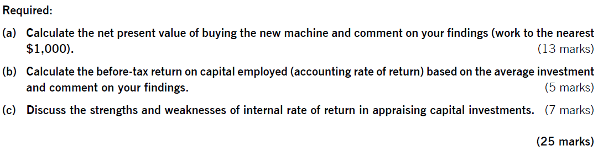
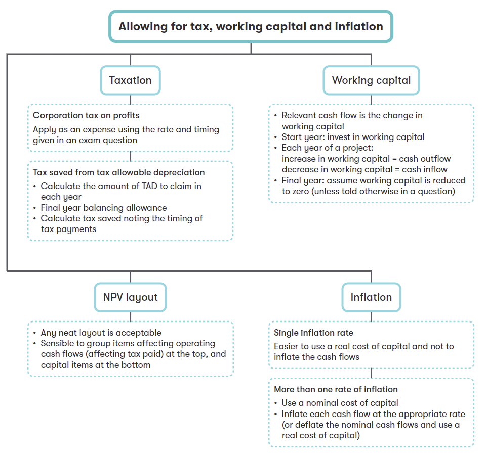

## Chapter 6 Allowing for Inflation and Taxation

### Syllabus  {.pagebreak}
**D. Investment Appraisal**

**1. Investment Appraisal Techniques**

a\) Identify and calculate relevant cash flows for investment projects^.\[2\]\^

**2. Allowing for Inflation and Taxation in DCF**

a\) Apply and discuss the real-terms and nominal-terms approaches to investment appraisal.\^\[2\]\^

b\) Calculate the taxation effects of relevant cash flows, including the tax benefits of tax-allowable depreciation and the tax liabilities of taxable profit.\^\[2\]\^

c\) Calculate and apply before- and after-tax discount rates^.\[2\]\^

### 1 Relevant Cash Flows {.pagebreak}

**General rule:** only cash inflows and outflows that are affected by a decision are relevant to the decision. This means using only **future, incremental cash** flow.

Examples of Non-Relevant Cash Flows

- sunk costs -- money already spent

- non-cash costs -- e.g. depreciation

- unavoidable costs -- money already committed and apportioned fixed costs

- **Finance costs** -- such as interest, because finances costs are accounted for by the discounting process.

However, **opportunity costs** and revenues must be included.

**Example 1**

> SW company has a barrel of chemicals in its warehouse that it purchased for a project a while ago at a cost of \$1,000. It would cost \$400 for a professional disposal company to collect the barrel and dispose of it safely. However, the chemicals could be used in a potential project which is currently being assessed.
>
> What is the relevant cost of using the chemicals in a new project proposal?
>
> A \$1,000 cost
>
> B \$400 benefit
>
> C \$400 cost
>
> D zero

:::

### 2 Taxation

Building taxation into a discounted cash flow involves dealing with 'the good the bad and the ugly'!.

- Tax is charged on operating results (=revenues -- operating costs)

- Tax relief is given on non-current assets via tax-allowable depreciation (TAD)

- The timing of tax cash flows is complex. They may occur in the year of taxable profits; or tax is paid one year in arrears (i.e. in the following year).

- Any tax relief on finance cost is accounted for in the discount rate.

Company may claim TAD according to the applicable tax regime. Exam questions will state the depreciation method (reducing balance or straight-line) and tax rate (%).

**Tax benefits** = allowance × tax rate

::: {.callout-tip}
**Example 2**

An asset is bought for \$8000 and will be used four years before being disposed of for \$500.Tax-allowable depreciation is allowed at **25% reducing balance** and tax rate is 30%. tax is **payable one year in arrears.**

Calculate the tax allowable depreciation and tax savings for each year.

  Year                                1          2          3          4
  ----------------------------------- ---------- ---------- ---------- ----------
  beginning book value                                                 

  Tax-allowable depreciation                                           

  Tax benefit on depreciation (30%)                                    

  timing                                                               

Simplifying assumptions:

- Tax rate is constant

- Sufficient taxable profits are available to use all tax deductions in full. This means even if the net cash flow for a year is negative, there will be a positive tax cash flow for the tax relief.

**Dealing with Taxation**

Operating Cash flow = sales- cash costs -- tax payments

= sales- cash costs - (sales- cash cost -- depreciation) \*tax rate

= (sales- cash costs) - (sales- cash costs) \* tax rate + depreciation \* tax rate

  Year                           0          1          2          3
  ------------------------------ ---------- ---------- ---------- ----------
  revenues                                  x          x          

  Cash operating costs                      \(x\)      \(x\)      

**Taxable Cash Flow** **x** **x**

  Tax @ 30%                                            \(x\)      \(x\)

  Tax savings                                          x          x

  Initial investment             \(x\)                            

  Scrap value                                                     x

**Project Cash Flow** **(x)** **x** **x** **x**

  Discount factor (r%)                                            

  Present value                                                   

  NPV

### 3 Inflation 

Inflation's impacts on NPV:

- Different costs and revenues will inflate at different rates

- the cost of capital (in nominal terms) will be altered

#### 3.1 Real and Nominal Interest Rates 

When dealing with inflation, it is important to distinguish between real and nominal (money) interest rates:

- The real interest rate reflects the interest rate in the absence of inflation.

- The nominal interest rate reflects the real interest rate adjusted for the effect of general inflation.

Relationship between the real and nominal interest rate (cost of capital) can be described by the following fisher formula:

1+i=(1+r) (1+h)

Where: r=real interest rate,

h=general rate of inflation

i=nominal interest rate

#### 3.2 Methods of Dealing with Inflation

**General and Specific Inflation Rates**

A specific inflation rate is the inflation rate on an individual item (e.g. Wage, material). A general inflation rate is weighted average of many specific inflation rates.

**Real and Nominal Cash Flows**

Real cash flows are cash flows expressed in current price, i.e. do not include the effect of inflation rate.

Nominal cash flows are cash flows that have been inflated into future values, i.e. include the effect of inflation rate.

Nominal cash flow in year i = cash flow in current price $\times$ ${(1 + h)}^{i}$

**Two Methods of Calculating NPV**

1)  Real NPV

- cash flows are expressed at current prices (before the effects of inflation)

- discounting these cash flows at a real cost of capital (excluding general inflation)

2)Nominal NPV

- cash flows are expressed in nominal terms (include the effects of inflation).

- Discounting these nominal (money) cash flows at a nominal cost of capital.

Using fisher formula to calculate a real (nominal) rate from a nominal (real) rate and the general inflation rate.

::: {.callout-tip}
**Example 3**

> A three-year project:
>
> Requires an initial investment of \$5m at time 0, with a scrap value of \$1m at the end of year 3;
>
> The selling price (in current price) are \$5.3 per unit and is expected to rise at 5% per year. Assuming sales volume are 200,000 units per year;
>
> The variable cost in at current prices are \$4 per unit and is expected to rise at 3% per year.
>
> The general inflation rate is expected to be 4% and the nominal cost of capital is 10%.
>
> Calculated the NPV of the project in nominal terms. Ignore tax.

:::

**NPV in Nominal Method:**

  Year                          0           1           2           3
  ----------------------------- ----------- ----------- ----------- -----------
                                \$          \$          \$          \$

  Inflated Revenues (w1)                                            

  Inflated Costs (w2)                                               

  Investment                                                        

  Scrap value                                                       

  Project cash flows                                                

  Discount factor ( )                                               

  Present value of cash flows                                       

  NPV                                                               

Workings

(1) Working 1 nominal sales revenues

  Year                                                                1      2      3
  ------------------------------------------------------------ ------ ------ ------ ------
  Current selling price(\$/unit)                                                    

  Inflated selling price (\$) = current price ×1.05\^i                              

  Sales volume(units)                                                               

  nominal sales revenue (\$) =inflated selling price × units                        

(2) Working 1 nominal variable costs

  Year                                                          1      2      3
  ------------------------------------------------------ ------ ------ ------ ------
  Current variable cost(\$/unit)                                              

  Inflated variable cost (\$) = current cost ×1.03\^i                         

  Sales volume(units)                                                         

  nominal variable costs (\$) = inflated costs × units                        

**Which method to use?**

If selling prices and costs have different inflation rates, using nominal method:

- Forecasting each cash flow in nominal terms; and

- discounting nominal cash flow at nominal cost of capital

The only situation in which the real method is valid is when revenues and costs all increase at the general inflation rate. in this case, inflation will have no impact on a project's NPV, so both nominal method and real method are appropriate.

::: {.callout-tip}
**Example 4**

> S company has a money cost of capital of 10%. If inflation is 4%, what is S company's real cost of capital?
>
> A 6%
>
> B 5.8%
>
> C 14%
>
> D 14.4%

:::

In questions there is more than one rate of inflation, if you are asked to **calculate an NPV in real terms**, the approach to required is:

- deflate nominal operating cash flows using general rate of inflation so that they become real cash flows.

Real cash flow = nominal cash flow ÷ (1+general inflation rate) \^n

- discount the real cash flows at the real cost of capital

Deflating process

  Year                                               1       2       3
  ------------------------------------------ ------- ------- ------- -------
  Nominal cash flows (\$)                                            

  Deflated by 1/ (1+h)^i^                                            

  Real cash flows (\$)                                               

::: {.callout-tip}
**Example 5**

> AM company will receive a perpetuity starting in 2 years' time of \$10,000 per annum, increasing by the general rate of inflation (which is 2%).
>
> What is the NPV of this perpetuity assuming a money cost of capital of 10.2%?
>
> A \$90,910
>
> B \$125,000
>
> C \$115,740
>
> D \$74,403

:::

### 4 Working Capital

Many projects also will require an investment in net current assets, i.e. working capital. Working capital is defined as inventory + accounts receivable -- accounts payable for project appraisal. The relevant cash flow is calculated as the change in working capital.

**Steps to Calculate the Working Capital Cash Flows**

step1: calculate the amounts of working capital needed in each year

step2: work out the incremental cash flows required each year

- increase in working capital = cash outflow

- decrease in working capital = cash inflow

- unless the question specifies otherwise, working capital is assumed to be **released** at the end of the project (i.e. a cash inflow)

It is assumed that changes in the level of working capital have no tax effects.

::: {.callout-tip}
**Example 6**

Darn co has undertaken a new project with four years life and the expected sales revenue are as follows.

  Year                           1          2          3          4
  ------------------------------ ---------- ---------- ---------- ----------
  Sales revenue (\$000)          1,300      2,800      7,900      5,400

The level of working capital investment at the start of each year is expected to be 10% of sales revenue in that year.

Calculate the relevant cash flow of working capital.
:::

### 5 NPV Layout

To evaluate a project, management should consider and determine followings:

- project's life or time horizon

- operating cash flow

- tax and tax benefits

- working capital

- initial investment and scrap value

- discount factor

Operating Cash flow = sales- cash costs -- tax payments

= sales- cash costs - (sales- cash cost -- depreciation) \*tax rate

= (sales- cash costs) - (sales- cash costs) \* tax rate + depreciation \* tax rate

  Year                                    0     1     2       3     4      5
  --------------------------------------- ----- ----- ------- ----- ------ ------
  Sales revenues (w1)                           x     x       x     x      x

  variable costs (W2)                                                      

  fixed costs                                                              

**Taxable Cash Flow**

  Tax \@30%                                                                

  Tax benefit on capital allowance (W3)                                    

  Initial investment                                                       

  residual value                                                           

  Working capital changes (W4)                                             

  project Cash Flows                                                       

  Discount factor (@cost of capital)                                       

  Present value of project cash flow                                       

  NPV                                                                      

W1: inflated revenue sales

  Year                                   1        2        3        4
  -------------------------------------- -------- -------- -------- --------
  Selling price per unit (\$)                                       

  Inflated selling price per unit (\$)                              

  Sales volume (unit)                                               

  Inflated sales revenue per year                                   

W2: inflated variable costs

  Year                                   1        2        3        4
  -------------------------------------- -------- -------- -------- --------
  Variable cost per unit (\$)                                       

  Inflated variable cost per unit (\$)                              

  sales volume (unit)                                               

  Inflated variable costs per year                                  

W3: tax benefit on capital allowance depreciation

  Year                                1          2          3          4
  ----------------------------------- ---------- ---------- ---------- ----------
  beginning balance                                                    

  Tax-allowable depreciation                                           

  Tax benefit on depreciation (30%)                                    

  timing                                                               

W4: relevant working capital cash flow

  Year                                0       1       2       3       4
  ----------------------------------- ------- ------- ------- ------- -------
  Working capital level needed (\$)                                   

  Incremental working capital (\$)                                    

{width="5.768055555555556in" height="3.2083989501312336in"}

{width="5.768055555555556in" height="1.462062554680665in"}
:::

### 6 Summary 

#### 6.1 Overview 

{width="6.3206627296587925in" height="5.991463254593175in"}

#### 6.2 Technical Articles

Related technical articles available.

[inflation and investment appraisal.pdf](../../technical%20articles/inflation%20and%20investment%20appraisal.pdf)

[advanced investment appraisal.pdf](../../technical%20articles/advanced%20investment%20appraisal.pdf)

