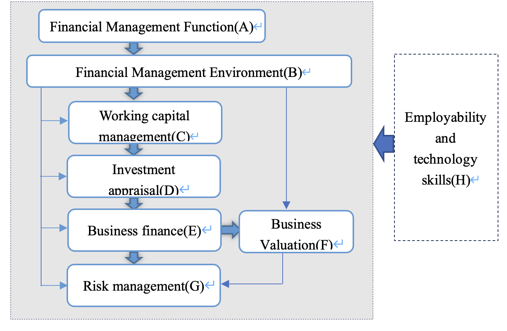
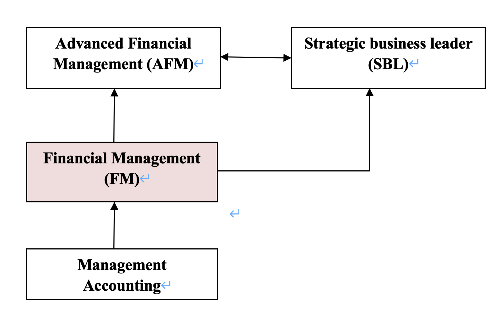

#  {#section .章标题}

# Introduction to ACCA F9 {#introduction-to-acca-f9 .章标题}

## Overall Aim of the Paper {#overall-aim-of-the-paper .标题一}

To develop the knowledge and skills expected of a finance manager, in relation to issues affecting investment, financing, and dividend policy decisions.

## Main capabilities  {#main-capabilities .标题一}

A.  Discuss the role and purpose of the financial management function

B.  Assess and discuss the impact of economic environment on financial management

C.  Discuss and apply working capital management techniques

D.  Carry out effective investment appraisal

E.  Identify and evaluate alternative sources of business finance

F.  Discuss and apply principles of business valuations

G.  Explain and apply risk management techniques in business

H.  Demonstrate employability and technology skills

## Intellectual Level {#intellectual-level .标题一}

Level 1: knowledge and comprehension

Level 2: application and analysis

Level 3: synthesis and evaluation

## F9 Exam structure {#f9-exam-structure .标题一}

The balance of the FM exam will be approximately 50:50 in terms of the number of marks available for discussion and the number of marks available for numerical calculations.

**Section A:** 15 Objective Test Questions (2 marks each)

- 覆盖所有知识点

- 练习册+卡普兰练习题

**Section B:** 3 Cases each contain 5 Objective Test Questions (2 marks each)

- 覆盖全部知识点

- 认真读题目要求，多选少选都不得分

- 数字题要注意输入正确答案格式，尤其是单位

- 没有特别格式要求，数字整数或保留二位小数均可

**Section C:** 2 20-Mark Questions

- 主要考 part C, D and E, 小部分来自于其他知识点

- 仔细读题要求，答非所问得分低

- 结合公司情况答题能够得到更多分

> e.g. 'Discuss THREE ways in which K Co can \...'

- 能把理论应用于公司情况有助于得到更多分，包括结合案例中相关数字或计算结果进行合理、恰当的建议

> e.g. 'the project is financially acceptable as it has a positive NPV'

- 文字题仅仅列出少数单词是无法得分的，要说出支持或反对的理由

> e.g. citing 'political factors' or 'economic factors' as reasons for capital rationing without further explanation

**Section C questions drawn mainly from the following areas:**

- The nature, elements and importance of working capital

- Management of inventories, accounts receivable, accounts payable and cash

- Determining working capital needs and funding strategies

- Investment appraisal techniques

- Allowing for inflation and taxation in DCF

- Adjusting for risk and uncertainty in investment appraisal

- Specific investment decisions

- Sources of and raising business finance

- Estimating the cost of capital

- Capital structure theories and practical considerations

- Finance for small and medium sized entities (SMEs)

## Observations from marking {#observations-from-marking .标题一}

1.  **Study the whole syllabus**

2.  **Master the basic financial management techniques you will need**

3.  **Study theory**

You should understand enough theory to support a critical discussion and understand how theory underpins the techniques you use

4.  **Relate theory to techniques**

5.  **Read the requirement carefully**

**Verbs** — Answers should relate to the verbs used in the question requirement -- for example calculate, critically discuss, discuss, briefly discuss -- while using the marks available as a guide to how much work to do

If a **requirement quantifies** what is needed -- for example, discuss THREE ways of doing something. There is no point offering more than the requirement

6.  **Calculation errors and errors of principle**

Calculation errors and mathematical errors can lose half a mark, while errors of principle can lose a whole mark.

## Relational Diagram  {#relational-diagram .标题一}

## Study plan {#study-plan .标题一}

- 从现在到考试之间的学习时间锁定

- 从初始任务开始学习，设定自己的进度

- 找到自己最好的学习状态，比如早上学习，或者每天保持较短但多频率的学习

- 每学习完几个单元后，要对所学知识进行回顾和巩固

- 制定计划，重在执行

- 每周回顾计划执行情况，必要时调整
